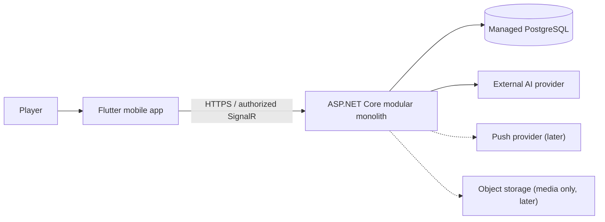
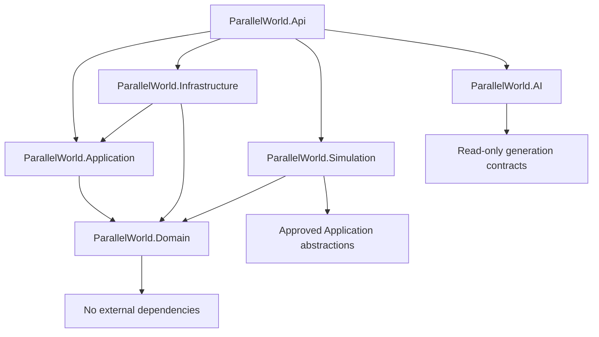
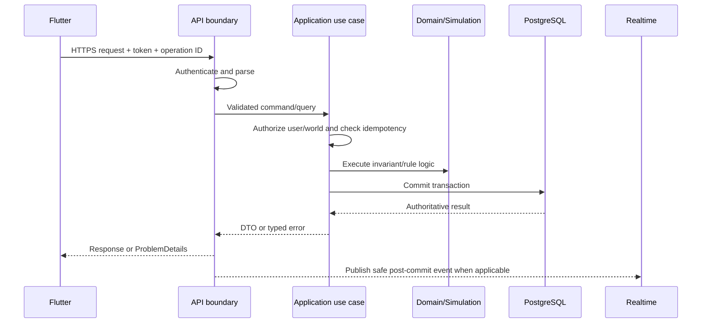
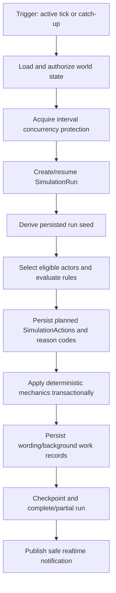
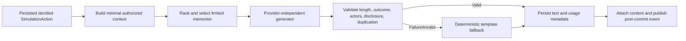
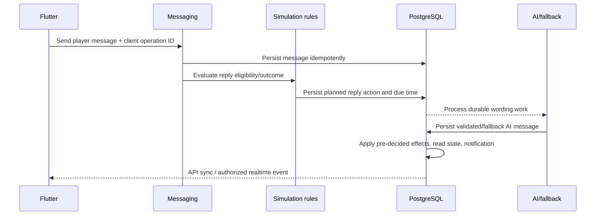
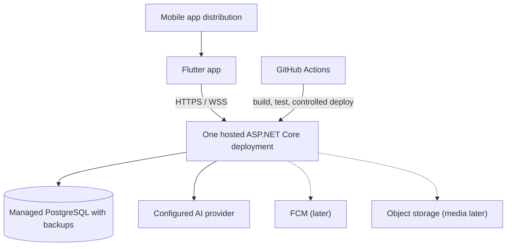

# Parallel World Architecture

This document is the authoritative application and system architecture for Parallel World. `docs/product/PRODUCT.md` owns product scope, `docs/game-design/GAME_RULES.md` owns gameplay behaviour, and the remaining architecture documents own database, API, and security detail. This document defines boundaries and lifecycles; it does not authorize implementation outside the current milestone.

## 1. Architecture goals

1. Preserve private, single-player world isolation at every boundary.
2. Keep PostgreSQL authoritative and mobile state replaceable.
3. Make deterministic simulation decisions reproducible, auditable, and idempotent.
4. Prevent AI providers from selecting or mutating mechanics.
5. Support guest-first ownership and later account recovery/synchronization without moving world data.
6. Deliver an understandable modular monolith that one developer can build, test, debug, deploy, and operate.
7. Prefer ordinary transactions, explicit application contracts, and simple hosting over distributed infrastructure.
8. Leave clean extraction seams without paying the cost of microservices prematurely.

The modular monolith is the correct initial style because one process and one database minimize deployment and debugging overhead, permit atomic updates across closely related gameplay state, reduce hosting cost, and allow early boundaries to change safely. Logical modules and architecture tests preserve future extraction options if measured load or team ownership eventually justifies them.

## 2. System context

The Flutter client communicates only with the ASP.NET Core backend. The backend owns authentication, authorization, simulation, persistence, external AI integration, realtime delivery, and later push delivery. PostgreSQL is private to the backend.



No real-user discovery, messaging, feed, relationship, or shared-world path exists. Authentication represents ownership, cloud save, recovery, and synchronization—not multiplayer identity.

## 3. Product invariants

- A real user owns one or more isolated `GameWorld` records; MVP exposes one.
- Each world has exactly one human-controlled player actor and multiple AI-controlled character actors.
- Every world-owned persistent record carries `WorldId`, including joins, events, jobs, idempotency records, and generated content.
- All cross-record references are validated as same-world references on the server.
- Real users never interact with, observe, or affect one another.
- PostgreSQL is authoritative for ownership, game state, world time, relationships, memories, actions, and history.
- Drift is a cache and pending-local-action store only. It never runs authoritative simulation or resolves mechanical conflicts.
- Deterministic rules decide actors, targets, actions, values, time, and outcomes. AI generates wording for a persisted decision only.
- All persistent timestamps use UTC. Character-local time is a projection for display and schedules.
- Simulation and background work are idempotent and safe to retry.

## 4. Technology stack

### Mobile

- Flutter and Dart
- Riverpod for application and asynchronous state
- GoRouter for navigation and authentication/world guards
- Dio for HTTP through shared API data sources
- Freezed or an equivalent immutable-model approach only where generated equality/copy/union support justifies it
- Drift for local cache, drafts, synchronization metadata, and pending local actions
- Flutter Secure Storage for access/refresh tokens and installation identity
- Firebase Cloud Messaging later, only for delivery of persisted notifications

### Backend

- ASP.NET Core Web API and C#
- Entity Framework Core with PostgreSQL
- FluentValidation or an equivalent explicit application-input validation approach
- RFC-compatible ProblemDetails responses
- Serilog structured logging with redaction
- OpenAPI for HTTP contract documentation
- SignalR for authorized in-app realtime events when its milestone is introduced
- ASP.NET Core `BackgroundService` initially, consuming durable PostgreSQL work records
- xUnit for backend unit, integration, deterministic-simulation, and architecture tests

### AI and infrastructure

- Provider-independent AI abstraction with an external provider initially
- Deterministic template fallback and output validation
- Docker for local/backend packaging
- GitHub Actions for build, test, migration checks, and deployment workflows
- One hosted ASP.NET Core service and managed PostgreSQL initially
- Object storage only after media is introduced

The accepted baseline, checked on 2026-08-25, is .NET 10 LTS/`net10.0`, stable Flutter 3.47 with bundled Dart 3.13, Android API 24 minimum, and Android as the initial launch platform. M01 pins the accepted toolchain and latest stable compatible patches within those lines. Future Flutter/Dart minor or major upgrades require explicit review. Providers and hosting vendors remain open. No additional distributed technology is implied.

## 5. Repository structure

The intended structure below is documentation only; projects and folders are created by the relevant implementation milestone.

```text
parallel-world/
├── AGENTS.md
├── README.md
├── docs/
├── codex/
├── backend/
│   ├── ParallelWorld.sln
│   ├── src/
│   │   ├── ParallelWorld.Api/
│   │   ├── ParallelWorld.Application/
│   │   ├── ParallelWorld.Domain/
│   │   ├── ParallelWorld.Infrastructure/
│   │   ├── ParallelWorld.Simulation/
│   │   └── ParallelWorld.AI/
│   └── tests/
│       ├── ParallelWorld.UnitTests/
│       ├── ParallelWorld.IntegrationTests/
│       └── ParallelWorld.ArchitectureTests/
├── mobile/
│   └── parallel_world_app/
├── infrastructure/
│   ├── docker/
│   └── scripts/
└── .github/
    └── workflows/
```

## 6. Backend solution structure

### `ParallelWorld.Domain`

Owns entities, value objects, enums, invariant-preserving domain rules, and useful domain events. It contains interfaces only when the abstraction is inherently domain-facing. It has no EF Core, ASP.NET Core, provider SDK, filesystem, clock implementation, or network dependency.

### `ParallelWorld.Application`

Owns use cases, commands, queries, DTOs, application validation, authorization orchestration, transaction boundaries, application interfaces, and module public contracts. It coordinates domain behaviour but does not implement HTTP, EF mappings, or provider SDK calls.

### `ParallelWorld.Infrastructure`

Owns EF Core, PostgreSQL mappings and migrations, repository/query implementations where justified, authentication and token implementations, secure external storage adapters, Serilog adapters, clocks, transaction implementation, and durable work persistence. It must not contain core gameplay decisions.

### `ParallelWorld.Simulation`

Owns deterministic actor/action selection, rule evaluation, world-time and catch-up processing, seeded randomness, reason codes, action planning, and mechanical action orchestration. It has no provider-specific AI code and no dependence on wall-clock calls outside an injected clock/interval input.

### `ParallelWorld.AI`

Owns stable text-generation interfaces, minimal context construction, provider adapters, template fallback, output validation, moderation hooks, usage diagnostics, and retry classification. It cannot write scores or decide actions.

### `ParallelWorld.Api`

Owns HTTP endpoints, authentication middleware, reusable authorization policies, ProblemDetails mapping, OpenAPI, SignalR hubs, rate-limit entry points, and dependency composition. Controllers/endpoints remain thin and contain no business or simulation rules.

### Tests

- Unit tests target domain, application, simulation, memory, and relationship behaviour.
- Integration tests target API, PostgreSQL, EF mappings, authentication, authorization, transactions, and idempotency.
- Architecture tests enforce project and module dependency rules.

## 7. Backend modules

Modules are logical boundaries inside the projects above, not separate deployables or databases.

| Module | Responsibilities and owned entities | Public application contracts | Allowed dependencies | Must not own |
|---|---|---|---|---|
| Accounts | User/account ownership, guest identity, credentials, refresh sessions, installation registrations | CreateGuestSession, UpgradeGuest, RefreshSession, GetAccount | SharedKernel | Worlds/gameplay state |
| Worlds | `GameWorld`, ownership link, world status, time cursor, world settings | Create/Get/Pause/Resume/ArchiveWorld, AuthorizeWorld | Accounts, SharedKernel | Actor profiles or feature content |
| Actors | Shared participant identity, actor kind, `PlayerProfile` | ResolveActor, GetPlayerProfile | Worlds | AI character traits or relationships |
| Characters | `Character`, personality, opinions, moods, goals, schedules, career summary | Character queries and validated state updates | Actors, Worlds | Simulation orchestration or AI providers |
| Social | Posts, replies, reactions, follows, feed queries | CreatePost/Reply/Reaction/Follow, GetFeed | Actors, Worlds | Relationship values or AI mechanics |
| Messaging | Conversations, messages, read state, planned reply reference | SendMessage, GetConversation, MarkRead | Actors, Worlds | Group chat in MVP, relationship mutation logic |
| Relationships | Directional values/events, shared romantic status/history | ApplyRelationshipEvent, EvaluateRomance, GetRelationship | Actors, Worlds | AI wording or feed ownership |
| Memories | Structured memory, knowledge provenance, secrets, promises, recall selections | Create/Resolve/RecallMemory | Actors, Worlds | Full conversation storage or AI provider calls |
| Simulation | SimulationRun, SimulationAction, interval/idempotency records, deterministic orchestration | RunInterval, RunCatchUp, ExecutePlannedAction | Approved module application contracts | Source feature entities it does not own |
| WorldEvents | Fictional WorldEvent and CharacterLifeEvent definitions/history | Evaluate/Activate/CompleteEvent | Worlds, Characters | Real-world news ingestion in MVP |
| Trends | Trend candidate/snapshot/status | EvaluateTrends, GetActiveTrends | Social, WorldEvents, Worlds | Posts or world events themselves |
| Notifications | Persisted in-app notification intent, read state, deduplication; deferred push-delivery attempts only when push is released | Create/Get/MarkReadNotification | Worlds, feature event contracts | Gameplay outcomes |
| AI | GenerationRequest/Result metadata and wording services | GenerateForDecidedAction | Stable read-only contracts | Any domain mutation |
| SharedKernel | Strong IDs, UTC/rule-version primitives, result/error primitives | Minimal shared types | None | Generic helpers, feature entities, or a “Common” dumping ground |

Cross-module work goes through application contracts or immutable integration notifications. Modules do not query another module's tables ad hoc. Integration notifications are not event sourcing; authoritative current state remains in ordinary relational tables.

MVP capability ownership is explicit: Accounts owns guest sessions; Worlds owns the private world; Actors and Characters own player/character profiles; Social owns posts, feed, replies, likes (as the MVP reaction), and follows; AI owns wording behind a read-only generation contract; Relationships owns friendship, rivalry, attraction, directional values, romantic status, and history; Messaging owns persistent one-to-one player/character conversations; Memories owns structured facts, promises, secrets, conflicts, and shared experiences; Simulation owns deterministic actions and catch-up; Notifications owns basic in-app indicators.

## 8. Dependency direction



Forbidden dependencies:

- Domain → EF Core, ASP.NET Core, Flutter, provider SDKs, infrastructure, or system time.
- Application → controllers, SignalR hubs, EF `DbContext`, or provider SDKs.
- Simulation → AI provider SDKs, HTTP endpoints, uncontrolled randomness, or direct cross-module table access.
- AI → relationship/memory/reputation mutation, simulation selection, or feature repositories that permit writes.
- Infrastructure → gameplay decisions.
- API → direct EF writes or ownership bypass.
- Flutter → PostgreSQL, AI providers, server secrets, or raw Dio calls from widgets.

Architecture tests enforce project references and selected namespace/module rules.

## 9. Domain boundaries

- `User` is the account owner, whether guest or registered.
- `GameWorld` is the ownership and isolation boundary, not a giant object graph loaded as one aggregate.
- `Actor` is the shared participant identity. `PlayerProfile` represents the human-controlled actor; `Character` adds AI-controlled structured state.
- Directional relationship feelings are one actor's values toward another. Shared romantic status/history is one pair-level record, not duplicated on both directions.
- `SimulationAction` is an auditable planned action with reason, seed, rule version, target, state, and idempotency key.
- `Memory` is structured knowledge owned by a character with provenance and access rules.
- `WorldEvent` is world-scoped shared context; `CharacterLifeEvent` belongs to one character.

Transactional consistency is required for: world ownership plus initial player actor; a feature action plus its authoritative event/idempotency record; relationship deltas plus relationship history; romantic transition plus pair status history; promise/secret resolution plus resulting events; a simulation checkpoint plus all mechanics it claims committed; and notification creation when it is part of the same use case. AI text and external delivery do not remain inside long database transactions.

The Actor boundary and dedicated Actor table begin in M03. World creation transactionally creates the player Actor and PlayerProfile; M05 reuses that abstraction for character Actors and Character records.

## 10. Flutter architecture

Flutter uses a pragmatic feature-first structure:

```text
lib/
├── app/
├── core/
│   ├── api/
│   ├── auth/
│   ├── cache/
│   ├── errors/
│   ├── routing/
│   ├── theme/
│   └── widgets/
├── features/
│   ├── session/
│   ├── world/
│   ├── feed/
│   ├── posts/
│   ├── characters/
│   ├── messaging/
│   ├── relationships/
│   ├── notifications/
│   └── settings/
└── main.dart
```

Each substantial feature may contain data sources, repository implementation, immutable transport/cache models, an optional domain model, Riverpod providers/controllers, screens, widgets, and tests. Tiny features stay compact rather than copying unnecessary clean-architecture layers.

Rules:

- Riverpod owns session, world selection, asynchronous feature state, pagination, retry, and offline indicators.
- Repositories own API/cache coordination and expose typed operations; widgets never call Dio or Drift directly.
- GoRouter guards depend on session/world state, not on widget-side redirects.
- Async state distinguishes initial loading, refreshing with stale data, empty, offline, recoverable error, and terminal/session-expired states.
- Optimistic actions receive a stable client operation ID, appear as Pending, and reconcile to server truth. Mechanical state is never optimistically mutated as authority.
- Paginated providers retain cursor and deduplicate by server ID.
- Access/refresh tokens and installation identity use secure storage; ordinary cached data uses Drift.

## 11. Authentication lifecycle

### MVP guest lifecycle

1. App creates and securely stores a random installation identity, then creates an independent opaque `GuestBootstrapProof` with at least 256 bits of entropy for the bootstrap operation.
2. App calls guest-session creation with installation metadata, the proof, and initial-world input. Generic idempotency keys do not govern this credential-issuing operation.
3. In one transaction, Accounts hashes the proof and creates the guest `User`, installation/session lineage, initial refresh family, owned MVP world, player Actor/Profile, WorldSettings, and WorldSimulationState.
4. Backend returns short-lived access and rotating refresh tokens plus the stable User/world identity.
5. A valid proof retry within 10 minutes may recover once by rotating to new credentials in the same bootstrap/session lineage without creating duplicate identity/world state; concurrent recovery permits at most one success.
6. Flutter stores tokens securely, discards the proof after durably storing the refresh token, and caches only non-authoritative session metadata in Drift.

The installation identity and bootstrap proof are never normal authentication or authorization credentials. Refresh-token rotation/revocation is server-authoritative and deliberately non-idempotent: a consumed-token retry, including after a lost response, triggers family-replay containment rather than credential-response replay.

### Later registration and recovery

Email/password, magic link, Google, or Apple identity may be attached to the existing guest `User`. Upgrade is transactional: credentials are added and guest status changes while `UserId`, worlds, actors, and history remain unchanged. A failed upgrade leaves the guest usable. Multiple-device sync and account recovery use registered credentials; they never merge worlds from unrelated users without an explicit future product rule.

## 12. Authorization and world ownership

The API is the enforcement boundary:

1. Resolve current `UserId` from validated authentication.
2. Treat route/body `WorldId` only as a locator.
3. Load/authorize `GameWorld` by both `WorldId` and owner `UserId` before feature access.
4. Validate every referenced actor, post, conversation, relationship, memory, event, action, and notification has the same `WorldId`.
5. Use composite world-scoped foreign keys and unique constraints where supported by DATABASE.md.
6. Apply authorization in application use cases through a reusable world-access service/policy; endpoint checks alone are insufficient.

Queries must include ownership scope. Cache data and SignalR connection parameters never bypass validation. Cross-world references fail without revealing whether the foreign record exists. Background jobs revalidate world/action scope from persisted IDs rather than assuming the enqueueing request was correct.

## 13. Request lifecycle



- API validates transport shape; Application validation checks command semantics; Domain enforces invariants.
- Transactions begin/end in the application use case or a transaction decorator, not in controllers.
- Idempotency is checked before mutation and completed in the same transaction as its result where practical. Credential endpoints follow the explicit API exception: guest bootstrap uses proof-bound identity idempotency with one newly rotated recovery, while refresh is non-idempotent.
- Typed errors become consistent ProblemDetails at the API boundary.
- Correlation ID, route, duration, outcome, user/world pseudonymous IDs, and safe reason codes are logged. Bodies, tokens, secrets, and private content are not.

## 14. Simulation lifecycle



Decision creation and execution are separable. A planned action contains actor, target, action type, topic/stance/tone/intent, seed, rule version, reason components, and idempotency key. Mechanical application follows GAME_RULES.md and commits before or with a durable text-work record. Generated wording is attached only after validation; template fallback completes text-required actions when AI fails.

Simulation intervals are half-open and uniquely owned by a world/rule-version interval key. A retry loads the existing run/action state and resumes; it never rerolls. Long catch-up work commits at safe bucket/action boundaries rather than holding one large transaction.

## 15. Catch-up simulation lifecycle

Catch-up is triggered when a player returns to an Active world or explicitly requests/resumes processing. Paused/Archived rules follow GAME_RULES.md.

1. Compare persisted simulation cursor/`LastSimulatedAt` with eligible current UTC/game time.
2. Claim the next bounded interval using a unique idempotency key and concurrency token.
3. Split it into detailed and compressed buckets using the authoritative balancing constants.
4. Load only state needed for each bucket and rank meaningful events deterministically.
5. Enforce per-character/world caps for posts, replies, messages, relationship changes, and summary items.
6. Commit mechanics and checkpoint each bucket.
7. Persist wording work for selected visible actions and deterministic fallback capability.
8. Produce a summary from committed structured facts, not from an AI-invented narrative.
9. Mark Complete or Partial with the next cursor. Retry resumes after the last committed boundary.

Older periods use daily aggregates; the newest detailed horizon uses six-hour buckets under current rules. The system does not evaluate every minute or generate every hidden action. AI failure cannot roll back committed mechanics.

## 16. AI generation lifecycle



The SimulationAction has already decided actor, target, type, topic, stance, tone, relationship context safe to reveal, and intended effect. AI lifecycle:

1. Build minimal context.
2. Retrieve no more than the GAME_RULES.md memory limit with knowledge/secret checks.
3. Select configured provider/model behind an interface.
4. Apply timeout, token, and budget limits.
5. Generate wording.
6. Validate length, action consistency, actor/target, secret disclosure, and prohibited claims.
7. Detect near-duplicate output where relevant.
8. Apply configured moderation when appropriate.
9. Persist provider-neutral request/result status, latency, token usage, rule/action IDs, and safe diagnostics—not full sensitive prompts.
10. Use template fallback on provider, validation, moderation, or budget failure.
11. Attach wording to the decided action without mutating mechanics.

## 17. Private messaging lifecycle



MVP supports player-to-character direct conversations only. A conversation and every message carry `WorldId`; sender/recipient actors must belong to it. Player message persistence precedes reply evaluation. GAME_RULES.md decides whether a reply exists and its effects. MVP may process it immediately, but the persisted action includes scheduling fields so delayed replies can be added later without making AI authoritative. Relevant memories are selected, not full history. Relationship effects reference the source event and apply idempotently.

Group conversations are deferred. Public contracts should avoid assuming all future conversations have exactly two participants, but MVP must not add group-chat UI, behaviour, or speculative generalized infrastructure beyond a clean migration seam.

## 18. Memory lifecycle

1. A committed interaction/event is evaluated by deterministic memory rules.
2. If meaningful, Memories persists type, owner/knowers, subject/topic, importance, emotional value, confidence, visibility, and source reference.
3. Promise/secret knowledge and resolution are updated transactionally with their source event.
4. Expiry/reinforcement follows rule-versioned behaviour; immutable provenance remains auditable.
5. Later use cases request ranked memory candidates for one character and purpose.
6. Access checks remove unknown or unauthorized secrets.
7. The bounded selection is supplied to rules or AI wording.
8. Recall metadata updates idempotently after actual use.

Conversation history remains in Messaging; Memories stores structured meaningful knowledge rather than duplicating entire transcripts. Full history is never sent to an AI provider.

## 19. Relationship and dating lifecycle

Interaction → immutable relationship event → bounded directional deltas → derived friendship label → optional romantic eligibility evaluation → one shared pair-level romantic transition → status-history event → eligible memories/notifications.

Relationships owns both directional value rows and the pair-level romantic status/history boundary. Applying an event, deltas, daily-cap ledger, and status transition occurs transactionally. A source-event/rule/direction uniqueness constraint prevents duplicate application. Derived friendship labels may be cached for reads but numerical values and history remain authoritative.

The shared romantic status is never copied independently into both directional rows. MVP states and transitions follow GAME_RULES.md. Engagement, marriage, separation, and divorce remain guarded/deferred until product release placement is decided.

## 20. Feed generation and pagination

- Feed is strictly `WorldId` scoped and contains eligible player, AI-character, and approved system posts.
- The initial ordering choice—chronological or simple deterministic ranking—remains open. Both must expose a stable total order.
- Cursor pagination encodes the ordering tuple, initially suitable as `(CreatedAtUtc, Id)` descending for chronological order or `(RankSnapshot, CreatedAtUtc, Id)` for deterministic ranking.
- Offset pagination is prohibited for growing feed and message histories.
- Cursor values are opaque to Flutter and validated/scoped server-side.
- Flutter caches pages and synchronization cursors in Drift, deduplicates by server ID, and refreshes from the first page when ordering context changes.
- Optimistic player posts use a client operation ID and Pending UI state; server response replaces the pending record. Failed actions remain retryable/discardable.
- Realtime delivery inserts or invalidates cache but does not become authority.
- Feed impressions are deferred until a product/architecture decision requires them.

## 21. Realtime events

SignalR may deliver NewAiPost, NewReply, NewPrivateMessage, NotificationCreated, RelationshipMilestone, and SimulationCompleted after the source transaction commits.

- Hubs authenticate the user and authorize each subscribed `WorldId`.
- Payloads contain minimal IDs, event type, cursor/version hints, and safe display data—not provider details or hidden state.
- Realtime is an enhancement. Reconnect always performs ordinary API synchronization from persisted cursors.
- Missed/duplicate events are harmless because client reconciliation uses server IDs and versions.
- SignalR does not perform gameplay mutation.

The exact milestone for first SignalR use is open; polling/refresh remains a valid MVP fallback where realtime has not shipped.

## 22. Push notifications

Firebase Cloud Messaging is deferred. Later flow:

1. Flutter registers a device token for the authenticated account/installation through the API.
2. Gameplay transaction creates a persisted Notification only.
3. A separate durable delivery record applies eligibility, quiet hours, deduplication, and rate limits.
4. BackgroundService attempts FCM delivery with retry/backoff.
5. Delivery result is recorded; gameplay state is unaffected by failure.

Device tokens are encrypted/protected server data, scoped to user/installation, rotated, and removable. Push contains minimal non-sensitive text and deep-link identifiers. It is optional delivery of persisted state, never part of the gameplay transaction.

## 23. Offline and caching strategy

Drift may store cached feed pages, character summaries, conversations/messages, notifications, session metadata, drafts, pending local actions, and synchronization cursors. Read-only display snapshots may include server-calculated relationship labels, but Drift never independently owns or calculates relationship scores, romantic state, memories, reputation, world clock, or simulation state.

- **Read path:** show cache with stale indicator, then revalidate from API; merge by server ID/version and remove tombstoned/invalidated entries.
- **Write path:** drafts remain local; submitted operations receive a stable client operation ID and Pending/Failed/Succeeded state.
- **Retry:** reuse the same operation ID with bounded backoff; do not create a new logical action on retry.
- **Conflict:** server authority wins for mechanical data. User-authored edit conflicts receive explicit conflict responses rather than silent overwrite.
- **Account switch/logout:** clear or cryptographically separate user/world cache, tokens, pending actions, and realtime subscriptions.
- **Schema:** Drift migrations are versioned/tested independently from EF migrations.
- **Offline writes:** only explicitly supported actions may queue; behaviour remains an open product decision. No offline simulation runs.

## 24. Error handling

Backend errors use ProblemDetails with stable machine-readable codes, safe title/detail, HTTP status, correlation ID, and validation fields when applicable.

| Condition | Typical response |
|---|---|
| Validation | 400 with field errors |
| Missing/invalid authentication | 401 |
| Authenticated but forbidden world | 403 or ownership-safe 404 per SECURITY/API decision |
| Not found | 404 without cross-world disclosure |
| State/concurrency/idempotency conflict | 409 |
| Rate limit | 429 with retry guidance |
| External AI failure | Fallback success when possible; otherwise safe 502/503 for text-only operation |
| Database/unexpected failure | Sanitized 500/503; no stack trace |

Flutter maps codes to user-safe empty/error/offline/session-expired states, offers retry only when safe, preserves pending user content, and may show a correlation ID for support. It never displays raw exceptions, provider responses, stack traces, or secrets.

## 25. Concurrency and idempotency

| Operation | Primary protection |
|---|---|
| Guest bootstrap | Unique proof hash plus transactional identity/world/session creation; one conditional recovery-consumption transition |
| Refresh rotation | One-use token hash and transactional successor/replay-family revocation; no generic response replay |
| World creation | Client idempotency key and user/world-slot uniqueness |
| Post/message submission | Client operation ID scoped to user/world |
| Reaction | Unique world/actor/post/reaction-type constraint |
| Follow | Unique world/follower/followed active edge and state transition key |
| Simulation interval | Unique world/rule-version/half-open interval plus run concurrency token |
| Relationship event | Unique source-event/rule/direction key |
| Notification | Unique user/source-event/category key |
| AI generation retry | One generation work record per action/version; attempts do not reapply mechanics |
| Push retry | Notification/device/delivery key |

Application use cases combine unique constraints, explicit idempotency records, transactions, and optimistic concurrency tokens. Database row/advisory locking is used only for short critical sections such as claiming a simulation interval or durable job. No distributed transaction exists. A duplicate with the same payload returns the recorded result; reuse of a key with a different payload returns an idempotency conflict.

## 26. Background processing

Initial processing uses ASP.NET Core `BackgroundService`, but in-memory queues are never the durable record. Before processing, the originating transaction writes a PostgreSQL work record containing type, payload reference, unique key, state, due time, attempts, and lease information.

BackgroundService polls/claims due work, commits a short lease, executes idempotently, records completion or bounded retry/backoff, and releases/lets expired leases recover after crashes. Uses include scheduled simulation actions, later delayed messages, AI generation/retries, notification delivery, and limited maintenance.

Initial deployment assumes one backend instance. Multiple instances require a reviewed PostgreSQL claim/locking strategy or durable scheduler/queue. A separate durable queue or scheduler becomes justified when database polling creates measured contention, scheduling accuracy is unmet, work volume/latency threatens API service, or independent worker scaling is required.

## 27. Observability

Serilog produces structured, sanitized logs with correlation ID, route/use case, safe user/world identifiers, duration, outcome, reason/error code, and deployment version. Metrics/diagnostics cover request duration/error rate, simulation run duration/action counts/partial failures, catch-up lag, AI latency/failure/fallback/token usage, database query duration, background queue depth/lease failures/retries, SignalR connections, and notification delivery outcomes.

Never log access/refresh tokens, raw guest-bootstrap proofs, signing keys, API keys, full private-message bodies, full AI prompts containing personal data, secret memories, passwords, or provider raw responses containing private context. Exact metrics/tracing library is open; observability must not introduce a distributed platform by default.

## 28. Security boundaries

- Flutter and the network are untrusted.
- HTTPS API authentication plus application ownership authorization is the trust boundary.
- PostgreSQL is reachable only from backend/deployment administration paths.
- AI providers receive minimized, authorized context with no platform secrets or unrelated world data.
- Runtime secrets come from environment variables or a hosting secret manager, never committed appsettings or Flutter source.
- Flutter tokens, installation identity, and the transient guest-bootstrap proof use secure storage; refresh tokens are rotatable/revocable and the bootstrap proof is discarded after durable token storage.
- Logs, ProblemDetails, realtime, push, and analytics are sanitized.
- Rate limits protect session/auth, messaging, simulation/catch-up, and AI-generating endpoints.
- Background jobs and SignalR connections re-establish user/world scope rather than trusting client claims.

Detailed algorithms and policy remain governed by `docs/architecture/SECURITY.md`; conflicts must be resolved before implementation.

## 29. Testing architecture

### Backend unit tests

Domain invariants, GAME_RULES formulas, relationship changes/caps, dating eligibility/transitions, memory scoring/access, feed scoring, validation, and use-case orchestration using controlled clocks/random seeds.

### Integration tests

Real PostgreSQL-compatible database tests for EF mappings/migrations, API ProblemDetails, authentication, guest upgrade, world ownership/isolation, transactions, cursor pagination, idempotency, concurrency, durable work claiming, and retry recovery.

### Architecture tests

Project reference direction, Domain independence, forbidden provider/EF/controller dependencies, module namespace boundaries, and absence of direct feature-table access where enforceable.

### Flutter tests

Repository API/cache reconciliation, Riverpod provider/controller states, widgets, navigation guards, pagination/deduplication, optimistic actions, offline/retry/session-expired behaviour, and cache clearing.

### Simulation tests

Fixed-seed reproducibility, stable candidate ordering, duplicate interval/action/event prevention, catch-up caps/compression/partial resume, fallback independence, and event-history correctness.

## 30. Configuration and secrets

Environment-specific configuration covers PostgreSQL connection, token issuer/audience/signing/expiry, AI provider/model/timeout/token and budget limits, Serilog levels/sinks, CORS, rate limits, SignalR limits, FCM later, object storage later, simulation enablement, and worker polling/lease settings.

Non-secret defaults may live in committed configuration. Secrets are injected at runtime. Flutter receives only public API base URL/build environment and public platform configuration. Startup validates required configuration and fails safely; diagnostics name missing keys without printing values.

## 31. Deployment topology



Initial production uses one backend deployment containing API and BackgroundService plus managed PostgreSQL. Deployment provides HTTPS/WSS, environment/secret injection, liveness/readiness checks, controlled EF migrations, database backups/restore testing, and versioned artifacts.

Migrations run as a controlled deployment step, not concurrently from every instance. Rollback prefers redeploying the prior compatible artifact; destructive schema changes require expand/migrate/contract planning and backup recovery. No hosting vendor is architectural authority.

## 32. Scaling path

Measure before adding infrastructure. Triggers include concurrent-world growth, simulation/catch-up backlog, AI queue latency/cost, multiple API instances, notification volume, or heavy feed queries.

Possible reviewed steps:

1. Tune queries/indexes, batching, pagination, and work limits.
2. Scale the monolith vertically.
3. Add multiple API instances with PostgreSQL-coordinated job/interval claims.
4. Separate the existing BackgroundService host from API using the same durable contracts.
5. Add a durable job queue/scheduler when PostgreSQL work polling no longer meets measured needs.
6. Add Redis only for a demonstrated cache/coordination need, with PostgreSQL still authoritative.
7. Add read replicas for proven read pressure.
8. Extract a module only when independent scaling, reliability, or team ownership clearly outweighs distributed complexity.

Growth alone does not justify microservices.

## 33. Explicitly rejected alternatives

- **Flutter-only/local authority:** cannot provide secure ownership, cloud recovery, authoritative simulation, or protected AI secrets.
- **SQLite as server database:** does not meet the chosen concurrent managed authoritative-store requirements; Drift/SQLite remains mobile cache only.
- **Direct Supabase/PostgreSQL access from Flutter:** bypasses application ownership, simulation, AI, and transactional rules.
- **Microservices:** unnecessary operational, consistency, deployment, and debugging cost for one developer.
- **Event sourcing as primary persistence:** adds projection/versioning complexity; immutable gameplay history is retained alongside ordinary current-state tables.
- **Redis from day one:** no demonstrated cache/coordination need; adds another authority/failure mode.
- **Kafka, RabbitMQ, Service Bus, or another broker from day one:** persisted PostgreSQL work plus BackgroundService is sufficient initially.
- **Distributed transactions:** unnecessary in the initial topology; external effects are retried from durable records.
- **Kubernetes:** excessive operational burden for one service.
- **CQRS everywhere:** commands/queries may be separated when useful, but duplicate models/pipelines are not mandatory.
- **Separate database per module/user:** complicates transactions, migrations, operations, and cross-module use cases.
- **AI-controlled mechanics:** nondeterministic, unauditable, costly to test, and contrary to product rules.
- **AI calls from Flutter:** exposes secrets and bypasses decision/validation boundaries.
- **Real-user multiplayer architecture:** contradicts private isolated worlds.
- **Full chat-history prompts:** violates context minimization, cost, privacy, and structured-memory design.
- **Offset pagination for feeds/messages:** unstable and inefficient as histories grow; cursor pagination is required.

## 34. Open Architecture Decisions

1. Exact patch pins within the accepted .NET 10 LTS and Flutter 3.47/Dart 3.13 baseline (M01 responsibility).
2. Freezed usage scope versus handwritten immutable models.
3. Initial external AI provider/model and provider-selection policy.
4. Initial hosting provider and managed PostgreSQL vendor.
5. Choice of EF naming-convention package versus explicit mappings; PostgreSQL `snake_case` itself is accepted.
6. Exact feed ordering for MVP: chronological or simple deterministic ranking.
7. First milestone that introduces SignalR versus API refresh/polling.
8. Whether feed impressions are persisted and, if so, at what release stage.
9. Whether the physical Actor abstraction is present in the first schema or introduced incrementally behind stable IDs/contracts.
10. Exact PostgreSQL strategy for simulation/job claiming when more than one backend instance exists.
11. Trigger and candidate technology for a durable scheduler/queue beyond BackgroundService.
12. Metrics/tracing library and hosting integration; Serilog remains required for structured logs.
13. Registered authentication and recovery methods for M17; ADR-013, ADR-014, and SECURITY.md resolve the M03 guest-bootstrap/access/refresh/session-family policy.
14. Offline write scope and conflict UX, consistent with PRODUCT.md.
15. Push-notification provider setup, payload policy, and introduction milestone; FCM is planned later.
16. Group-conversation persistence model if the deferred product feature is ever approved.
17. Object-storage provider and media processing architecture when media is approved.

Before implementation, affected open decisions must be resolved in `docs/development/DECISIONS.md` or the appropriate authoritative document. No implementation task may silently choose them.
