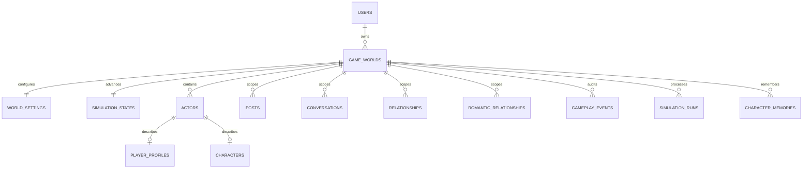

# Parallel World Database Design

PostgreSQL is authoritative. This document fixes the database integrity requirements needed to implement the approved product, rules, and modular-monolith architecture. It does not introduce application code or authorize deferred product features.

## 1. Mandatory conventions

- Primary keys are UUID/GUID values generated outside or inside PostgreSQL through one documented convention.
- Persistent timestamps are UTC (`timestamptz`).
- Every world-owned table—including child, join, history, job, generation, and idempotency tables—contains non-null `WorldId`.
- Every world-owned principal exposes `UNIQUE (WorldId, Id)` so children can use composite foreign keys.
- Every reference between world-owned rows uses a composite foreign key beginning with `WorldId`; a single-column FK is insufficient.
- World ownership is enforced in application authorization and reinforced by database constraints. Client-supplied `WorldId` is never proof of ownership.
- Mutable aggregate roots use an optimistic concurrency token such as PostgreSQL `xmin` mapping or an explicit `Version` column, chosen consistently during implementation.
- All foreign-key delete behaviours are explicit. Historical gameplay rows do not disappear through accidental cascades.
- Cursor indexes exactly match filters and ordering.
- All values defined as bounded in `GAME_RULES.md` have database check constraints as a final integrity boundary.
- PostgreSQL tables, columns, constraints, and indexes use unquoted `snake_case`. C# entities/properties use PascalCase; EF Core naming conventions or explicit mappings translate between them. Quoted PascalCase PostgreSQL identifiers are prohibited. Conceptual names in this document map accordingly (for example, `SimulationRuns` -> `simulation_runs` and `WorldId` -> `world_id`).

### Required bounded checks

| Value family | Constraint |
|---|---|
| Traits, activity, influence, popularity, reputation, relationship dimensions, importance, confidence, goal priority/progress | `CHECK (value BETWEEN 0 AND 100)` |
| Opinion position and emotional value/impact | `CHECK (value BETWEEN -100 AND 100)` |
| Cached counts, attempts, ordinals, token counts | `CHECK (value >= 0)` |
| Time intervals | `CHECK (IntervalEnd > IntervalStart)` |
| Actor pairs | `CHECK (ActorAId <> ActorBId)` or source/target equivalent |

Application rules still clamp before persistence; check constraints reject corrupted or bypassed writes.

## 2. World-isolation pattern

For every world-owned principal `P`:

```text
PRIMARY KEY (Id)
UNIQUE (WorldId, Id)
FOREIGN KEY (WorldId) REFERENCES GameWorlds(Id) ON DELETE RESTRICT
```

For every child reference to `P`:

```text
FOREIGN KEY (WorldId, PId)
  REFERENCES P(WorldId, Id)
  ON DELETE RESTRICT
```

Join tables include `WorldId` in their primary/unique key and in every participant FK. These constraints make cross-world links impossible even if an application authorization defect occurs.



The omitted detail tables use the same `WorldId` composite-FK pattern.

## 3. Account-owned tables

These records are account-level and therefore do not carry `WorldId`.

### Users

- `Id`
- `AccountType`: Guest or Registered
- `Email` nullable until registration
- `NormalizedEmail` nullable
- `PasswordHash` nullable for external-only authentication
- `Status`
- `CreatedAt`, `UpdatedAt`, `Version`

Indexes and constraints:

- Partial unique index on `NormalizedEmail WHERE NormalizedEmail IS NOT NULL`.
- Account type/credential consistency is validated by the Accounts use case; future external identities remain deferred.

### DeviceInstallations

- `Id`, `UserId`, `InstallationPublicId`, `Platform`, `LastSeenAt`, `CreatedAt`, `RevokedAt`
- Unique `InstallationPublicId`.
- Index `(UserId, LastSeenAt DESC)`.
- FK to Users uses `ON DELETE CASCADE` only during an explicitly authorized hard account deletion.
- `InstallationPublicId` is metadata/recovery context, never a credential. Authentication requires valid token/session state resolved server-side.

### RefreshTokens

- `Id`, `UserId`, `DeviceInstallationId`, `TokenHash`, `RotationFamilyId`, `ExpiresAt`, `ConsumedAt`, `RevokedAt`, `ReplacedByTokenId`, `CreatedAt`
- Unique `TokenHash`.
- Index `(UserId, DeviceInstallationId, ExpiresAt)` and `(RotationFamilyId, ExpiresAt)`; family/oldest-active queries must be covered by an implementation-verified index.
- `ReplacedByTokenId` is a self-reference to the successor created by successful rotation. Family membership and device association are non-null and immutable after issuance.
- Store only a secure cryptographic hash of the opaque token; never persist plaintext tokens. The raw value has at least 256 bits of entropy and exists server-side only transiently for one-time issuance/rotation.
- M03 issues tokens with `ExpiresAt` exactly 30 days after `CreatedAt`. `ExpiresAt > CreatedAt` is database constrained; the exact lifetime is also an application/configuration test.
- Successful rotation atomically sets `ConsumedAt` and `ReplacedByTokenId` and inserts the successor in the same family. A token with `ConsumedAt`, `RevokedAt`, or elapsed `ExpiresAt` cannot mint an access token.
- Replay of a consumed/replaced token transactionally revokes every still-active token in that family while preserving unrelated families. Timestamps, replacement links, family ID, user ID, and device ID provide replay audit context without raw token material.
- Accounts enforces at most five active families per user. Creating a sixth locks/rechecks the user's active families and revokes the oldest before activating the new family. Current logout revokes one family; all-device revocation marks every active family for the user revoked.
- Access JWTs and an access-token denylist are not persisted for MVP.

## 4. Worlds and ownership

### GameWorlds

- `Id`, `OwnerUserId`, `Name`, `CurrentWorldTime`, `LastSimulatedAt`, `Status`, `CreatedAt`, `UpdatedAt`, `Version`
- FK `OwnerUserId -> Users.Id ON DELETE RESTRICT`.
- Alternate key `UNIQUE (OwnerUserId, Id)` supports database-enforced owner/world references.
- Index `(OwnerUserId, CreatedAt DESC, Id DESC)`.
- Index `(OwnerUserId, Status)`.

MVP one-world exposure is enforced by the application/idempotent creation use case rather than a permanent database unique constraint, because the approved long-term model allows multiple worlds.

### WorldSettings

- `Id`, `WorldId`, `TimeScale`, action-limit values, AI budget settings, content settings, `RuleVersion`, `CreatedAt`, `UpdatedAt`, `Version`
- Unique `WorldId`.
- FK `WorldId -> GameWorlds.Id ON DELETE RESTRICT`.
- Checks require positive time scale and non-negative limits/budgets.

### WorldSimulationState (`world_simulation_states`)

- `Id`, `WorldId`, `NextDueAt`, `LastCompletedIntervalEnd`, `DeterministicSequence`, `CreatedAt`, `UpdatedAt`, `Version`
- Unique `WorldId`.
- PostgreSQL table `world_simulation_states`; conceptual C# entity `WorldSimulationState`.
- FK `WorldId -> GameWorlds.Id ON DELETE RESTRICT`.
- The row is locked briefly when claiming an interval; a run must start exactly at the persisted cursor.

## 5. Actors, player profile, and characters

### Actors

- `Id`, `WorldId`, `ActorType`: Player, Character, or System
- `PlayerProfileId` nullable
- `CharacterId` nullable
- `CreatedAt`, `Status`, `Version`

Constraints:

- `UNIQUE (WorldId, Id)`.
- Player requires PlayerProfileId only; Character requires CharacterId only; System requires neither.
- Composite FKs `(WorldId, PlayerProfileId)` and `(WorldId, CharacterId)` target their detail tables.
- Unique `PlayerProfileId` and unique `CharacterId` prevent duplicate actor identities.
- Partial unique index `UNIQUE (WorldId) WHERE ActorType = 'Player'` enforces exactly at most one player actor; world creation transaction creates the required one.

### PlayerProfiles

- `Id`, `WorldId`, `DisplayName`, `Handle`, `Bio`, `Reputation`, `Influence`, `FollowersCount`, `CreatedAt`, `UpdatedAt`, `Version`
- Unique `WorldId` and unique `(WorldId, Id)`.
- Unique `(WorldId, Handle)`.
- Checks for bounded scores and non-negative cached count.

### Characters

- `Id`, `WorldId`, `DisplayName`, `Handle`, `Bio`, `Age`, `Profession`, `Archetype`, `WritingStyle`, `ActivityLevel`, `Influence`, `Popularity`, `CurrentMoodType`, `Status`, `CreatedAt`, `UpdatedAt`, `Version`
- Unique `(WorldId, Id)` and `(WorldId, Handle)`.
- Checks for non-negative age and bounded activity/influence/popularity.
- Index `(WorldId, Status, Id)` for catalogue/simulation eligibility.

Actor creation and its PlayerProfile/Character detail are one transaction. Because ordinary FKs cannot assert a referenced actor discriminator without triggers, the application validates discriminator/detail consistency and integration tests prove it; the database checks null-shape, uniqueness, and same-world identity.

### CharacterTraits

- `Id`, `WorldId`, `CharacterId`, one explicit 0-100 column per stable trait, `CreatedAt`, `UpdatedAt`, `Version`
- Unique `(WorldId, CharacterId)`.
- Composite FK to Characters; every trait has a 0-100 check.

### Topics

Topic taxonomy ownership (global catalogue versus world-scoped) is deferred. Until resolved, no FK design may silently mix global and world-owned topic rows.

### CharacterInterests and CharacterOpinions

Both contain `Id`, `WorldId`, `CharacterId`, `TopicId`, timestamps, and unique `(WorldId, CharacterId, TopicId)`. Interests store bounded `Strength`. Opinions store `Position` (-100..100), `Confidence`, `Intensity`, and `LastChangedAt` with relevant checks. Character FKs are composite.

### CharacterGoals, CharacterSchedules, Careers, MoodHistory

Each contains explicit `WorldId`, `CharacterId`, unique identity, timestamps, status, and composite character FK. Goals check priority/progress 0-100 and index `(WorldId, CharacterId, Status, Priority DESC)`. Schedules index `(WorldId, CharacterId, DayOfWeek, StartLocalTime)`. Mood history stores source `GameplayEventId`, intensity/cause, and `(WorldId, CharacterId, OccurredAt DESC, Id DESC)`.

## 6. Immutable gameplay audit anchor

### GameplayEvents

This is an auditable source anchor, not event sourcing and not the primary representation of current state.

- `Id`, `WorldId`, `EventType`, `ActorId` nullable, `TargetActorId` nullable, `OccurredAt`, `Importance`, `EmotionalImpact`, `ReasonCode`, `RuleVersion`, `IdempotencyKey`, `CreatedAt`
- Composite same-world actor FKs.
- Unique `(WorldId, Id)` and `(WorldId, IdempotencyKey)`.
- Checks for bounded importance/emotional impact and distinct actor/target.
- Index `(WorldId, OccurredAt DESC, Id DESC)` and `(WorldId, EventType, OccurredAt DESC)`.

Posts, messages, relationship events, memories, promises, secrets, notifications, and simulation effects reference a `GameplayEventId` where they require a source. This replaces unenforceable `SourceType/SourceId` polymorphic references. Current state remains in its feature tables.

## 7. Social feed

### Posts

- `Id`, `WorldId`, `AuthorActorId`, `ParentPostId` nullable, `QuotePostId` nullable, `GameplayEventId`, `Content`, `Visibility`, cached `LikeCount`, `ReplyCount`, `RepostCount`, `CreatedAt`, `DeletedAt`, `Version`
- Composite FKs to Actors, parent/quoted Posts, and GameplayEvents.
- Checks prevent self-parenting/self-quoting and negative cache counts.
- Visibility is private-world scope for MVP.

Indexes:

- Feed cursor: `(WorldId, CreatedAt DESC, Id DESC) WHERE DeletedAt IS NULL`.
- Author history: `(WorldId, AuthorActorId, CreatedAt DESC, Id DESC) WHERE DeletedAt IS NULL`.
- Reply cursor: `(WorldId, ParentPostId, CreatedAt ASC, Id ASC) WHERE ParentPostId IS NOT NULL AND DeletedAt IS NULL`.
- Quote lookup: `(WorldId, QuotePostId) WHERE QuotePostId IS NOT NULL`.

### PostReactions

- `Id`, `WorldId`, `PostId`, `ActorId`, `ReactionType`, `GameplayEventId`, `CreatedAt`
- Unique `(WorldId, PostId, ActorId, ReactionType)`.
- Composite FKs to Posts, Actors, and GameplayEvents.
- Check Actor differs from post author is enforced by the Social use case because it crosses rows; integration tests cover it.
- Index `(WorldId, PostId, ReactionType, CreatedAt, Id)`.

### Follows

- `Id`, `WorldId`, `FollowerActorId`, `FollowedActorId`, `StartedAt`, `EndedAt` nullable, `GameplayEventId`, `IdempotencyKey`
- Composite FKs to both Actors and GameplayEvents.
- Check follower differs from followed.
- Partial unique index `(WorldId, FollowerActorId, FollowedActorId) WHERE EndedAt IS NULL` permits one active edge while retaining unfollow/re-follow history.
- Unique `(WorldId, IdempotencyKey)`.
- Index `(WorldId, FollowedActorId, EndedAt)` for follower counts and `(WorldId, FollowerActorId, EndedAt)` for following lists.

Cached counts are updated in the same transaction as source-row changes and can be rebuilt from Posts/PostReactions/Follows. Cache values never become the source of truth.

Reposts, hashtags, mentions, and bookmarks remain deferred. When introduced, each join row must carry WorldId and use composite same-world FKs.

## 8. Direct messaging

### Conversations

- `Id`, `WorldId`, `ConversationType`, `PlayerActorId` nullable, `CharacterActorId` nullable, `CreatedAt`, `LastMessageAt`, `IsActive`, `Version`
- MVP Direct conversations require both actor columns, distinct actors, and no group-only fields.
- Composite FKs to Actors.
- Partial unique index `(WorldId, PlayerActorId, CharacterActorId) WHERE ConversationType = 'Direct' AND IsActive = TRUE` enforces one active pair.
- Index `(WorldId, LastMessageAt DESC, Id DESC)` for conversation list pagination.

The Messaging use case verifies PlayerActorId has Player type and CharacterActorId has Character type. Group conversation schema remains deferred.

### ConversationParticipants

- `WorldId`, `ConversationId`, `ActorId`, `JoinedAt`, `LeftAt` nullable, `LastReadMessageId` nullable, `LastReadAt` nullable
- Primary key `(WorldId, ConversationId, ActorId)`.
- Composite FKs to Conversations and Actors.
- Composite FK `(WorldId, ConversationId, LastReadMessageId)` targets `Messages(WorldId, ConversationId, Id)`, preventing a cursor into another conversation/world.

### Messages

- `Id`, `WorldId`, `ConversationId`, `SenderActorId`, `GameplayEventId`, `SimulationActionId` nullable, `ClientOperationId` nullable, `Content`, `DeliveryStatus`, `CreatedAt`, `EditedAt` nullable, `Version`
- Unique `(WorldId, Id)` and `(WorldId, ConversationId, Id)`.
- Composite FKs to Conversation, sender Actor, GameplayEvent, and optional SimulationAction.
- Partial unique `(WorldId, SenderActorId, ClientOperationId) WHERE ClientOperationId IS NOT NULL` prevents duplicate player sends.
- Cursor index `(WorldId, ConversationId, CreatedAt DESC, Id DESC)`.

Conversation participation and sender membership are verified in the transaction and integration tested; same-world FKs prevent cross-world references.

## 9. Directional relationships and shared romance

### Relationships

Directional current values only:

- `Id`, `WorldId`, `SourceActorId`, `TargetActorId`
- `Familiarity`, `Trust`, `Respect`, `Affection`, `Attraction`, `Comfort`, `Rivalry`, `Jealousy`, `Commitment`
- `UpdatedAt`, `Version`

Constraints and indexes:

- Unique `(WorldId, SourceActorId, TargetActorId)`.
- Composite FKs to both Actors.
- Check source differs from target and every value is 0-100.
- Index `(WorldId, TargetActorId)` for reverse lookups.
- No `RomanticStatus` column is permitted here.

### RomanticRelationships

One shared pair-level current status:

- `Id`, `WorldId`, `ActorAId`, `ActorBId`, `Status`, `StatusSince`, `InvitationExpiresAt` nullable, `UpdatedAt`, `Version`
- Canonical pair check `ActorAId < ActorBId` and distinct-actor check.
- Unique `(WorldId, ActorAId, ActorBId)`.
- Composite FKs to both Actors.
- State values/transitions must match GAME_RULES.md; deferred states remain disabled by rule version.

### RelationshipEvents

- `Id`, `WorldId`, `SourceActorId`, `TargetActorId`, `GameplayEventId`, `ReasonCode`, one explicit delta column per relationship dimension, old/new value snapshot or structured delta payload, `OccurredAt`, `RuleVersion`, `IdempotencyKey`
- Unique `(WorldId, IdempotencyKey)` and `(WorldId, GameplayEventId, SourceActorId, TargetActorId, RuleVersion)`.
- Composite FKs to Actors and GameplayEvents.
- Delta checks enforce the GAME_RULES.md ordinary/severe maximum range; application validates event-specific cap.
- Cursor index `(WorldId, SourceActorId, TargetActorId, OccurredAt DESC, Id DESC)`.

### RelationshipDailyChangeLedgers

- `WorldId`, `SourceActorId`, `TargetActorId`, `GameDate`, accumulated absolute change per dimension, `UpdatedAt`, `Version`
- Primary key `(WorldId, SourceActorId, TargetActorId, GameDate)`.
- Composite actor FKs and non-negative/cap checks.
- Updated transactionally with RelationshipEvents to enforce daily limits.

### RomanticStatusHistory

- `Id`, `WorldId`, `RomanticRelationshipId`, `FromStatus`, `ToStatus`, `GameplayEventId`, `InitiatorActorId` nullable, `ReasonCode`, `OccurredAt`, `RuleVersion`, `IdempotencyKey`
- Unique `(WorldId, IdempotencyKey)`.
- Composite FKs to RomanticRelationships, GameplayEvents, and optional initiator Actor.
- Cursor index `(WorldId, RomanticRelationshipId, OccurredAt DESC, Id DESC)`.

RelationshipEvents and RomanticStatusHistory record different facts and do not duplicate shared status on directional rows.

## 10. Memories, secrets, promises, and recall

### CharacterMemories

- `Id`, `WorldId`, `CharacterId`, `SubjectActorId` nullable, `GameplayEventId`, `MemoryType`, `Summary`, `Importance`, `EmotionalValue`, `Confidence`, `CreatedAt`, `LastRecalledAt` nullable, `ExpiresAt` nullable, `RecallCount`, `Version`
- Composite FKs to Character, subject Actor, and GameplayEvent.
- No generic SourceType/SourceId.
- Checks: Importance/Confidence 0-100, EmotionalValue -100..100, RecallCount non-negative.

Indexes:

- Recall candidates `(WorldId, CharacterId, SubjectActorId, Importance DESC, CreatedAt DESC, Id DESC)`.
- Expiry `(WorldId, CharacterId, ExpiresAt) WHERE ExpiresAt IS NOT NULL`.
- Source uniqueness `(WorldId, CharacterId, GameplayEventId, MemoryType)` prevents duplicate creation from retries.

### Secrets and SecretKnowers

`Secrets` contains `Id`, `WorldId`, `OwnerActorId`, optional `SubjectActorId`, `GameplayEventId`, structured description, `Confidentiality`, `Status`, timestamps, and Version. It uses composite actor/event FKs and a 0-100 confidentiality check.

`SecretKnowers` contains `WorldId`, `SecretId`, `ActorId`, `LearnedFromGameplayEventId`, `LearnedAt`, `DisclosurePromiseId` nullable, and status. Primary key `(WorldId, SecretId, ActorId)` plus composite FKs prevents cross-world knowledge. Index `(WorldId, ActorId, Status)` supports access-filtered recall.

### Promises

- `Id`, `WorldId`, `CreatorActorId`, `RecipientActorId`, `CreatedGameplayEventId`, `ResolvedGameplayEventId` nullable, structured description, `DueAt` nullable, `DueCondition` nullable, `Status`, `Importance`, timestamps, `IdempotencyKey`, `Version`
- Composite actor/event FKs; creator differs from recipient.
- Unique `(WorldId, IdempotencyKey)`.
- Status check permits Active, Kept, Broken, Cancelled and forbids mutation from terminal states in application/domain rules.
- Index `(WorldId, Status, DueAt) WHERE Status = 'Active'`.

### MemoryRecallRequests and MemoryRecallSelections

`MemoryRecallRequests` stores `Id`, `WorldId`, `CharacterId`, optional `SimulationActionId`, purpose/topic/subject, `CreatedAt`, `IdempotencyKey`. `MemoryRecallSelections` stores `WorldId`, `RequestId`, `MemoryId`, `Rank`, `Score`, and `UsedAt` nullable. Composite keys/FKs enforce same-world selection; unique `(WorldId, RequestId, MemoryId)` and `(WorldId, RequestId, Rank)` prevent duplicates. Recall input/selection can be audited without storing full AI prompts.

## 11. Simulation, idempotency, AI work, and durable jobs

### SimulationRuns

- `Id`, `WorldId`, `RunType` (`ActiveTick` or `CatchUp`), `IntervalStart`, `IntervalEnd`, `ProcessedThrough`, `Seed`, `RuleVersion`, `Status` (`Pending`, `Running`, `Partial`, `Completed`, `FailedRetryable`, `FailedTerminal`), `StartedAt`, `CompletedAt` nullable, `IdempotencyKey`, safe `ErrorCode` nullable, `Version`
- Unique `(WorldId, Id)` and `(WorldId, IdempotencyKey)`.
- Unique `(WorldId, RuleVersion, IntervalStart, IntervalEnd)`.
- Check interval end > start.
- Index `(WorldId, Status, IntervalStart)` and `(WorldId, CompletedAt DESC)`.

Catch-up reuses `SimulationRuns`; `RunType = CatchUp` identifies it without redundant run infrastructure. `IntervalStart`/`IntervalEnd` are the requested processed interval, `ProcessedThrough` is the last committed checkpoint boundary, and `IntervalEnd - ProcessedThrough` is the remaining interval. A Partial or FailedRetryable run resumes from `ProcessedThrough` with the same seed, rule version, and run identity. Overlap prevention does not rely on the caller's idempotency key: the run transaction locks the world's WorldSimulationState row, requires `IntervalStart = LastCompletedIntervalEnd`, rejects an existing Running interval, inserts the exact-interval unique row, and advances the world cursor only to a committed boundary. These constraints plus the lock prevent differently keyed overlapping processing without requiring a PostgreSQL extension.

### SimulationRunCheckpoints

- `Id`, `WorldId`, `SimulationRunId`, `BucketStart`, `BucketEnd`, `StableOrdinal`, `Status`, `CommittedAt`, `IdempotencyKey`, `Version`.
- Composite FK to SimulationRun; unique `(WorldId, SimulationRunId, StableOrdinal)`, `(WorldId, SimulationRunId, BucketStart, BucketEnd)`, and `(WorldId, IdempotencyKey)`.
- Index `(WorldId, SimulationRunId, BucketStart)` supports ordered retry/resume.
- A checkpoint is written atomically with every mechanic/event/action it claims committed. A retry loads completed checkpoints and never rerolls them.

### CatchUpSummaries and CatchUpSummaryItems

- `CatchUpSummaries`: `Id`, `WorldId`, `SimulationRunId`, `FromGameTime`, `ToGameTime`, `Status`, `GeneratedAt`, optional fallback-safe `Text`, `IdempotencyKey`, `Version`.
- `CatchUpSummaryItems`: `Id`, `WorldId`, `CatchUpSummaryId`, `GameplayEventId`, `ItemType`, `StableOrdinal`, structured safe fact data/resource reference, optional generated/fallback wording, `CreatedAt`.
- Composite FKs enforce the same world for run, summary, item, and source event. Unique `(WorldId, SimulationRunId)`, `(WorldId, IdempotencyKey)`, `(WorldId, CatchUpSummaryId, StableOrdinal)`, and `(WorldId, CatchUpSummaryId, GameplayEventId, ItemType)` prevent duplicate summaries/facts.
- Indexes `(WorldId, GeneratedAt DESC, Id DESC)` and `(WorldId, CatchUpSummaryId, StableOrdinal)` support latest-summary and item retrieval.
- Only committed facts become items. Summary generation may retry or use fallback wording without reapplying mechanics. Summaries and items are owned through non-null `WorldId` and retained at least as long as the referenced run/events; exact purge duration remains an open release decision.

### SimulationActions

- `Id`, `WorldId`, `SimulationRunId`, `StableOrdinal`, `ActorId`, `ActionType`, optional `TargetActorId`, `TargetPostId`, `TopicId`, `Stance`, `Tone`, `ReasonCode`, `Status`, `ScheduledAt`, `ExecutedAt`, `IdempotencyKey`, `Version`
- Composite FKs to run, actor, target actor, and target post.
- Unique `(WorldId, Id)`, `(WorldId, IdempotencyKey)`, and `(WorldId, SimulationRunId, StableOrdinal)`.
- Index `(WorldId, Status, ScheduledAt, Id)` for due actions.
- Target-shape checks require the fields appropriate to ActionType; application/domain rules validate richer combinations.

### IdempotencyRecords

- `Id`, `UserId`, `WorldId` nullable, `Operation`, `IdempotencyKey`, `RequestHash`, `Status`, `ResponseCode`, safe response reference/data, `CreatedAt`, `ExpiresAt`, `Version`
- Unique `(UserId, Operation, IdempotencyKey)`.
- When WorldId is present, composite FK `(UserId, WorldId) -> GameWorlds(OwnerUserId, Id) ON DELETE RESTRICT` proves that the idempotency owner owns the world. Account-level records leave WorldId null.
- Same key with different RequestHash is a conflict, never a second operation.
- Index `(Status, ExpiresAt)` for cleanup/recovery.

### AIGenerationRequests

- `Id`, `WorldId`, `SimulationActionId`, `MemoryRecallRequestId` nullable, `Provider`, `Model`, `Status`, `AttemptCount`, `InputHash`, `OutputHash` nullable, token/latency metrics, `FailureCode` nullable, `FallbackUsed`, timestamps, `IdempotencyKey`, `Version`
- Composite FKs to action/recall request.
- Unique `(WorldId, IdempotencyKey)` and `(WorldId, SimulationActionId, InputHash)`.
- No full private prompt or provider secret is required for diagnostics.
- AI completion attaches wording; it cannot reapply mechanics.

### BackgroundWorkItems

- `Id`, `WorldId` nullable only for account-level work, `WorkType`, `PayloadReference`, `DueAt`, `Status`, `AttemptCount`, `MaxAttempts`, `LeaseOwner` nullable, `LeaseExpiresAt` nullable, `LastErrorCode` nullable, `IdempotencyKey`, timestamps, `Version`
- World work always has WorldId and composite references through its payload owner.
- Unique `(WorkType, IdempotencyKey)`.
- Due-work index `(Status, DueAt, Id) WHERE Status IN ('Pending','Retry')`.
- Lease-recovery index `(Status, LeaseExpiresAt) WHERE Status = 'Processing'`.
- Checks for non-negative attempts and `AttemptCount <= MaxAttempts`.

All work exists in PostgreSQL before BackgroundService processes it. Leases/retries are idempotent; in-memory queues are not authoritative.

## 12. Deferred events/trends and MVP notifications

### WorldEvents and CharacterLifeEvents

Both carry `WorldId`, stable ID, status, source GameplayEventId where applicable, start/end timestamps, rule version, idempotency key, and Version. CharacterLifeEvents use a composite Character FK. State and interval checks follow GAME_RULES.md. Detailed catalogues remain deferred.

### Trends and TrendSnapshots

Both carry WorldId. Trends have normalized topic key, status, start/end, and unique active topic constraint. Snapshots reference Trend using a composite FK and are unique `(WorldId, TrendId, SnapshotAt)`. Full implementation remains deferred.

### Notifications

- `Id`, `WorldId`, `RecipientUserId`, `RecipientActorId` nullable, `GameplayEventId`, `Category`, `Priority`, `CreatedAt`, `ReadAt` nullable, `ExpiresAt` nullable, `IdempotencyKey`, `Version`
- Composite FKs to Actor and GameplayEvent.
- Composite FK `(RecipientUserId, WorldId) -> GameWorlds(OwnerUserId, Id) ON DELETE RESTRICT` prevents delivery to a user who does not own the world.
- Unique `(WorldId, IdempotencyKey)` and `(WorldId, RecipientUserId, GameplayEventId, Category)`.
- Cursor index `(WorldId, RecipientUserId, CreatedAt DESC, Id DESC)`.
- Unread index `(WorldId, RecipientUserId, CreatedAt DESC) WHERE ReadAt IS NULL`.

Push-delivery attempts are deferred and separate from Notification creation.

## 13. Delete and retention behaviour

| Parent/entity | Required behaviour |
|---|---|
| User | Disable/revoke first. Hard deletion is an explicit privacy workflow; auth/device/token rows may cascade only inside that workflow. Worlds never disappear through an incidental user delete. |
| GameWorld | Archive/soft-delete by status initially. All world-owned FKs are `RESTRICT`; any approved hard-delete workflow deletes in an explicit audited dependency order. |
| Actor/Profile/Character | Mark inactive/soft-delete when history exists. Posts, messages, relationships, memories, and events restrict physical deletion. |
| Post | Soft delete content while preserving thread/history keys and cached-count rebuildability. Reactions do not cascade accidentally. |
| Conversation/Message | Retain as persistent history; account/world privacy deletion uses the explicit world workflow. |
| Relationship/RomanticRelationship | Retain current row and immutable history. Physical deletion is restricted. |
| GameplayEvent/RelationshipEvent/StatusHistory | Immutable; no update/delete in normal application paths. |
| SimulationRun/Action/Idempotency | Retain through the operational audit window; cleanup policy must not remove rows needed for retry/history integrity. |
| Catch-up checkpoint/summary/item | Retain while needed for retry, player-visible history, and referenced-event integrity. Exact purge duration is decided before release. |
| Background work/AI diagnostics | May be retained/trimmed by an explicit policy after terminal state, never while needed for idempotency. |

No cascade may cross from one world to another. Every migration declares delete behaviour explicitly.

## 14. Transaction and cache-count requirements

The following are one transaction:

- Rotate a refresh token by consuming the old record and inserting its successor; replay detection and whole-family revocation are committed consistently.
- Create a device/session family while enforcing the five-active-family limit and revoking the oldest active family when necessary.
- Create world, settings, simulation state, player profile, and player Actor.
- Create a post/message/follow/reaction plus GameplayEvent and idempotency result.
- Apply RelationshipEvent, directional values, daily ledger, romantic transition/history, and qualifying memories/notification.
- Resolve promise/secret disclosure plus source event, memories, and relationship effects.
- Commit a simulation action's mechanics, GameplayEvent, checkpoint, and durable AI/background work record.

AI/provider calls and push delivery remain outside database transactions. Cache counts are changed atomically with source rows and validated as non-negative. Rebuild queries from source rows are documented/tested before a count cache is relied upon.

## 15. Required cursor and operational indexes

| Query | Required index |
|---|---|
| Owned worlds | `(OwnerUserId, CreatedAt DESC, Id DESC)` |
| Character catalogue | `(WorldId, Status, Id)` |
| Feed | `(WorldId, CreatedAt DESC, Id DESC)` filtered active |
| Replies | `(WorldId, ParentPostId, CreatedAt ASC, Id ASC)` |
| Conversations | `(WorldId, LastMessageAt DESC, Id DESC)` |
| Messages | `(WorldId, ConversationId, CreatedAt DESC, Id DESC)` |
| Relationship history | `(WorldId, SourceActorId, TargetActorId, OccurredAt DESC, Id DESC)` |
| Romantic history | `(WorldId, RomanticRelationshipId, OccurredAt DESC, Id DESC)` |
| Memory recall | `(WorldId, CharacterId, SubjectActorId, Importance DESC, CreatedAt DESC, Id DESC)` |
| Due actions | `(WorldId, Status, ScheduledAt, Id)` |
| Catch-up runs | `(WorldId, RunType, Status, IntervalStart)` and `(WorldId, CompletedAt DESC)` |
| Catch-up checkpoints | `(WorldId, SimulationRunId, BucketStart)` |
| Latest catch-up summary | `(WorldId, GeneratedAt DESC, Id DESC)` |
| Due background work | `(Status, DueAt, Id)` filtered Pending/Retry |
| Notifications | `(WorldId, RecipientUserId, CreatedAt DESC, Id DESC)` |

Index names and physical options follow the eventual naming convention. Query plans must be tested with representative data before adding redundant indexes.

## 16. Likely high-growth tables

MVP uses ordinary PostgreSQL tables and the indexes above. Do not partition pre-emptively. Measure row count, table/index bytes, write rate, query p95, vacuum pressure, and retention backlog; evaluate partitioning only after representative production/staging measurements show that indexing, bounded queries, and approved retention are insufficient.

| Table family | Growth pattern | Important access/indexes | Retention considerations | Evaluation trigger |
|---|---|---|---|---|
| `posts` | Feed posts and replies accumulate per world | Feed, author-history, and reply cursor indexes | Preserve player content/history; soft-deleted content follows approved purge policy | Feed/reply p95 or index/table growth exceeds measured release targets |
| `messages` | Persistent conversation history is append-heavy | Conversation cursor `(world_id, conversation_id, created_at DESC, id DESC)` | Product/privacy retention decision required before purge | Message pagination or backup/restore cost breaches measured targets |
| `gameplay_events`, `relationship_events` | Immutable event/audit history grows with actions | World/time, actor-pair/time, and source/idempotency indexes | Retain while needed for history, mechanics, and audit integrity | Event-history queries, vacuum, or storage trend becomes material |
| `simulation_actions`, `simulation_run_checkpoints` | Bounded bursts per active/catch-up run | Due-action and run/checkpoint ordering/uniqueness indexes | Never purge rows needed for retry, checkpoints, or referenced summaries | Catch-up/runtime p95, retry scans, or audit-window storage exceeds targets |
| `character_memories` | Qualified memories accumulate per character | Character/subject/relevance cursor index | Preserve active promises/secrets and important history; expiry/purge policy remains explicit | Recall-query p95 or per-character rows exceed measured bounds |
| `notifications` | Released intents append per source event | Recipient cursor and unread partial indexes | Minimal MVP list may expire/hide; source/history integrity remains | Unread/list query or expired-row cleanup exceeds targets |
| `ai_generation_requests` | One or more diagnostics rows per wording attempt | Action/input idempotency and terminal-work indexes | Retain sanitized operational metadata only for an approved window | Diagnostic volume, cost, or cleanup backlog exceeds targets |

Partitioning is a later operational decision, not an M01 or default MVP requirement. Any partitioning proposal requires measured evidence, migration/rollback planning, EF Core compatibility review, and preservation of composite world ownership and uniqueness.

## 17. Database consistency checks

Before accepting an implementation or migration, verify:

1. Every world-owned table has non-null WorldId.
2. Every reference between world-owned rows is a composite `(WorldId, Id)` FK; each row's direct world root uses `WorldId -> GameWorlds.Id`.
3. Cross-world actor, post, conversation, message, relationship, memory, event, notification, and simulation references are rejected by PostgreSQL.
4. One player actor/profile exists per world; actor detail references are unique and discriminator-consistent.
5. Directional relationship rows contain no romantic status; one canonical pair-level record owns it.
6. Direct player-character active conversation uniqueness is enforced by the partial unique index.
7. Generic polymorphic source IDs do not exist; GameplayEvent composite FKs provide provenance.
8. Relationship and romantic histories are immutable, indexed, and idempotent.
9. Simulation claims lock the world cursor and exact interval uniqueness prevents duplicate processing.
10. Client create, AI, notification, and background-work retries have unique idempotency constraints.
11. Bounded scores, deltas, counts, attempts, and intervals have check constraints.
12. Feed/message/history cursor indexes start with WorldId and match ordering.
13. Cached counts rebuild exactly from source rows and never go negative.
14. Deletes are RESTRICT/soft by default and cannot erase audit history accidentally.
15. Secrets, promises, and recalled memory context cannot reference another world.
16. Refresh rows contain hashes only; rotation permits one successor, consumed-token replay revokes only its family, and unrelated device families remain active.
17. Expired/revoked families cannot mint access tokens; current/all-family revocation and the five-active-family limit are transactionally consistent.
