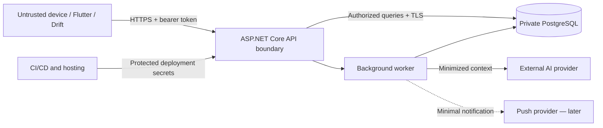
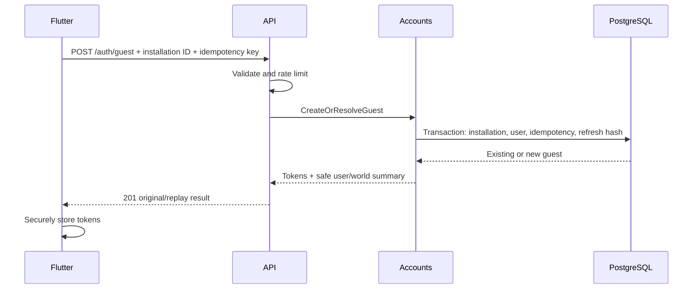
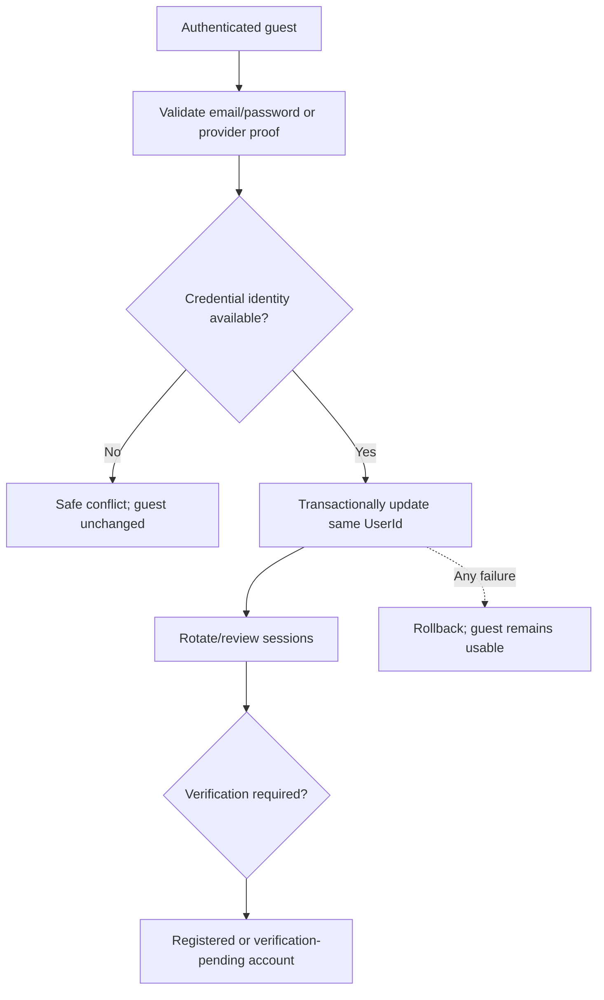
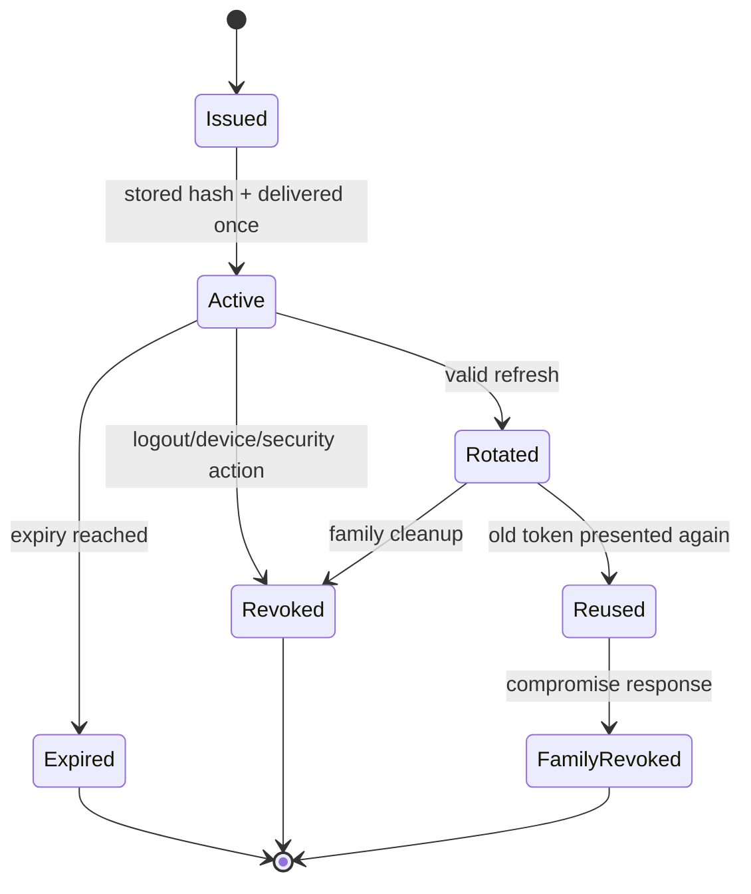
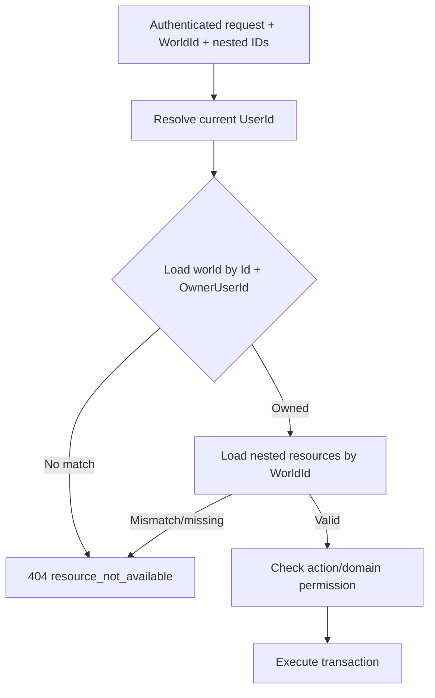
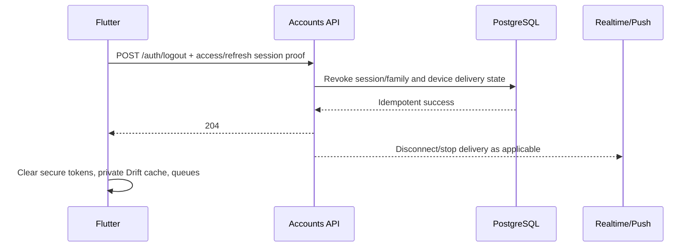
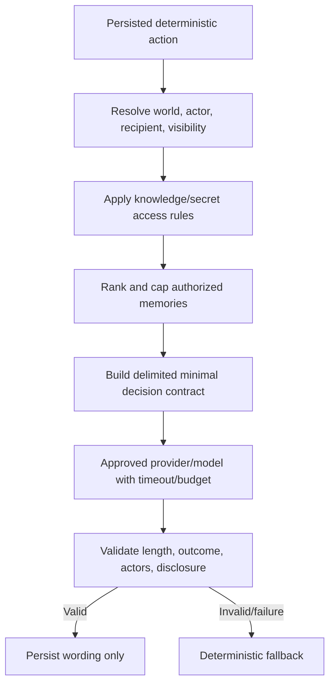
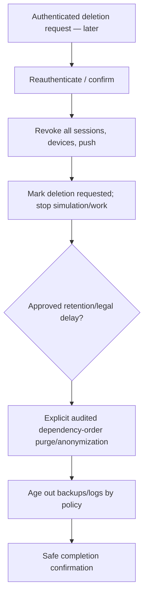

# Parallel World Security and Authentication Specification

This document is the authoritative security, privacy, authentication, authorization, token, device-session, abuse-prevention, secrets, logging, and account-evolution specification for Parallel World. Product scope, game mechanics, system boundaries, persistence, public API behavior, and Flutter behavior remain governed by their respective source-of-truth documents.

Release labels are **MVP**, **Version 1**, **Future**, and **Development-only**. This document defines controls; it does not authorize application implementation or deferred features.

## 1. Security principles

- Flutter, devices, networks, request identifiers, cached data, push payloads, and AI content are untrusted.
- The authenticated ASP.NET Core application boundary enforces ownership and action permission.
- PostgreSQL is never exposed directly to Flutter; every world-owned operation validates current ownership.
- Every nested actor/resource reference is validated against the authorized `WorldId`.
- Client-supplied `UserId`, actor kind, author, sender, outcome, score, seed, or AI instruction is never trusted.
- Security failures fail closed without revealing another user's resource existence.
- Secrets are never committed, returned to Flutter, or logged. Tokens and private-message bodies are never logged.
- AI providers receive the minimum authorized context and never control mechanics.
- Realtime and push are post-commit hints, never authorization or truth.
- Development shortcuts are environment-gated and absent from production.
- Controls remain practical for one developer: framework primitives, explicit policies, database constraints, and focused tests before new infrastructure.

## 2. Trust boundaries

| Zone | Trust and data crossing | Required controls | Failure behavior |
|---|---|---|---|
| User/device | Untrusted input, tokens, cached private data | Secure storage, validation, cache clearing, no embedded secrets | Reject/clear compromised session; cached data never authorizes |
| Flutter app | Modifiable/untrusted client | HTTPS, bearer tokens, opaque IDs, server ownership checks | Safe error/offline state |
| Public internet | Hostile transport | TLS/WSS, valid certificates, size/rate limits | Fail closed; no plaintext fallback |
| ASP.NET Core API | Authentication/authorization boundary | Token validation, use-case ownership, validation, ProblemDetails | Sanitized response and correlated log |
| Background worker | Trusted process, untrusted persisted payload references | Re-resolve world/resource scope, leases/idempotency | Retry/contain without duplicate mechanics |
| PostgreSQL | Authoritative private store | Private network, TLS where supported, least privilege, constraints, backups | Transaction rollback; no client fallback authority |
| AI provider | External/untrusted processor | Backend-only key, minimized delimited input, output validation, budget/timeout | Deterministic fallback; mechanics remain committed |
| Push provider | External delivery service | Minimal payload, device-scoped token, no sensitive body | Persisted notification remains truth |
| Object storage | Future external data store | Signed/safe URLs, type/size checks, least privilege | Feature unavailable; no access broadening |
| CI/CD/hosting | Privileged operational systems | Protected secrets, least privilege, reviewed deployments/audit | Rotate/revoke and halt affected deployment |

### Diagram 1 — trust boundaries



## 3. Threat model

### Matrix 1 — threats and mitigations

| Threat/asset | Attack path | Prevention | Detection | Containment/recovery | Phase |
|---|---|---|---|---|---|
| Stolen access token/world data | Device/log/network theft | TLS, secure storage, short expiry, no logs | Unusual auth failures/use where privacy-approved | Expiry; revoke session/keys after compromise | MVP |
| Stolen refresh token/account | Device extraction | Secure storage, hash at rest, rotation/device binding | Reuse event, abnormal refresh | Revoke family/device; require recovery | MVP |
| Refresh replay | Reuse rotated token | Atomic one-time rotation and family chain | Explicit reuse signal | Revoke active descendants/family | MVP |
| Compromised/modified client | Forge fields/flows | Server authorization/domain rules; no app secrets | Validation/ownership/rate telemetry | Reject, revoke session/device | MVP |
| Changed WorldId/ActorId | Guess another ID | Owner+world query and same-world FK/use-case validation | Ownership-safe failures | 404, investigate repeated probes | MVP |
| Cross-world messages/relationships | Nested foreign ID | Composite constraints and application checks | Integration tests, safe error metrics | Reject transaction | MVP |
| Duplicate writes/simulation | Replay or worker retry | Idempotency records, unique keys, cursor locks | Duplicate/conflict metrics | Return prior result; stop overlapping interval | MVP |
| Simulation/AI cost abuse | Repeated expensive calls | User/device/IP limits, budgets, durable work dedupe | Rate/budget/queue metrics | 429, temporary restriction, provider disable | MVP |
| Prompt injection | Hostile post/message/memory | Delimit as data, minimize context, fixed decision contract | Output validation/fallback metrics | Discard output; deterministic fallback | MVP |
| Oversized/malformed input | Resource exhaustion/injection | Body/field limits, enum/UUID/cursor validation, text rendering | Validation/rate metrics | 400/429; temporary throttle | MVP |
| Sensitive logs | Bodies/tokens/prompts recorded | Denylist/redaction and body logging off | Log review/scanning | Remove access, rotate exposed credentials, purge where possible | MVP |
| Sensitive push | Body/secret on lock screen | Generic minimal payload and authenticated refetch | Delivery review/tests | Disable category/provider; revoke tokens | Version 1 |
| Guest farming/takeover | Automated installs/token theft | Guest quotas/rate limits; installation not auth | Creation/reuse anomalies | Throttle/revoke; guest-loss warning | MVP |
| Upgrade confusion | Email/provider linked to wrong user | Authenticated transactional same-user upgrade, uniqueness, verification | Conflict/audit events | Roll back; revoke new sessions; recovery | Version 1 |
| Password attacks | Brute force/stuffing/reset abuse | Adaptive framework hash, rate limits, generic responses, optional MFA later | Failed-login/reset signals | Temporary account-aware throttle; session revoke | Version 1 |
| External linking error | Unverified issuer/audience/subject | Backend validation, nonce, unique provider subject, explicit linking | Link conflicts/audit | Unlink/revoke and recovery review | Later |
| Dev endpoint exposure | Production route/config mistake | Environment gating, auth, production route/OpenAPI absence | Deployment/security tests | Disable route, rotate affected secrets, audit | Development-only |
| Backup/database leakage | Storage/operator compromise | Managed encryption, access control, encrypted backups where available | Provider/access audit | Revoke credentials, restore policy, incident response | MVP |
| CI secret leakage | Logs/artifacts/dependency compromise | Encrypted secrets, least privilege, no echo, pinned/reviewed actions | Secret scanning/audit | Rotate secret, revoke workflow token, rebuild | MVP |
| Dependency compromise | Malicious/vulnerable package | Minimal maintained dependencies, lockfiles, review/scanning | Advisory/CI findings | Remove/update, rotate exposed secrets | MVP/later |

No control assumes UUID secrecy, app obfuscation, CORS, root detection, or IP address alone is an authorization boundary.

## 4. Data classification

“Low sensitivity” below means visible inside one private world, not public on the Internet.

### Matrix 2 — data classification

| Class/examples | Storage/access | Logging/retention | Transmission/AI eligibility |
|---|---|---|---|
| World-visible fictional: character profile, world post, fictional event | PostgreSQL; owned world only; optional Drift cache | No content logging by default; product retention | TLS; AI only when required by persisted decision |
| Private: messages, relationships, memories, secrets, promises, email, device details | PostgreSQL; strict module/world/knowledge access; minimized cache | Bodies/secrets denied; duration open by category | TLS; AI only authorized minimal subset; email/device IDs never |
| Sensitive operational: token/password hashes, signing/API/database/push credentials | Protected server/secret manager; least privilege; tokens in secure mobile storage | Values never logged; rotate/expire by policy | Never sent to AI/push/Flutter except one-time raw session token issuance |
| Diagnostics: correlation/error codes, safe IDs, latency, token counts, fallback state | Protected logs/diagnostic tables | Content-free, access-controlled, duration open | Provider-neutral telemetry only; no private prompt/response |

## 5. Authentication phases

- **MVP:** random installation identity, guest `User`, one exposed owned world, short-lived access token, rotating refresh token, current-device logout. Authentication exists for ownership/cloud persistence, not multiplayer.
- **Version 1:** email registration/login, same-user guest upgrade, verification/recovery method, multiple devices, richer session revocation.
- **Later:** verified Google/Apple providers, explicit account linking, stronger device management, optional MFA if risk justifies it.

The database may support multiple owned worlds, but PRODUCT.md/API_CONVENTIONS.md expose one playable MVP world.

## 6. Guest authentication

1. Flutter securely loads or creates a cryptographically random installation public ID.
2. It calls `POST /api/v1/auth/guest` with platform/app version and stable idempotency key.
3. API applies payload validation and per-installation/IP guest-creation limits.
4. In one idempotent use case, Accounts resolves/creates the installation and guest user, then persists the user-scoped idempotency result.
5. API issues access and refresh tokens and returns the current world summary when present.
6. Flutter stores tokens/installation identity securely; installation identity alone never authenticates later requests.

Repeated identical requests return the recorded result/current guest identity where valid. A different fingerprint with the same key returns the API idempotency conflict. Installation ID is never logged or displayed.

A guest may be unrecoverable if both device storage and usable refresh credentials are lost before registration. MVP must communicate this limitation without forcing registration.

### Diagram 2 — guest authentication



## 7. Registered-account authentication

Version 1 supports an approved email/password or recovery-first method, email verification as decided, login, password reset/magic link, session revocation, multiple devices, and later external providers. Responses do not reveal whether an email exists. Credentials are transmitted only over TLS and never stored reversibly or logged.

## 8. Guest-account upgrade

Upgrade is an authenticated, idempotent, transactional mutation of the existing guest `User`:

1. Revalidate the current guest session and submitted registration/provider proof.
2. Normalize and enforce unique credential/provider identity.
3. Lock/recheck the user and reject parallel/conflicting upgrades.
4. Attach verified credentials and change account state without changing `UserId`.
5. Preserve worlds, actors, posts, messages, relationships, memories, and history.
6. Rotate current refresh credentials; other guest sessions follow the approved revocation policy.
7. Commit completely or leave the guest account usable and unchanged.

An email/provider already attached elsewhere returns a safe conflict; records are never copied or merged implicitly.

### Diagram 3 — guest-account upgrade



## 9. Access tokens

Use a signed JWT or later accepted equivalent. Exact algorithm, key storage, and lifetime remain open, but implementation must:

- Use an explicit server allowlist for algorithm/key; never trust token-declared algorithm alone.
- Validate signature, issuer, audience, expiry/not-before, key identifier, and small configured clock skew.
- Keep lifetime short; embed only stable user subject, session/token version identifier when useful, and minimal account-state claim when required.
- Never embed refresh token, email/private profile, owned WorldIds, roles that replace current authorization, or game state.
- Rotate signing keys with overlap for currently valid tokens and emergency revocation procedure.

World ownership is loaded from current server data. Ordinary logout revokes refresh/session state; a previously issued access token may remain valid until short expiry unless a high-risk use case also checks server session version. This limitation must be tested/documented.

## 10. Refresh tokens

Refresh tokens are high-entropy random bearer values. Only a one-way hash is stored; plaintext is returned once through TLS and kept in Flutter Secure Storage. Each record is associated with user, device installation, rotation family, expiry, revocation/replacement state, and timestamps.

Rotation is atomic:

1. Receive token in body—not URL—and never log it.
2. Hash/look up and lock the record.
3. Verify token, user/session, device, expiry, revocation, and replacement state.
4. Mark old token rotated/replaced and insert a new hashed token.
5. Commit, then return new access/refresh tokens.
6. Reuse of a rotated token is a security event: revoke the active family/descendants and require session recovery.

Flutter single-flight refresh reduces legitimate concurrent reuse. Strict replay containment is the safe baseline; any bounded retry-grace design requires a reviewed decision and must not allow an attacker to reuse a token.

### Diagram 4 — token lifecycle



### Diagram 5 — refresh rotation and reuse

```mermaid
sequenceDiagram
    participant F as Flutter
    participant A as Accounts
    participant P as PostgreSQL
    F->>A: Refresh token once
    A->>P: Hash, lock, validate token/device/family
    P-->>A: Active token
    A->>P: Transaction: revoke old + insert new hash
    A-->>F: New access + refresh token
    F->>A: Old token replayed
    A->>P: Detect replaced token; revoke family descendants
    A-->>F: 401 refresh_token_reused
```

## 11. Device installations

One installation record represents one app installation and records user association, installation public ID, platform, app version, last seen, created/revoked state, and later push token. Installation ID and push token are locators, not credentials.

- Device revocation blocks future refresh and later push delivery.
- Account switch/log out clears or separates local tokens, private cache, queues, and realtime subscriptions.
- A device has one active account association unless a future multi-account design explicitly changes it.
- Push tokens rotate/update independently and never establish identity.
- Lost-device remote management is Version 1; an unregistered guest who loses all credentials may be unrecoverable.

## 12. Session lifecycle

### Matrix 3 — token/session lifecycle states

| State | Entry | Allowed behavior | Exit/security action |
|---|---|---|---|
| Active | Valid refresh/device and issued access token | Protected requests subject to authorization | Refresh, logout, expiry, revocation |
| Refreshing | Access renewal started | One server rotation; Flutter single-flight | Active or terminal failure |
| Expired | Token time elapsed | Access denied; refresh only if refresh active | Active after refresh or unauthenticated |
| Revoked/logged out | Explicit current/all-device action | No refresh; access ends by expiry/session check | New authentication |
| Suspicious/reuse | Rotated token replay/anomaly | Deny refresh | Revoke family/device; recovery |
| Device revoked | Device/session action | No refresh/push | Reauthentication/re-registration if permitted |
| Upgrade-pending | Credential verification incomplete | Guest-safe behavior per approved policy | Registered or rollback/expiry |

Password change, compromise, guest upgrade, account deletion, and logout-all revoke the configured session scope. Exact device/session limits and user-facing management are open.

## 13. Authorization

Authorization layers are authentication, current user resolution, world ownership, resource ownership, same-world nested reference validation, action permission, and domain-state validation. Endpoint attributes alone are insufficient; application use cases enforce the same boundary.

### Matrix 4 — endpoint authentication requirements

| Endpoint class | Authentication | Additional security |
|---|---|---|
| `/auth/guest` | Public bootstrap | Installation/IP rate limits and idempotency |
| `/auth/refresh` | Refresh bearer in body | Device/family/rotation validation and rate limit |
| `/auth/login`, reset, verification | Public/mixed, Version 1 | Generic responses, credential proof, stricter limits |
| `/auth/upgrade`, `/auth/logout` | Access token | Current-user session checks and idempotency/revocation |
| `/worlds/{worldId}/...` | Access token | Owner query plus same-world nested resources |
| `/devices...` | Access token, Version 1 | Current-user installation ownership |
| `/hubs/world` | Access token | Authorize every subscribed world/group |
| `/dev/...` | Authenticated Development-only | Environment gate, strong authorization, absent in production |
| `/health/live`, `/health/ready` | Deployment policy | Minimal output; no secrets/configuration |

The player can act only as the owned player actor. Clients cannot submit character-authored content, relationship values, romantic outcomes, memories, simulation actions, system events, or internal AI calls.

## 14. World ownership

Canonical rule:

```text
Authenticated UserId + requested WorldId
-> query GameWorld where Id = WorldId and OwnerUserId = UserId
-> authorize world-scoped use case
```

UUID opacity is irrelevant. A route `WorldId` is a locator, and owned-world results are derived from current PostgreSQL state. The MVP exposes one world while the long-term model permits more.

### Diagram 6 — world ownership authorization



## 15. Actor and resource ownership

- Player actor belongs to the owned world and is the only client-controlled actor.
- Character actors belong to the world; System actor is server-only.
- Author/sender/notification recipient and mechanical fields are derived server-side.
- Conversation access requires the owned world and player participation.
- Relationships, romance, memories, events, summaries, trends, and simulation targets must match the authorized world.
- Globally unique IDs do not remove the ownership check.

## 16. Cross-world protection

Protection exists at API authorization, application use-case validation, PostgreSQL composite world-aware foreign keys/uniques, and integration tests. All new world-owned tables carry non-null `WorldId` as DATABASE.md requires.

### Matrix 5 — ownership checks by resource type

| Resource/reference | Required ownership checks |
|---|---|
| Post parent/quote/reaction | Route world owned; post, parent/quote, actor all same world |
| Follow | Owned player follower; target actor same world; self-follow rejected |
| Conversation/message/read cursor | Conversation same world and includes player; sender derived; referenced message belongs to conversation/world |
| Relationship/romance/history | Both actors same world; shared pair status canonical; client cannot mutate values/status |
| Memory/secret/promise | World and character/actor provenance valid; knower/access rules enforced; no broad client endpoint |
| Simulation/action/target | Owned active world; internal authorized trigger; target resources same world; interval idempotent |
| Notification/summary | Recipient owns world; linked resources same world and safe for player visibility |
| Trend/world/life event | Same authorized world; Version 1 release gate |

Cross-user or cross-world lookup returns ownership-safe `404 resource_not_available`; known owned-resource action denial may use `403` exactly as API_CONVENTIONS.md defines.

## 17. Password handling

Passwords are deferred from MVP. When introduced, use ASP.NET Core Identity or another reviewed framework implementation with adaptive one-way hashing, unique salts, framework verification, upgradeable parameters, sensible length/compromised-password controls, and no custom cryptography.

Passwords and reset proofs travel only over TLS and are never logged, stored reversibly, returned, or sent to other providers. Avoid arbitrary composition rules that encourage weak patterns. Reset tokens are random, hashed/protected at rest, short-lived, single-use, purpose/user-bound, and invalidate according to the approved session policy.

## 18. External identity providers

Google/Apple are later features. Backend—not Flutter—validates signature, issuer, exact audience/client ID, expiry, nonce/state where applicable, and provider subject. Provider subject is unique per provider. Email claims are trusted only according to verified-provider rules; profile fields from Flutter never establish identity.

Linking requires an authenticated current account plus fresh provider proof, explicit conflict handling, and audit event. Never auto-merge two users/worlds based only on matching email. Revocation and provider-account loss feed the approved recovery process.

## 19. Account recovery

Version 1 recovery method—password reset, magic link, or both—is open. Any flow must use generic request responses, rate limits, short-lived single-use purpose-bound proof, verified destination/provider, atomic credential update, session revocation/rotation, and a safe completion notification.

Recovery must not reveal account existence or transfer worlds to a new `UserId`. Guest-only accounts have no remote recovery guarantee before registration. Support/admin override is not assumed; any later override requires strong operator auth, audit, least privilege, and explicit product/privacy approval.

## 20. Logout and revocation

Current-device logout authenticates the caller, atomically revokes the presented refresh session/family as designed, unregisters/marks device delivery state as needed, and returns idempotent success. Flutter then clears secure tokens, private cache, pending operations, and realtime state. An access token may remain cryptographically valid until short expiry unless the endpoint/use case performs server session-version checks.

Logout-all/session management is Version 1. Lost/compromised device response revokes the device and all associated refresh descendants. Password/recovery/upgrade/account deletion rotate or revoke sessions per policy.

### Diagram 7 — logout and session revocation



## 21. Rate limiting

Use endpoint policies with per-user limits after auth, per-installation limits for guest/device flows, and per-IP fallback—stricter for anonymous requests. IP is an abuse signal, not identity; avoid permanent IP-only lockout.

- Auth: guest creation, login, refresh, reset, verification resend.
- Content: post, reply, reaction, follow, message.
- AI-heavy: message reply generation, world resume/catch-up, Development-only simulation, any future regeneration.
- Operational: dev endpoints and push registration; health probes are separately controlled.

Return `429` ProblemDetails, stable `rate_limit_exceeded` or `ai_generation_limit_reached`, and `Retry-After`. Exact numbers, distributed strategy, IP metadata retention, and user-visible quota UX remain configurable/open. Limits do not disclose internal AI budgets.

## 22. Abuse prevention

Layer rate limits with API size limits, GAME_RULES.md cooldowns/caps, idempotency, unique constraints, device/account creation quotas, AI token/cost budgets, bounded retries, malformed-cursor handling, and monitoring.

Spam posts/message flooding/date-invitation repetition are constrained by endpoint limits plus authoritative game/domain rules. Simulation spam cannot choose seed/action/outcome and reuses interval idempotency. Repeated invalid IDs remain ownership-safe and may be throttled. Private-world scraping is limited by auth, ownership, cursors, and rates. Temporary account/device controls require safe recovery; do not permanently lock on IP alone.

## 23. AI-provider security

- Provider credentials, selection, and calls remain backend-only.
- Use provider/model allowlists, timeouts, output/token/cost limits, bounded retry, and durable idempotent work.
- Send only authorized minimized context for a persisted already-decided action.
- Treat provider output as untrusted text; validate length, actor/target/outcome, disclosure, format, and prohibited claims.
- Provider failure/invalid output uses deterministic template fallback where supported and never rolls back/reapplies mechanics.
- Persist only provider-neutral status, hashes, latency/token usage, fallback state, and safe errors—no full sensitive prompt/raw response.
- Provider instructions/output cannot invoke tools, commands, queries, or mechanical mutations.

## 24. Prompt and context minimization

Player text, posts, messages, selected memories, and world text are untrusted data, never system instructions. Use separated structured sections and a fixed system/developer contract. Do not claim prompt injection is eliminated; contain its impact through least context and output validation.

Allowed when the persisted decision contract requires it: character voice/personality summary, current mood, decided topic/stance/tone/intent, safe relationship summary, the source message/content necessary for the action, authorized world-event summary, and up to `MAX_MEMORIES_PER_AI_REQUEST` selected memories.

Never send access/refresh tokens, email, device/install/push identifiers, unrelated account/profile data, secrets unknown to the character/recipient, unrelated memories, raw diagnostics, formulas/hidden thresholds, provider credentials, or full conversation history.

**Recorded conflict:** the task request generally allows “last few relevant messages,” while GAME_RULES.md section 18 permits only the persisted decision contract plus bounded authorized memories and forbids full-history prompting. This document preserves GAME_RULES.md: only the source message or excerpts explicitly persisted as part of the approved decision contract may be used. Broader conversational context requires prior correction of GAME_RULES.md and ARCHITECTURE.md.

### Diagram 8 — AI context minimization



## 25. Secrets management

Secrets include database connection string, JWT signing material, AI/push/object-storage/email credentials, external OAuth client secrets, and privileged CI/deployment tokens.

- Local development: user-secrets or ignored local environment source.
- CI/CD: encrypted environment/repository secrets with least-privilege scopes and no fork exposure.
- Production: hosting secret manager or protected environment variables.
- Flutter/assets/committed configuration: public values only.

Never commit, print, return, package, or place secret values in examples. Document names only. Rotate on schedule/incident, validate presence without value, separate environments, minimize principals, and remove unused credentials.

## 26. Logging and telemetry

Use structured sanitized events and production-appropriate levels. Correlation ID is not authentication. User/world identifiers are pseudonymized or included only when operationally necessary and protected.

### Matrix 6 — logging allow/deny examples

| Allowed when necessary | Prohibited |
|---|---|
| Safe route template, method, status, duration | Authorization headers; access/refresh/reset tokens |
| Correlation ID, deployment version, safe error/reason code | Passwords, secrets, signing/provider/database credentials |
| Simulation run/action IDs, counts, duration, fallback state | Private-message bodies, full post/draft content |
| Provider/model identifier, latency and token counts | Full prompts/raw private provider responses |
| Durable work state/attempt count, sanitized failure category | Character secrets, promise text, hidden memories/relationship values |
| Privacy-approved pseudonymous user/world/session ID | Installation/push tokens and unnecessary personal/IP data |

Request/response body logging is off by default. Redaction happens before sinks. Logs have least-privilege access, retention/deletion policy, and no silent debugging escalation in production. Security signals include refresh reuse, repeated ownership probes, auth/rate failures, dev-route attempts, provider budget/fallback anomalies, and secret-scanner findings.

## 27. Private-message privacy

Messages belong to one private world and a player/AI-character conversation. Server services process only as required for persistence, deterministic rules, authorized memory selection, and wording. Message bodies are never logged; push previews omit them by default; diagnostics reference IDs/hashes/status only.

Flutter caches only what user experience needs and clears/separates it on logout/account switch/deletion/reset. Support/admin access is not implicit. Message retention and optional field-level encryption are open; do not claim encryption not implemented.

## 28. Memory and secret privacy

Internal memories are not broadly exposed to Flutter. Player-visible shared/relationship history is a sanitized projection. Secrets are available only to recorded knowers and purposes/recipients allowed by game rules. Promise/secret/memory provenance and all actor references are same-world constrained.

AI retrieval applies character knowledge and secret restrictions before ranking. Logs, summaries, realtime, notifications, push, and errors must not reveal hidden secret text, motivation, attraction, or memory. An AI output that discloses unauthorized content is rejected and replaced by safe fallback.

## 29. Data at rest

- Use managed PostgreSQL/storage encryption and encrypted backups where the selected provider offers/configures them; verify rather than assume.
- Keep database/backup access private and least-privileged; test restore access controls.
- Store refresh/password/reset credentials only as approved hashes/protected tokens.
- Store runtime credentials in secret management, not database/application source unless specifically designed.
- Store Flutter bearer tokens in platform secure storage; Drift contains scoped cached private data but is not assumed encrypted.

Private-message field-level encryption and Drift encryption are deferred security decisions. Field encryption would reduce database/backup/operator exposure but complicates querying, generation, key rotation, and recovery; it does not replace authorization.

## 30. Data in transit

Production requires HTTPS and WSS with valid certificates. Plain HTTP is local-development-only and environment-bound. Use TLS to managed PostgreSQL and AI/push/object providers where supported/required. Never put tokens or private text in URLs/query parameters. Do not follow redirects that could forward authorization to an untrusted host.

Certificate pinning is not initially required because rotation/operational risk may exceed benefit; revisit only with a threat/risk decision.

## 31. Mobile-client security

Flutter is untrusted and contains no backend signing, AI, database, push-server, storage, or OAuth client secret. Access/refresh tokens and installation identity use secure storage; ordinary preferences/Drift never store tokens. Obfuscation and root/jailbreak detection are optional defense signals, not security boundaries.

Deep/app links and push IDs are untrusted locators and require authenticated API fetch/ownership validation. Clear or isolate tokens/cache/queues/realtime/navigation on logout/account switch. Do not prevent screenshots unless a later product risk decision requires it. Production builds disable verbose networking and debug/dev endpoints.

## 32. Local cache and secure storage

Drift contains account/world-scoped cached private data, drafts, cursors, and approved pending operation metadata. Cache never bypasses token validation or becomes authoritative. Corruption may reset replaceable cache; reset must not silently erase secure credentials or claim pending success.

Tokens remain separate in secure storage. On logout/account switch/deletion/local reset, clear private cache and safely remove/cancel pending writes. Failed items retain only user-required content and safe error metadata. Exact cache/message retention, terminal operation retention, and encryption remain open and must match FLUTTER_GUIDELINES.md.

## 33. Push-notification privacy

Push is Version 1/later. The database Notification is truth; provider payload is a minimal untrusted delivery hint. Default previews omit message bodies and use generic language for romance/secrets. Taps authenticate, authorize world, and refetch.

Push token is device-specific, protected server-side, updated/rotated/revoked, never identity, never logged, and removed on device/account deletion. Revoked devices receive no future delivery. Respect platform lock-screen privacy and later approved quiet-hour/category settings.

## 34. Input validation

Validate transport and explicit DTOs for UUIDs, strings/normalization, documented lengths, enums, UTC/date ranges, opaque cursor, idempotency key/fingerprint, handles, and later email/password/file metadata. Unknown request fields and malformed JSON follow API_CONVENTIONS.md.

Reject oversized bodies, dangerous control characters where relevant, invalid nested/cross-world IDs, unsupported enum/state transitions, malformed/tampered cursors, and server-controlled ownership/mechanical fields. Render user/AI text as text by default; do not render raw HTML/script. Database constraints are a final boundary, not primary user validation.

## 35. File and media security later

Media is deferred. When approved: upload through authenticated backend flow; authorize world/resource; cap content length and decoded dimensions; verify file signature/type rather than extension; normalize safe names; store outside executable paths; scan where risk warrants; strip risky metadata; use least-privilege object access and short-lived signed/safe URLs; prevent SVG/script/polyglot abuse; isolate processing; and define deletion/retention.

Do not design video or public media delivery for MVP.

## 36. CORS and transport security

Flutter mobile does not rely on CORS. Configure only environment-specific trusted origins needed by approved browser/tooling clients; never wildcard origins with credentials. Preflight and CORS do not authenticate users. A future web client requires explicit CSRF/cookie/storage review; bearer mobile contracts must not be assumed safe unchanged.

Production applies TLS/WSS, secure headers appropriate to any browser surface, host/proxy forwarding validation, and no HTTP downgrade. Exact hosting/proxy policy is environment configuration.

## 37. Error handling and information disclosure

Use API ProblemDetails and stable codes: `401` missing/invalid auth; `403` only for known owned-resource permission denial; ownership-hidden/missing `404`; `409` idempotency/state/concurrency; `429` plus retry guidance; sanitized `5xx`.

Return no stack trace, SQL/constraint/provider secret, token detail, prompt, hidden resource existence, private content, or internal identifier not safe for the caller. Include validated server correlation/trace ID. Internal logs contain only sanitized context from section 26. Template fallback avoids exposing AI failures where it can satisfy wording safely.

## 38. Administrative and development endpoints

MVP has no general administrative gameplay/data API. `POST /api/v1/dev/worlds/{worldId}/simulate` is Development-only: disabled/absent in production routing and production OpenAPI, environment-gated, authenticated, strongly authorized, rate-limited, and still deterministic/ownership-scoped.

Never expose raw database query, arbitrary user/world lookup, token minting, raw prompt/provider proxy, secret/config dump, test-account creation, or debug exception endpoints. Any future support/admin access needs separate identity, least privilege, purpose limitation, immutable audit, approval, and privacy/retention policy.

## 39. Account deletion and data retention

Account deletion is later and follows database delete/retention constraints:

1. Authenticate and reauthenticate when approved/risk-relevant.
2. Revoke all sessions/devices/push delivery immediately.
3. Persist deletion request/state and apply any approved legal/safety delay.
4. Stop simulation/background generation for owned worlds.
5. Explicitly delete/anonymize account, worlds, messages, memories, relationships, notifications, diagnostics, and devices in dependency order.
6. Purge expired backups/logs according to disclosed retention capability.
7. Confirm completion without leaking data.

Private worlds have no real-user shared-content preservation requirement. Incidental cascade is prohibited; deletion is explicit/audited. Exact durations remain open for active/revoked refresh records, idempotency, messages, memories/history, notifications, AI diagnostics, durable work, logs, deleted-account delay, and backups.

### Diagram 9 — account deletion



## 40. Incident response expectations

For one developer, maintain a concise runbook and contact inventory. On suspected incident: contain affected route/provider/deployment; revoke token families/devices; rotate signing/provider/database/CI secrets; preserve necessary sanitized evidence; review logs/access; assess affected data/users; patch/test/deploy; restore/verify; notify providers/users/regulators when required; document timeline/root cause; and add regression tests/controls.

Do not destroy evidence casually or keep excess private data “just in case.” Prioritize credential revocation and world isolation. Record who/what/when for material actions without placing secrets in the incident record.

## 41. Security testing

Required automated/integration coverage:

- Authentication: guest create/replay/conflicting key, access expiry/claims, refresh rotation/concurrency/reuse/family revoke, logout/revocation/device revoke; upgrade/recovery later.
- Authorization: cross-user world and cross-world actor/post/parent/quote/reaction/follow/conversation/message/relationship/romance/memory/secret/promise/notification/summary/simulation targets.
- Input/error: malformed JSON/UUID/enums/cursors/idempotency, oversized/control text, safe `401/403/404/409/429/5xx`, no disclosure.
- AI: hostile prompt treated as data, memory/secret filtering, context cap, output cannot alter mechanics, invalid/provider failure fallback, budget/rate controls.
- Idempotency/concurrency: guest/world/post/message/date/simulation duplicates and overlapping intervals.
- Mobile: secure-token abstraction, single-flight refresh, cache/account-switch clearing, safe logs, deep-link/push reauthorization.
- Operations: production dev endpoint absent, secret/config validation, migration ownership constraints, backup/restore access controls where available.

Use real PostgreSQL-compatible integration tests for relational ownership/constraints. Never use production secrets/accounts or real AI in ordinary automated tests. Dependency policy includes maintained minimal packages, lockfiles, license/reputation review, CI vulnerability/secret scanning when selected, removal of unused packages, and review of native permissions/SDK telemetry.

## 42. Explicitly rejected insecure patterns

- Client-supplied `UserId`, `WorldId`, actor type, or UUID secrecy as authorization.
- Direct Flutter database/Supabase/AI/provider access or secrets in the app.
- Raw refresh tokens in PostgreSQL/logs/analytics; reusable nonrotating refresh tokens.
- Tokens/private messages/prompts/secrets/passwords in logs or URLs.
- Full chat history/unrelated memories sent to AI.
- AI output parsed into actions, scores, memories, relationships, or simulation state.
- Wildcard CORS with credentials or CORS as authentication.
- Mutating GET routes, public production dev/debug/admin endpoints, arbitrary query/prompt endpoints.
- Client-controlled relationship scores, romantic outcomes, simulation seeds/actions/results.
- Hardcoded production secrets or shared GitHub credential in scripts.
- App obfuscation, installation ID, push token, root detection, or IP address as an auth boundary.
- Permanent IP-only lockout, silent account merge, copying guest worlds to a new user during upgrade.
- Assuming storage/backup/field/cache encryption without verification/implementation.
- Realtime/push delivery as source of truth or authorization.

## 43. Open security decisions

1. Exact access-token format/algorithm, signing-key storage/rotation, lifetime, and clock skew.
2. Refresh-token lifetime, exact family scope per device/session, session/device limits, user-visible management, and whether a reviewed bounded concurrency grace ever supersedes the strict replay baseline.
3. Password versus magic-link registration/recovery and email-verification requirements.
4. External-provider order, linking UX, and MFA trigger if ever justified.
5. Guest-loss/recovery UX before registration.
6. Exact authentication/content/AI rate limits and temporary restriction behavior.
7. IP/device metadata collection and retention.
8. Message, memory/history, notification, AI diagnostic, idempotency, work, log, and backup retention.
9. Private-message field encryption and Drift encryption.
10. Account-deletion reauthentication, delay, backup purge, and confirmation policy.
11. Push preview/category/quiet-hours policy.
12. Admin/support access model; none exists by default.
13. Dependency, SAST/DAST, secret-scanning, SBOM, and vulnerability-scanning tools.
14. Hosting/provider-specific TLS, encryption, audit, backup, and incident contacts.
15. Whether selected high-risk requests check server session version before access-token expiry.
16. Broader conversational AI context; blocked by the recorded GAME_RULES.md conflict until corrected.

### Matrix 7 — MVP versus deferred security controls

| Control | MVP | Version 1/later |
|---|---|---|
| Guest identity, access/rotating refresh, device record, current logout | Required | Session/device management expansion |
| Server world/resource ownership and database constraints | Required | Same invariant for every new module |
| Rate/size/idempotency/AI budgets and safe fallback | Required | Tune/expand based on abuse telemetry |
| Secure storage, cache isolation/clearing, sanitized logs | Required | Optional approved cache encryption |
| Password/login/verification/recovery | Not implemented | Version 1 after decisions |
| Guest same-user upgrade | Contract/control defined, not MVP endpoint | Version 1 implementation |
| Google/Apple linking/MFA | Deferred | Later after decisions |
| SignalR | Milestone open; HTTP fallback | Authorized groups and resync when introduced |
| Push/FCM/device token delivery | Deferred | Version 1 with generic payload/refetch |
| Media/object storage security | Deferred | When media is product-approved |
| Account deletion UI/full purge automation | Policy defined, endpoint deferred | Implement after retention/legal decisions |
| Admin/support tooling | None | Only with audited explicit design |

### Final consistency checks

Before accepting security implementation, verify:

1. Guest ownership works without treating installation ID as authentication.
2. Upgrade preserves the same user/world data and rolls back atomically.
3. Access tokens are short-lived/minimal and world ownership uses current server data.
4. Refresh tokens are hashed, one-time rotated, device-associated, reusable only through detection/containment, and revocable.
5. Every world/resource/nested ID is server-authorized and cross-world constraints/tests reject links.
6. Flutter/Drift/realtime/push remain untrusted/cache-or-delivery-only.
7. Tokens, message bodies, memories, secrets, prompts, and credentials are absent from logs.
8. AI input is minimized/authorized and output cannot affect mechanics.
9. Rate limits and budgets cover guest/auth/content/simulation/AI-heavy operations.
10. Dev/admin/debug endpoints cannot ship publicly to production.
11. Deletion/retention/backup limitations are explicit and not overstated.
12. Cross-user/world, token replay, idempotency, input, AI, mobile-clearing, and production-gating tests exist.
13. No real-user social interaction or shared-world access was introduced.
14. Deferred authentication/push/media/admin features are not MVP requirements.
15. Controls remain feasible for the modular monolith and one developer.
