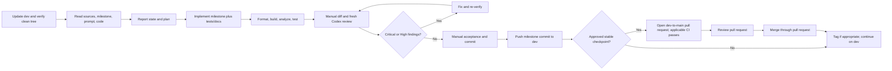
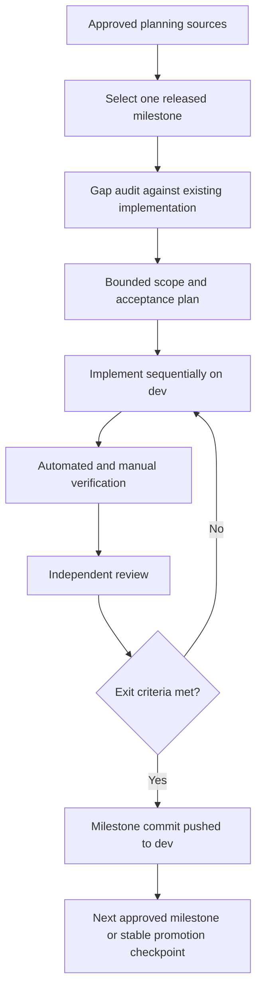
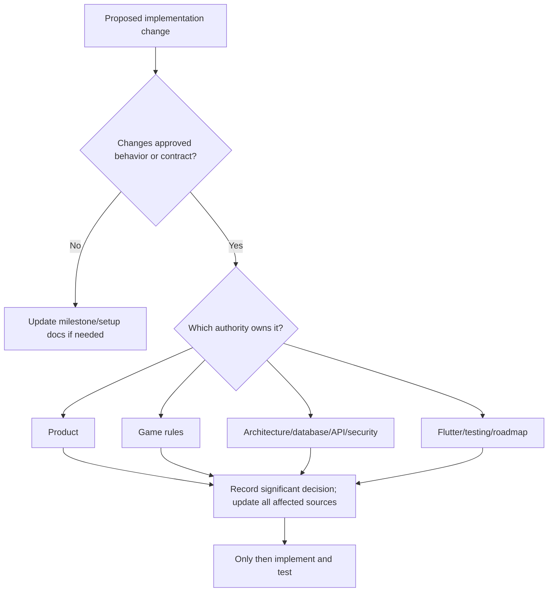
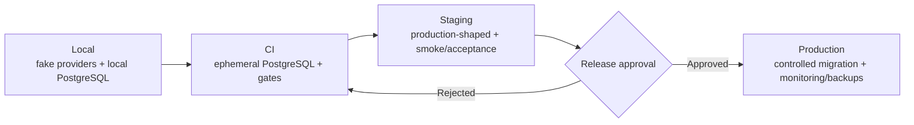
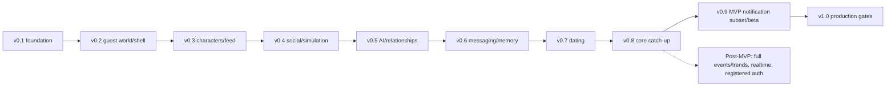
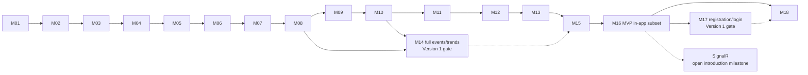

# Parallel World Development Plan

This document is the authoritative implementation roadmap for Parallel World. It sequences approved work into reviewable milestones; it does not authorize code by itself. Product scope, game mechanics, architecture, persistence, API, security, Flutter practice, and verification remain owned by their higher-priority source documents.

Release labels are **MVP**, **Version 1**, **Future**, and **Development-only**. “Core loop complete” means the player journey is demonstrable; it does not mean production-ready or that every MVP quality gate has passed.

## 1. Development objectives

1. Deliver small, visible, independently testable vertical slices.
2. Preserve private single-player worlds: no real-user interaction and no cross-world access.
3. Keep deterministic rules authoritative and AI limited to wording.
4. Keep PostgreSQL authoritative and Drift cache-only.
5. Align backend, database, Flutter, security, documentation, and tests within each milestone.
6. Minimize integration risk with migrations, contract tests, ownership tests, and review before merge.
7. Keep the roadmap achievable by one developer using Codex without speculative infrastructure.

## 2. Scope-control principles

- Execute one milestone at a time on the persistent `dev` development and integration branch.
- Do not implement later-milestone or deferred features early, including “foundation” that has no current acceptance need.
- Avoid unrelated refactoring and preserve unrelated user changes.
- Justify every dependency; do not add a package for convenience alone.
- Every schema change uses a reviewed EF Core migration and PostgreSQL verification.
- A game-rule change updates `GAME_RULES.md`; an API contract change updates `API_CONVENTIONS.md`; an architecture change requires an accepted ADR; security-sensitive work reviews `SECURITY.md`; Flutter-pattern changes review `FLUTTER_GUIDELINES.md`.
- Required tests and documentation are part of milestone scope, not cleanup afterward.
- Do not merge with unresolved Critical or High review findings.
- Never claim an unrun build, test, migration, scan, or manual check passed.
- When a lower-priority instruction conflicts with an approved source, stop, preserve the approved rule, and report the conflict.

## 3. Source-of-truth hierarchy

### Table 1 - authority and precedence

| Priority | Source | Authority |
|---:|---|---|
| 1 | `AGENTS.md` | Repository-wide governance and invariants |
| 2 | `docs/product/PRODUCT.md` | Product/release scope and exclusions |
| 3 | `docs/game-design/GAME_RULES.md` | Mechanical rules and transitions |
| 4 | `docs/architecture/ARCHITECTURE.md` | System/module boundaries and lifecycles |
| 5 | `docs/architecture/DATABASE.md` | Persistence integrity and migrations |
| 6 | `docs/architecture/API_CONVENTIONS.md` | Public HTTP/realtime contracts |
| 7 | `docs/architecture/SECURITY.md` | Security, privacy, authentication, and secrets |
| 8 | `docs/development/FLUTTER_GUIDELINES.md` | Mobile structure, state, cache, and UX patterns |
| 9 | `docs/development/TEST_STRATEGY.md` | Verification and quality gates |
| 10 | `docs/development/DEVELOPMENT_PLAN.md` | Sequence, dependencies, and roadmap |
| 11 | `docs/milestones/` | Milestone checklists and acceptance |
| 12 | `codex/*-prompts/` | Working instructions |
| 13 | Existing implementation | Current state to inspect, not authority over approved behavior |

`docs/development/DECISIONS.md` records accepted decisions and supersession history. It interprets but does not silently override higher-priority documents; an accepted change must update every affected authoritative document. Any lower-priority conflict stops implementation until reported or corrected.

## 4. Development workflow

The exact milestone loop is:

1. Update local `dev` from the approved repository state.
2. Confirm a clean working tree.
3. Confirm the active branch is `dev` (or an explicitly chosen optional short-lived branch for isolated or risky work).
4. Read `AGENTS.md` and relevant documentation.
5. Read the milestone checklist.
6. Read the corresponding implementation prompt.
7. Inspect the existing implementation.
8. Report current state.
9. Present a short implementation plan.
10. Implement only missing milestone scope.
11. Add or update tests.
12. Run formatting, build, analysis, and relevant tests.
13. Review the diff manually.
14. Run a fresh Codex review prompt.
15. Fix Critical and High findings.
16. Re-run verification.
17. Perform manual acceptance checks.
18. Commit.
19. Push `dev`.
20. Record the milestone as complete on `dev`; a pull request is not required after every milestone.
21. Start the next milestone only after the previous milestone is stable on `dev`.
22. At an approved stable checkpoint, open a pull request from `dev` into `main`.
23. Require all applicable CI checks to pass.
24. Review the pull request, including the required independent Codex diff review.
25. Merge through the pull request and tag a release when appropriate.

A milestone is complete on `dev` after its acceptance criteria and verification pass, its diff is reviewed, and its milestone-specific commit is pushed. Promotion to stable/release-ready `main` is separate and requires the `dev`-to-`main` pull-request workflow. A reviewed local merge is not an accepted alternative to that promotion pull request.

## 5. Branching and commit workflow

`main` is stable/release-ready. `dev` is the persistent active development and integration branch, and milestones are implemented sequentially there. Do not perform feature development directly on `main`. Short-lived branches such as `feature/<short-description>` may be used for isolated or risky work, but are optional and must integrate back into `dev`. Bug-fix branches use `fix/<short-description>` and documentation branches use `docs/<short-description>` when a separate branch is useful.

### Table 2 - branch roles

| Branch | Role |
|---|---|
| `main` | Stable/release-ready; accepts approved promotion from `dev` through pull request |
| `dev` | Required persistent branch for sequential milestone development and integration |
| `feature/<short-description>` | Optional short-lived branch for isolated or risky work; integrates into `dev` |

Use focused milestone-specific conventional commits, for example `feat(m01): bootstrap repository`, `feat(m03): add guest session flow`, `feat(m06): add cursor-paginated feed`, `feat(m08): add deterministic action engine`, `feat(m11): add private character conversations`, `test(security): cover cross-world access`, `fix(memory): prevent duplicate memory creation`, and `docs(workflow): adopt dev-main promotion`. Each commit should build where practical; do not mix unrelated formatting or future work.

## 6. Milestone execution process

Each milestone begins with an evidence-backed gap audit and ends with measurable exit criteria. “Already implemented” items are verified rather than rewritten. Scope is split further if one diff cannot be reviewed safely by one developer. Database and public-contract changes land with their migration/documentation/tests in the same milestone.

## 7. Review process

After each implementation prompt: verify acceptance criteria; run milestone tests; perform general diff review; run database, security, simulation, Flutter, or release review when relevant; fix all Critical/High findings; record deferred Medium/Low findings; re-run verification; create the milestone-specific commit, and push `dev` only when exit criteria pass. At an approved stable checkpoint, promote `dev` to `main` only through the required pull request. Use a fresh Codex session for independent review where practical.

### Table 3 - required reviews

| Milestones | General | Database/ownership | Security | Simulation | Flutter | Release |
|---|---:|---:|---:|---:|---:|---:|
| M01-M02 | Yes | M02 | M02 | No | M01 | No |
| M03-M04 | Yes | M03 | Both | No | M04 | No |
| M05-M07 | Yes | Yes | Ownership/privacy | M07 rule effects | Yes | No |
| M08-M09 | Yes | Yes | AI/context | Yes | As affected | No |
| M10-M13 | Yes | Yes | Privacy/romance | Yes | Yes | No |
| M14-M16 | Yes | Yes | Realtime/privacy | Yes | Yes | No |
| M17 | Yes | Yes | Mandatory auth review | No | Yes | No |
| M18 | Yes | Yes | Mandatory | Regression | Release build | Mandatory |

## 8. Verification process

Use `TEST_STRATEGY.md` and the active milestone as the minimum. Run only commands whose artifacts exist, but report every expected command as Passed, Failed, Unavailable, or Not applicable. Required categories are formatting, restore/dependency resolution, build/analyze, unit/rule, architecture, PostgreSQL integration/migration, Flutter provider/widget/integration, security checks, and manual acceptance. Re-run the complete affected set after fixes.

### Table 4 - required test focus

| Milestone range | Minimum focus |
|---|---|
| M01-M02 | Build/tooling, startup, health, ProblemDetails, dependency boundaries |
| M03-M04 | Guest/token/world ownership; bootstrap, secure storage, routing/offline states |
| M05-M07 | Deterministic characters, feed cursors, social idempotency, world isolation, widgets |
| M08-M09 | Fixed seeds, interval retry, mechanical invariance, provider failure/fallback |
| M10-M13 | Relationship caps/history, messaging privacy/cursor, memory access, dating transitions |
| M14-M16 | Released event rules, catch-up checkpoints, notification ownership, optional realtime |
| M17 | Upgrade preservation/rollback, login/recovery, token/device regression |
| M18 | Full suites, migration, scans, staging smoke, performance/recovery |

## 9. Documentation-update rules

Implementation changes update their owner: product behavior → `PRODUCT.md`; game calculation → `GAME_RULES.md`; module boundary → `ARCHITECTURE.md`; schema → `DATABASE.md`; endpoint/DTO → `API_CONVENTIONS.md`; auth/security → `SECURITY.md`; Flutter pattern → `FLUTTER_GUIDELINES.md`; verification → `TEST_STRATEGY.md`; roadmap/scope → `DEVELOPMENT_PLAN.md`; significant accepted decision → `DECISIONS.md`.

## 10. Environment progression

- **Local:** local API/PostgreSQL, fake AI/push, deterministic seed, debug logging, no production secrets.
- **CI:** ephemeral PostgreSQL, fake providers, isolated tests, automated quality gates.
- **Staging:** hosted API/PostgreSQL, production-shaped configuration, strict AI budget, smoke/acceptance tests, fictional data.
- **Production:** controlled migrations, protected secrets, monitoring, backups/restore procedure, strict limits/budgets, release approval, safe smoke checks only.

## 11. Release progression

Suggested versions are planning markers, not commitments.

### Table 5 - suggested release versions

| Version | Candidate contents |
|---|---|
| `v0.1.0` | M01-M02 repository/backend foundation |
| `v0.2.0` | M03-M04 guest world and Flutter shell |
| `v0.3.0` | M05-M06 characters and feed |
| `v0.4.0` | M07-M08 social actions and deterministic simulation |
| `v0.5.0` | M09-M10 AI wording and relationships |
| `v0.6.0` | M11-M12 messaging and memory |
| `v0.7.0` | M13 basic dating |
| `v0.8.0` | M15 core catch-up; M14 only if separately approved |
| `v0.9.0` | MVP subset of M16 and closed-beta hardening; M17 only as Version 1 work |
| `v1.0.0` | First production release after M18 gates |

## 12. Milestone dependency map

The document order remains M01-M18. M14, M17, delayed messaging, and SignalR are release-gated; they do not become MVP prerequisites merely because of numbering.

### Table 6 - milestone dependencies

| Milestone | Hard dependencies | Gated/optional dependency |
|---|---|---|
| M01 | None | None |
| M02 | M01 | None |
| M03 | M02 | None |
| M04 | M03 API contract | None |
| M05 | M03-M04 | None |
| M06 | M05 | Feed ordering decision before final implementation |
| M07 | M06 | None |
| M08 | M05-M07 | None |
| M09 | M08 persisted decisions | AI provider choice |
| M10 | M08; M09 for final wording only | None |
| M11 | M03-M05, M08-M10 | Delayed timing remains deferred |
| M12 | M10-M11 and event provenance | None |
| M13 | M10-M12 | Romance/content policy before broad release |
| M14 | M08 and M10 | Version 1 product activation |
| M15 | M08, M10-M13 | Full M14 is not required; use released MVP topics only |
| M16 | M03, M07, M11, M13, M15 | SignalR introduction remains open |
| M17 | Stable guest MVP/M16 subset | Version 1 auth decisions |
| M18 | All features selected for the target release | M14/M17 only if included in that release |

Limited parallel work is confined to docs/tests or Flutter visuals after contracts stabilize. Avoid parallel edits to shared entities/migrations.

## 13. Milestone overview

### Table 7 - milestone overview and user-visible result

| Milestone | Phase | User-visible result |
|---|---|---|
| M01 | Foundation | Buildable repository shells; no feature |
| M02 | Foundation | Operational API health; no gameplay |
| M03 | MVP | Guest obtains isolated world |
| M04 | MVP | App bootstraps/restores session and routes safely |
| M05 | MVP | About 10 distinct character profiles |
| M06 | MVP | Private cursor-paginated feed and player post |
| M07 | MVP | Reply, like, and follow |
| M08 | MVP | Reproducible autonomous world activity |
| M09 | MVP | Character wording with safe fallback |
| M10 | MVP | Visible friendship/rivalry history |
| M11 | MVP subset | Persistent direct conversation; no simulated delay requirement |
| M12 | MVP | Bounded memory-aware continuity |
| M13 | MVP | Basic date invitation/outcome/history |
| M14 | Version 1 gate | Full fictional events/trends only after approval |
| M15 | MVP core-loop point | Bounded world advancement and return summary |
| M16 | MVP subset/open | Basic in-app indicators; realtime only if approved |
| M17 | Version 1 | Same-user registration/login without progress loss |
| M18 | Release | Production-shaped, verified release candidate |

### Table 8 - backend deliverables

| Range | Principal backend deliverables |
|---|---|
| M01-M04 | Solution boundaries, API foundation, guest/tokens/worlds, Flutter-facing session contracts |
| M05-M07 | Character projections, feed/posts/replies/likes/follows and cursors |
| M08-M09 | Deterministic engine/actions and provider-independent wording/fallback |
| M10-M13 | Relationships, direct messaging, structured memory, basic romance/history |
| M14-M16 | Gated events/trends, catch-up/checkpoints/summaries, notifications and optional realtime |
| M17-M18 | Registered auth/recovery, hardening, observability, release operations |

### Table 9 - Flutter deliverables

| Range | Principal Flutter deliverables |
|---|---|
| M01-M04 | App shell, bootstrap, secure session, routing, Drift/cache lifecycle |
| M05-M07 | Character, feed, composition, social actions, explicit UI states |
| M08-M09 | Simulation status/refresh and transparent fallback behavior |
| M10-M13 | Relationship, chat, memory-informed projections, dating timeline |
| M14-M16 | Gated event UI, return summary, notifications and optional realtime sync |
| M17-M18 | Registration/recovery/session management and release build validation |

### Table 10 - database and migration deliverables

| Milestone | Migration-bearing scope |
|---|---|
| M01 | None; no entities/migration |
| M02 | DbContext/configuration only unless a reviewed foundation migration is necessary |
| M03 | Users, installations, refresh hashes, worlds, player actor/profile/settings/simulation state |
| M05-M07 | Characters/state; posts/replies; reactions/follows |
| M08-M09 | Runs/actions/idempotency; generation/work metadata |
| M10-M13 | Relationship/history/ledger; conversations/messages; memories/secrets/promises; romance/history |
| M14 | Event/trend tables only when Version 1 is activated |
| M15-M16 | Catch-up/checkpoints/summaries; released notifications; realtime needs no new authority |
| M17 | Registered credentials/identities/session evolution |
| M18 | No feature schema; validate/optimize approved migrations only |

Every listed schema change includes an EF migration, clean/previous-schema PostgreSQL test, documentation update, and rollback consideration.

## 14. M01 Repository bootstrap

- **Goal:** Create buildable backend and Flutter shells without product behavior.
- **User-visible result:** None beyond a launchable empty shell.
- **Dependencies:** Approved planning documents; no implementation milestone.
- **Backend scope:** Solution plus Api, Application, Domain, Infrastructure, Simulation, AI, UnitTests, IntegrationTests, ArchitectureTests, and narrow TestUtilities projects; references match `ARCHITECTURE.md`.
- **Database scope:** None; no entities or migration.
- **Flutter scope:** Application/package shell, lint/format configuration, no feature implementation.
- **Infrastructure scope:** `.editorconfig`, `.gitignore`, README setup, a working initial GitHub Actions workflow containing all applicable M01 checks, and Docker directory skeleton only.
- **Seed data:** None.
- **Test scope:** Empty test discovery, build/reference architecture checks, Flutter baseline test.
- **Documentation updates:** README and setup/verification guidance only.
- **Explicit exclusions:** Entities, endpoints, auth, characters, feed, simulation, AI integration, production deployment.
- **Acceptance criteria:** Backend restore/configured format check/build/unit-or-empty tests and Flutter pub get/format/analyze/tests succeed locally and in the working initial GitHub Actions workflow; no domain entity or auth code exists.
- **Required verification:** `dotnet restore`, configured backend format check, `dotnet build`, `dotnet test`; `flutter pub get`, Dart format check, `flutter analyze`, `flutter test`; workflow configuration syntax. PostgreSQL migrations, PostgreSQL integration tests, and schema verification are **Not applicable — M01 creates no database schema**. Record every result as Passed, Failed, Unavailable, or Not applicable — with reason.
- **Manual checks:** Clone/setup instructions work on a clean machine or clean workspace.
- **Review focus:** Project references, dependency footprint, empty feature scope.
- **Required development branch:** `dev`. Suggested milestone commit: `feat(m01): bootstrap repository`.
- **Exit criteria:** M01 is complete on `dev` when all applicable verification passes with exact results recorded, the diff has no unresolved Critical/High finding, and the milestone-specific commit is pushed to `dev`. A pull request is not required solely to complete M01 on `dev`. Promotion to stable/release-ready `main` occurs only at an approved checkpoint through a reviewed `dev`-to-`main` pull request with applicable CI; a reviewed local merge is not an accepted substitute.
- **Main risks:** Premature abstractions, unnecessary packages, CI complexity.
- **Rollback:** Revert focused bootstrap commit; no persisted data exists.

## 15. M02 Backend foundation

- **Goal:** Create a production-shaped ASP.NET Core host without game entities.
- **User-visible result:** Operational health response; no gameplay.
- **Dependencies:** M01.
- **Backend scope:** Startup/composition, validated configuration, ProblemDetails/global exception handling, Serilog redaction, correlation IDs, OpenAPI, liveness/readiness, PostgreSQL DbContext registration, approved transaction abstraction.
- **Database scope:** Configurable PostgreSQL connectivity; no gameplay schema. A migration is Not applicable unless a reviewed foundation schema is introduced.
- **Flutter scope:** None beyond any safe development base-URL compatibility check.
- **Infrastructure scope:** API Dockerfile and local PostgreSQL Compose.
- **Seed data:** None.
- **Test scope:** Startup, health, sanitized ProblemDetails, missing-config failure, project dependency rules, PostgreSQL connectivity.
- **Documentation updates:** Local backend/configuration/secret-name instructions.
- **Explicit exclusions:** Users, worlds, actors, feed, simulation, AI/provider behavior.
- **Acceptance criteria:** API starts, health is safe, PostgreSQL is configurable, logs/errors reveal no secrets, architecture tests pass.
- **Required verification:** Backend restore/format/build/test, Compose config, local health and configuration-failure checks.
- **Manual checks:** Start/stop API/PostgreSQL; inspect health, correlation ID, and redacted failure.
- **Review focus:** Security defaults, exception boundary, dependency direction, no game entities.
- **Suggested milestone commit:** `feat(api): add production-shaped backend foundation`.
- **Exit criteria:** Production-shaped host verified with no feature scope.
- **Main risks:** Secret logging, over-general transaction layer, health leaking configuration.
- **Rollback:** Revert host/config changes; no gameplay migration/data.

## 16. M03 Guest session and private world

- **Goal:** Deliver the first owned private-world flow.
- **User-visible result:** Online guest creates/restores a session, creates one exposed world, and retrieves it.
- **Dependencies:** M02 and accepted ADR-013 M03 token/session policy.
- **Backend scope:** Guest create/replay; 15-minute RS256 JWT issuance/validation; opaque hashed 30-day refresh rotation; transactional family replay containment; current-family logout; backend all-family revocation; five-active-family limit; M03 auth rate limits; world create/list/current/get; reusable world ownership policy. Registered-authentication and public logout-all/session-management endpoints remain M17.
- **Database scope:** Users, DeviceInstallations, hash-only RefreshTokens with device/session family, expiry, consumption, replacement, revocation, and audit state, GameWorlds, WorldSettings, WorldSimulationState (`world_simulation_states`), player Actor/Profile; composite ownership constraints and migration. No character Actor or Character row is created.
- **Flutter scope:** None beyond contract fixtures; M04 owns UI/session implementation.
- **Infrastructure scope:** Local/CI PostgreSQL migration execution; protected current/previous signing-key configuration with `kid`; no committed private key, cloud-vendor key provider, distributed token denylist, Redis, or distributed rate-limit infrastructure.
- **Seed data:** Idempotent initial player actor/profile/world settings; no characters.
- **Test scope:** Guest first/repeat/conflicting key; valid access authentication; wrong issuer/audience, expired token, invalid signature, and 30-second skew boundary; refresh success/rotation/expiry; same token cannot rotate twice; consumed-token replay revokes its family while another device family remains valid; current-family and all-family revocation; sixth family revokes the oldest active family; raw refresh token is not persisted and raw tokens are not logged; session/identity continuity preserves the guest `UserId` and world for later upgrade without implementing M17; auth rate limits return `429`; cross-user/session ownership attacks fail; world create/replay, one player, two-user denial, cross-world constraints, clean migration.
- **Documentation updates:** API/database/security docs only if implementation requires approved contract clarification; otherwise setup notes.
- **Explicit exclusions:** Registration/password/recovery, characters, feed, multiple exposed worlds, real-user interaction.
- **Acceptance criteria:** Guest and owned world persist; ADR-013 token validation, rotation, replay containment, family limits/revocation, redaction, and rate limits behave as specified; foreign user gets ownership-safe denial; retries create one effect; migration applies cleanly.
- **Required verification:** Backend unit/API/PostgreSQL/migration/security tests and log-redaction check.
- **Manual checks:** First guest, repeat launch token refresh, world create/current, foreign-ID attempt, logout.
- **Review focus:** Token storage/rotation, `WorldId`, owner queries, same-world FKs, idempotency.
- **Suggested milestone commit:** `feat(auth): add guest session and private world ownership`.
- **Exit criteria:** Isolated guest world demonstrated and M03 tests pass.
- **Main risks:** Installation ID treated as credential, cross-world leakage, token replay, duplicate world.
- **Rollback:** Roll back application artifact; use a reviewed compensating/backup strategy for the migration, never ad-hoc destructive SQL.

## 17. M04 Flutter foundation

- **Goal:** Securely bootstrap the mobile app and route by session/world state.
- **User-visible result:** First launch creates guest online; returning launch restores; missing world routes to creation; existing world routes home.
- **Dependencies:** Stable M03 contracts.
- **Backend scope:** Only fixes needed to meet approved M03 contract; no new feature endpoint.
- **Database scope:** No EF schema change.
- **Flutter scope:** Bootstrap, public environment config, Dio, secure token/installation storage, Riverpod session controller, single-flight refresh, GoRouter guards, splash/retry/world-create/home placeholders, Drift initialization, cache/session clearing.
- **Infrastructure scope:** Safe local/test/staging public configuration mechanism.
- **Seed data:** Fake session/world responses and cache fixtures.
- **Test scope:** Startup states, guest repository, secure-store abstraction, refresh races, routes, first-launch offline, cached offline state, missing world, logout clearing.
- **Documentation updates:** Flutter setup/configuration and any selected package justification.
- **Explicit exclusions:** Feed/characters, new offline writes, simulation, AI, registration.
- **Acceptance criteria:** All bootstrap paths terminate in explicit usable/recovery states; tokens never enter Drift/logs; routing matches server state.
- **Required verification:** Flutter pub/format/analyze/unit/provider/widget tests and backend contract regression.
- **Manual checks:** First/returning/offline/expired-session/missing-world/logout flows.
- **Review focus:** Secure storage, interceptor loops, cache authority, navigation races, privacy.
- **Suggested milestone commit:** `feat(mobile): add secure guest bootstrap and routing`.
- **Exit criteria:** Reliable shell against M03 API with explicit loading/error/offline states.
- **Main risks:** Refresh loops, token leakage, cache surviving account switch, router races.
- **Rollback:** Revert mobile release/build; backend M03 remains independently usable.

## 18. M05 Character catalogue

- **Goal:** Create and display a deterministic initial cast.
- **User-visible result:** Approximately 10 distinct same-world characters can be listed and viewed, including cached offline summaries.
- **Dependencies:** M03 ownership and M04 app shell.
- **Backend scope:** Reuse the Actor abstraction created in M03; add character Actors, Characters, traits, interests, opinions, basic moods/schedules/profession, list/detail projections, hidden-field filtering.
- **Database scope:** Character/detail tables, bounds, handles, same-world composite FKs/indexes, EF migration.
- **Flutter scope:** Catalogue/profile, navigation, cache, loading/empty/error/offline states.
- **Infrastructure scope:** None beyond migration in CI.
- **Seed data:** Rule-versioned deterministic cast around 10; fictional stable fixtures.
- **Test scope:** Seed reproducibility, score constraints, one-world scope, hidden-field DTO contract, cursor/catalogue mapping, widget/cache states.
- **Documentation updates:** Seed/setup notes and API examples if the approved projection needs clarification.
- **Explicit exclusions:** Autonomous actions, relationships, feed, AI-generated character creation, trait evolution.
- **Acceptance criteria:** Cast is stable for seed/version, distinct, private, safely projected, and cache-readable offline.
- **Required verification:** Unit, PostgreSQL/migration, API ownership/contract, Flutter mapping/provider/widget tests.
- **Manual checks:** Create world, inspect about 10 profiles, offline revisit, foreign character link.
- **Review focus:** Hidden state disclosure, deterministic seed, Actor/detail integrity, cache scope.
- **Suggested milestone commit:** `feat(characters): add deterministic private-world catalogue`.
- **Exit criteria:** Character vertical slice passes automated/manual acceptance.
- **Main risks:** Non-deterministic seeding, sensitive goal/opinion leakage, inconsistent actor identity.
- **Rollback:** Revert artifact; migration rollback through approved compensating/restore path while preserving owned world data.

## 19. M06 Social feed

- **Goal:** Deliver the private text feed and player post creation.
- **User-visible result:** Player reads character/player posts, paginates, refreshes, creates a post, and sees cache offline.
- **Dependencies:** M05; resolve chronological versus deterministic ranked ordering before final feed implementation. Until then use the approved current chronological contract only if explicitly accepted.
- **Backend scope:** Posts/reply-ready parent structure, author actor, GameplayEvent provenance, world feed, opaque cursor, player post idempotency, deterministic seeded character-post fixtures.
- **Database scope:** Posts, composite actor/event/parent FKs, active feed/author/reply cursor indexes, count checks, migration.
- **Flutter scope:** Feed/post card/composer, pull-to-refresh, next-page state, Drift cache, optimistic player post, failed retry.
- **Infrastructure scope:** None beyond migration/test data.
- **Seed data:** Deterministic same-world character posts; no simulated activity yet.
- **Test scope:** Order/tie-break/cursor scope, duplicate pages, idempotent create, cross-world parent/author denial, optimistic reconciliation, all screen states.
- **Documentation updates:** Setup/contract examples only if needed.
- **Explicit exclusions:** Quote/repost/hashtags/mentions/rich reactions, feed impressions, autonomous posting, public/global feed.
- **Acceptance criteria:** Stable private feed and one player post effect; cache is clearly stale/non-authoritative offline.
- **Required verification:** API/PostgreSQL/cursor/idempotency tests plus Flutter repository/provider/widget tests.
- **Manual checks:** Empty and seeded feed, paging, offline cache, post timeout/retry, foreign post ID.
- **Review focus:** Cursor stability, author derivation, world isolation, pending reconciliation.
- **Suggested milestone commit:** `feat(feed): add private cursor-paginated feed`.
- **Exit criteria:** Feed vertical slice stable with no deferred social features.
- **Main risks:** Open ordering choice, duplicate optimistic rows, cache mistaken for truth.
- **Rollback:** Revert app/API; preserve post rows or use explicit migration recovery—never drop user posts casually.

## 20. M07 Reactions, replies, and follows

- **Goal:** Add released social interactions.
- **User-visible result:** Player replies, likes/unlikes, and follows/unfollows AI characters.
- **Dependencies:** M06.
- **Backend scope:** Player replies, MVP Like, follow edges, idempotent/natural PUT-DELETE behavior, count projections, same-world/self/actor checks.
- **Database scope:** PostReactions and Follows plus reply use of Posts; unique active edges/actions, composite FKs, migration.
- **Flutter scope:** Reply flow/thread where required, like/follow optimistic state, rollback, pending/failure states.
- **Infrastructure scope:** None.
- **Seed data:** Posts/actors suitable for positive and negative social tests.
- **Test scope:** Duplicate/natural idempotency, self-follow, wrong actor/world, reply depth/cursor, counts, rollback/reconcile, widgets.
- **Documentation updates:** API/setup notes if approved behavior needs clarification.
- **Explicit exclusions:** Reposts/quotes/bookmarks/hashtags/mentions, AI autonomous action, rich notifications.
- **Acceptance criteria:** Each action produces at most one persisted effect; Flutter cannot act as an AI actor.
- **Required verification:** Rule/unit, API/PostgreSQL ownership/constraint, Flutter provider/widget tests.
- **Manual checks:** Like/unlike, reply, follow/unfollow, retry, foreign actor/post.
- **Review focus:** Server-derived actor, uniqueness, cached counts, optimistic rollback.
- **Suggested milestone commit:** `feat(social): add replies likes and follows`.
- **Exit criteria:** Released social actions stable and idempotent.
- **Main risks:** Count drift, duplicate edges, client AI impersonation.
- **Rollback:** Revert clients/API; preserve history and rebuild cached counts from source rows.

## 21. M08 Rule-based simulation

- **Goal:** Advance autonomous character activity deterministically without external AI.
- **User-visible result:** The private world gains reproducible character posts/replies/likes/follows expressed by deterministic templates.
- **Dependencies:** M05-M07.
- **Backend scope:** Injected clock/PRNG, world time, SimulationRun/Action, ACT/POST/REPLY/REACT/FOLLOW rules, stable ordering, reasons/statuses, idempotent half-open intervals, template fallback, checkpoint-safe execution.
- **Database scope:** Runs/actions/idempotency/work records, exact interval uniqueness, cursor locking, composite target FKs, migration.
- **Flutter scope:** Development-only trigger only if securely gated; status and authoritative refresh.
- **Infrastructure scope:** BackgroundService may process durable PostgreSQL work; in-memory queue is not authority.
- **Seed data:** Stable scenarios 1001-1004 and deterministic rule version.
- **Test scope:** Same-state/interval/version/seed equality, candidate-order independence, caps/cooldowns/reasons, duplicate/overlap, rollback/partial resume, cross-world targets.
- **Documentation updates:** Rule/architecture docs only if an approved behavior decision changes; otherwise operational notes.
- **Explicit exclusions:** External AI, catch-up compression, relationships/memory/dating, real-time delivery.
- **Acceptance criteria:** Same inputs give identical mechanics; duplicate interval gives no duplicate effect; no provider is required.
- **Required verification:** Unit/scenario/PostgreSQL/concurrency/architecture/security tests and deterministic snapshot comparison.
- **Manual checks:** Run fixed seed twice from restored fixture; inspect reasons/template posts; retry interval.
- **Review focus:** Uncontrolled time/randomness, ordering, idempotency, AI absence, `WorldId`.
- **Suggested milestone commit:** `feat(simulation): add deterministic action engine`.
- **Exit criteria:** Reproducible auditable rules pass independent simulation review.
- **Main risks:** Hidden nondeterminism, interval overlap, overlarge transactions, premature rule families.
- **Rollback:** Disable scheduling, deploy prior compatible artifact, preserve run/action audit rows and cursors.

## 22. M09 AI text generation

- **Goal:** Add provider wording to already-decided actions without changing mechanics.
- **User-visible result:** Character text is more natural; failures still show deterministic fallback.
- **Dependencies:** M08 persisted decisions; approved provider/config choice.
- **Backend scope:** Provider-neutral interface/adapter, minimized context, request/result metadata, timeouts/budgets/retry classification, output validation/duplicate detection/moderation hook, fallback.
- **Database scope:** Generation request/result/work metadata without full sensitive prompts/raw responses; idempotency and migration.
- **Flutter scope:** Display persisted wording/fallback normally; no provider call/key or mechanical assumption.
- **Infrastructure scope:** Runtime secret injection and staging budget; fake provider by default locally/CI.
- **Seed data:** Deterministic valid/invalid/timeout/rate/fallback fixtures.
- **Test scope:** Success, failure, timeout, invalid/empty/excessive/duplicate, hostile prompt as data, context access, no mechanical mutation, sanitized logs.
- **Documentation updates:** Environment variable names/provider setup; source docs only for accepted decisions.
- **Explicit exclusions:** AI-selected actions/targets/scores/memories, full chat history, mobile provider access, real AI in automated tests.
- **Acceptance criteria:** Mechanical records are identical with fake success/failure; fallback completes safely; secrets/private context do not leak.
- **Required verification:** Unit/stub integration/security/architecture tests and budget/fallback manual check.
- **Manual checks:** Staging wording under strict budget, forced timeout/invalid output, inspect logs/context metadata.
- **Review focus:** Mechanical capability boundary, privacy, provider secrets, retries/cost.
- **Suggested milestone commit:** `feat(ai): generate validated wording for decided actions`.
- **Exit criteria:** AI affects wording only and provider failure cannot break mechanics.
- **Main risks:** Cost growth, prompt injection, secret leakage, repetitive text.
- **Rollback:** Disable provider/use fallback; retain committed mechanics and safe diagnostics.

## 23. M10 Relationship engine

- **Goal:** Persist deterministic directional relationships and explain meaningful changes.
- **User-visible result:** Friendship/rivalry/attraction summaries and recent history respond to interactions.
- **Dependencies:** M08; M09 only for phrasing, never mechanics.
- **Backend scope:** REL-01 dimensions/events, caps/ledgers/asymmetry, derived labels, same-world application contracts; shared romance status is not stored in directional rows.
- **Database scope:** Relationships, RelationshipEvents, daily ledgers, bounds/uniques/composite FKs/history indexes, migration.
- **Flutter scope:** Safe qualitative summary/recent history with loading/empty/error/offline states; no hidden raw scores unless approved.
- **Infrastructure scope:** None.
- **Seed data:** Stranger/friend/close-friend/rival scenarios and public-defence/conflict events.
- **Test scope:** Initial values, deltas/multipliers/clamps/daily caps, asymmetry, labels/priority, duplicate event, transaction rollback, ownership, UI projection.
- **Documentation updates:** No balance change without `GAME_RULES.md` rule-version update.
- **Explicit exclusions:** Romantic pair transitions, dating, marriage/divorce, client-authored deltas, passive MVP decay.
- **Acceptance criteria:** Qualified events create one auditable directional change; history explains it; no romantic status column exists here.
- **Required verification:** Rule/scenario/PostgreSQL/ownership/API/Flutter tests and architecture review.
- **Manual checks:** Positive/negative interaction, asymmetric projection, cap boundary, foreign actor.
- **Review focus:** Formula fidelity, transaction/idempotency, hidden-score privacy, separation of romance.
- **Suggested milestone commit:** `feat(relationships): add deterministic directional relationship engine`.
- **Exit criteria:** Relationship slice passes game-rule/database/Flutter review.
- **Main risks:** Pacing imbalance, duplicate deltas, wrong direction, exposing hidden values.
- **Rollback:** Disable new event production if needed; preserve immutable history and use compensating events/migration, not row rewriting.

## 24. M11 Private messaging

- **Goal:** Deliver persistent one-to-one player/character conversations.
- **User-visible result:** Player opens one direct conversation per character, sends messages, reads history offline, and receives an eligible immediate reply or explicit no-response state.
- **Dependencies:** M03-M05 and M08-M10.
- **Backend scope:** Conversation resolve/create, participation, message send/read/cursor, MSG-02 deterministic reply eligibility, persisted planned action, immediate MVP AI/template reply, notification hook.
- **Database scope:** Conversations, Participants, Messages, composite conversation/read-cursor FKs, unique active player-character pair, client-operation uniqueness, migration.
- **Flutter scope:** Conversation list/chat/composer, paging, cache, pending/failed/retry, approved reply state, polling/refresh.
- **Infrastructure scope:** Durable wording work through existing BackgroundService pattern; realtime not required.
- **Seed data:** Empty/history, eligible/no-response, provider-fallback, equal-time cursor fixtures.
- **Test scope:** Conversation uniqueness, sender/membership, duplicate client ID, order/cursor, eligibility/fallback, ownership, pending retry, log redaction, screen states.
- **Documentation updates:** Messaging setup and any approved contract clarification.
- **Explicit exclusions:** Simulated delayed replies, character initiation, follow-up, group chat, editing/deletion, SignalR requirement.
- **Acceptance criteria:** Messages persist and paginate; one logical send creates one message; eligible reply mechanics precede wording; offline history is cache-only.
- **Required verification:** Rule/API/PostgreSQL/privacy/Flutter repository-provider-widget tests.
- **Manual checks:** New/existing conversation, send timeout/retry, fallback/no-response, offline history, foreign conversation.
- **Review focus:** Private-body logging, participant/world checks, idempotency, full-history exclusion.
- **Suggested milestone commit:** `feat(messaging): add private character conversations`.
- **Exit criteria:** Persistent private messaging works without unreleased timing behavior.
- **Main risks:** Privacy leakage, duplicate sends, cursor errors, accidental delayed-feature scope.
- **Rollback:** Disable reply worker while retaining player messages; revert compatible clients/API without deleting conversation history.

## 25. M12 Long-term memory

- **Goal:** Create and retrieve meaningful structured character memories.
- **User-visible result:** Character wording can reference relevant prior interactions without exposing unrelated secrets.
- **Dependencies:** M10-M11 and GameplayEvent provenance.
- **Backend scope:** MEM-01/02 creation/ranking/recall, expiry/reinforcement/contradiction, secrets/knowers, promises/resolution, authorized bounded AI context.
- **Database scope:** CharacterMemories, Secrets/SecretKnowers, Promises, RecallRequests/Selections with composite provenance/access FKs, checks/uniques/indexes, migration.
- **Flutter scope:** No raw memory browser; only sanitized history/wording projections and ordinary states.
- **Infrastructure scope:** No new external service; existing AI work receives bounded references.
- **Seed data:** Meaningful/trivial, promise, secret, contested, expired/permanent memory scenarios.
- **Test scope:** Thresholds, mandatory types, ranking/tie/cap, expiry, provenance, knower access, promise states, duplicate prevention, no full chat history, secret leakage.
- **Documentation updates:** No memory formula/access change without rule/security documentation.
- **Explicit exclusions:** AI-created authoritative memory, full transcript storage in memory, broad client endpoint, cross-world knowledge.
- **Acceptance criteria:** Only qualified events create idempotent memories; recall is bounded/reproducible/authorized; AI failure changes no memory.
- **Required verification:** Rule/scenario/PostgreSQL/security/AI-context tests and safe projection checks.
- **Manual checks:** Create meaningful/trivial interaction; inspect relevant recall and secret exclusion; force fallback.
- **Review focus:** Knowledge provenance, secret privacy, bounded context, duplicate/reinforcement semantics.
- **Suggested milestone commit:** `feat(memory): add structured bounded character memory`.
- **Exit criteria:** Memory continuity works with no unauthorized context.
- **Main risks:** Secret leakage, context cost, duplicate memories, confusing contradictions.
- **Rollback:** Disable recall/context use while retaining structured records; use reviewed data migration for schema rollback.

## 26. M13 Dating and relationship history

- **Goal:** Add the PRODUCT.md-approved basic romantic invitation, outcome, Dating state, and necessary history.
- **User-visible result:** Eligible player can invite a character, see persisted acceptance/rejection, Dating status, and the necessary invitation/outcome timeline.
- **Dependencies:** M10-M12 and unresolved romance/content policy decisions required before broad release.
- **Backend scope:** ROM-01/02, canonical pair, invitation/cooldown/outcome, shared Dating status and necessary invitation/outcome history, rule-created memories where released, wording after outcome.
- **Database scope:** RomanticRelationships and RomanticStatusHistory plus invitation fields/records, canonical ordering, composite FKs/uniques/indexes, migration.
- **Flutter scope:** Invitation action, pending/result, safe eligibility feedback, status/timeline, loading/empty/error/offline states.
- **Infrastructure scope:** None.
- **Seed data:** Stable eligible, rejected, accepted, and invalid-transition scenarios.
- **Test scope:** Thresholds, compatibility/cooldown, duplicate/concurrent invite, acceptance/rejection, Dating, canonical pair, required history/memory/ownership/UI, and rejection of deferred transitions.
- **Documentation updates:** No threshold/state change without `GAME_RULES.md`; content UX decision documented before release.
- **Explicit exclusions:** Breakup lifecycle, FormerPartner re-entry, reconciliation/cooldowns/cycling, commitment beyond Dating, engagement, marriage, separation, divorce, children, and family simulation.
- **Acceptance criteria:** Server rules decide one outcome and history; AI only phrases it; forbidden paths fail safely.
- **Required verification:** Rule/scenario/PostgreSQL/API/security/Flutter tests and romance-content review.
- **Manual checks:** Eligible/ineligible/rejected/accepted path, duplicate retry, required romantic history, deferred-transition rejection, foreign character.
- **Review focus:** Consent/content boundaries, canonical status, client mechanical fields, history consistency.
- **Suggested milestone commit:** `feat(dating): add rule-based invitation and history`.
- **Exit criteria:** Basic dating vertical slice is auditable, safe, and phase-correct.
- **Main risks:** Pacing/content safety, status duplication, AI contradicting outcome.
- **Rollback:** Feature-gate invitations; preserve immutable history and current compatible status.

## 27. M14 World events and trends

- **Goal:** Add full fictional world-event, life-event, and trend systems only after Version 1 activation.
- **User-visible result:** When approved, released fictional events influence characters and auditable trends appear.
- **Dependencies:** M08 and M10; explicit post-MVP product activation. This is not a hard dependency of M15.
- **Backend scope:** Version 1 templates/lifecycles, trend scoring/snapshots, actor reactions and eligible posts; no real-news ingestion.
- **Database scope:** Topics decision first; then WorldEvents, CharacterLifeEvents, Trends/Snapshots, same-world constraints/status/uniqueness, migration.
- **Flutter scope:** Event/trend projections only when approved; no required “Explore” surface without a UX/product decision.
- **Infrastructure scope:** None beyond existing workers; no news service.
- **Seed data:** Fictional stable event/trend fixtures.
- **Test scope:** Eligibility/scoring/lifecycle/caps, interest matching, duplicate trend, world isolation, deterministic reactions, UI states when released.
- **Documentation updates:** Product release placement, active rules/constants, API routes, database and Flutter UI must be approved before implementation.
- **Explicit exclusions:** MVP implementation, real-world news, advanced politics/economy, multiple cities.
- **Acceptance criteria:** While gated, no code is created. After activation, events/trends are deterministic, auditable, world-local, and tested.
- **Required verification:** Pre-activation source-decision audit; after activation full rule/PostgreSQL/API/Flutter suites.
- **Manual checks:** After activation only: event start/end, actor reaction, trend start/end, foreign world.
- **Review focus:** Release authorization, deterministic mechanics, event frequency, deferred-feature leakage.
- **Suggested milestone commit:** `feat(events): add fictional world events and trends` only after approval.
- **Exit criteria:** Either documented intentional deferral, or approved Version 1 slice passes all gates.
- **Main risks:** Violating MVP scope, simulation noise, database growth, premature Explore UI.
- **Rollback:** Disable new event evaluation and retain history; migrate only through approved path.

## 28. M15 Catch-up simulation

- **Goal:** Advance an Active world after absence through bounded deterministic compression.
- **User-visible result:** Returning player sees reliable world progress and a concise “while you were away” summary.
- **Dependencies:** M08 and released M10-M13 behavior. Full M14 is not required; seeded MVP topics remain sufficient.
- **Backend scope:** CATCH-01 elapsed-time calculation, six-hour/daily buckets, caps/priorities, checkpoint/Partial state, summary facts/wording, duplicate/concurrent resume, cursor updates.
- **Database scope:** Catch-up run/bucket checkpoint and world-summary/item persistence as required, constraints/indexes/idempotency, migration.
- **Flutter scope:** Resume/progress/partial/error state, summary and safe links to released posts/characters/conversations; no unreleased event link.
- **Infrastructure scope:** Durable bounded background processing and lease recovery using PostgreSQL.
- **Seed data:** No/short/long/over-cap, failure-after-bucket, duplicate/concurrent resume fixtures.
- **Test scope:** Paused/archived exclusion, compression/caps/order, relationship/message effects, checkpoint retry, concurrent resume, summary correctness/fallback, UI states.
- **Documentation updates:** Operational limits and setup; balancing changes require rule-version documentation.
- **Explicit exclusions:** Simulating every minute, full trend updates without M14 approval, unbounded catch-up, AI-invented summary facts.
- **Acceptance criteria:** Same snapshot/interval/version/seed yields same committed progress; retry duplicates nothing; summary contains only committed facts.
- **Required verification:** Fixed-seed scenario, PostgreSQL concurrency/recovery, API idempotency, Flutter provider/widget/integration tests.
- **Manual checks:** No/short/long absence, forced partial failure/retry, concurrent resume, fallback summary.
- **Review focus:** Cursor correctness, bounded work, transaction checkpoints, priority, AI independence.
- **Suggested milestone commit:** `feat(simulation): add bounded catch-up and return summary`.
- **Exit criteria:** The core MVP gameplay loop is demonstrable and stable; release gates remain.
- **Main risks:** Long-running work, duplicate mechanics, noisy summary, cost.
- **Rollback:** Pause catch-up scheduling, preserve last committed cursor, deploy prior compatible processor.

## 29. M16 Notifications and realtime

- **Goal:** Complete the MVP in-app notification subset; introduce realtime only after the open architecture/milestone choice is accepted.
- **User-visible result:** Released reply, private-message, and catch-up-summary indicators appear through a badge/deep link and bounded minimal list; missed updates recover through HTTP. If separately approved, foreground realtime reduces delay.
- **Dependencies:** M03, M07, M11, M13, M15.
- **Backend scope:** Reply, PrivateMessage, and CatchUpSummary Notification categories; unread/bounded-minimal-list/cursor/read-one/read-all/dedupe. SignalR hub/group/events only under an accepted introduction decision.
- **Database scope:** Notifications with recipient ownership/event provenance/uniques/indexes and migration; realtime remains delivery, not authority.
- **Flutter scope:** List/badge/deep links/safe previews/offline states. Optional SignalR authenticates, dedupes, reconnects, refetches, and disconnects on logout.
- **Infrastructure scope:** None for HTTP/polling MVP; websocket hosting/config only if SignalR approved. Push remains deferred.
- **Seed data:** Released category, duplicate, unread/read, expired, foreign-recipient, reconnect fixtures.
- **Test scope:** Ownership/dedupe/cursor/read state/safe preview; optional hub auth/wrong-world/duplicate/reconnect/refetch/minimal payload.
- **Documentation updates:** SignalR decision and contract only if introduced; notification category release labels stay synchronized.
- **Explicit exclusions:** Follow and DatingInvitation indicators, push/FCM, rich Version 1 categories/filtering/search/history, and SignalR as mandatory MVP authority.
- **Acceptance criteria:** Basic indicators are persisted/idempotent/private; HTTP recovers state; optional realtime never mutates gameplay.
- **Required verification:** API/PostgreSQL/security/Flutter tests; websocket tests only when applicable.
- **Manual checks:** Unread/read/deep link/offline refresh; if applicable reconnect/logout/wrong-world.
- **Review focus:** Recipient ownership, sensitive preview, duplicate delivery, release gating.
- **Suggested milestone commit:** `feat(notifications): add private in-app activity indicators`.
- **Exit criteria:** MVP notification subset passes; realtime status is explicitly Implemented or Deferred.
- **Main risks:** Sensitive previews, missed/duplicate events, mandatory realtime scope creep.
- **Rollback:** Disable realtime and retain HTTP/persisted notifications; never roll back source gameplay transaction.

## 30. M17 Registration and login

- **Goal:** Version 1 upgrade of the existing guest user without progress loss.
- **User-visible result:** Guest registers/logs in/recovers and uses multiple approved devices while retaining the same worlds/history.
- **Dependencies:** Stable guest MVP and accepted authentication/recovery decisions.
- **Backend scope:** The registered-authentication and recovery approach accepted in `DECISIONS.md`, including its required verification/recovery flow; same-user transactional upgrade; login, logout-all, and session/device management; external identity linking only if the accepted approach requires it or it is separately approved.
- **Database scope:** Registered credential/identity state and session evolution; uniqueness and integrity rules required by the accepted authentication method; migration preserving `UserId`.
- **Flutter scope:** Register/login/upgrade/recovery/session devices, same-account cache preservation, account-switch clearing.
- **Infrastructure scope:** Method-specific provider or recovery configuration and protected secrets only for the selected approach.
- **Seed data:** Guest with full history, duplicate email, parallel upgrade, recovery, multiple-device fixtures.
- **Test scope:** Same `UserId`/world/data, atomic rollback, duplicate/parallel request, login/recovery/generic responses, revocation/devices, cache behavior, ownership regression.
- **Documentation updates:** Resolve/authenticate method, verification, lifetime/session/recovery decisions across security/API/Flutter/ADR before coding.
- **Explicit exclusions:** MVP requirement, social discovery, account/world merging, real-user interaction, unapproved providers/MFA.
- **Acceptance criteria:** Upgrade mutates the same user transactionally; failure leaves guest usable; no multiplayer path exists.
- **Required verification:** Full auth/security/PostgreSQL/API/Flutter regression and log/secret checks.
- **Manual checks:** Upgrade populated guest, relaunch/login, recovery, second device, duplicate registered identifier, account switch.
- **Review focus:** Identity proof, session rotation/reuse, enumeration, cache/data preservation.
- **Suggested milestone commit:** `feat(auth): upgrade guest accounts without progress loss`.
- **Exit criteria:** Version 1 auth decisions are accepted and flows pass independent security review.
- **Main risks:** Account takeover, data reassignment, email enumeration, recovery complexity.
- **Rollback:** Roll back application while retaining compatible guest identity; never copy worlds to a replacement user.

## 31. M18 Production hardening

- **Goal:** Produce a staging/beta-ready, operable, secure release candidate.
- **User-visible result:** Stable core journey with controlled failure behavior and recoverable service operations.
- **Dependencies:** Every milestone selected for the release; M14/M17 only if that release includes them.
- **Backend scope:** Configuration validation, limits/budgets, observability/redaction, health/readiness, recovery, performance fixes supported by evidence—no new feature.
- **Database scope:** Empty/previous migration validation, query-plan/index review, backup/restore procedure, retention implementation only after decisions.
- **Flutter scope:** Release build, production configuration, error/crash reporting only if approved, accessibility/performance regression.
- **Infrastructure scope:** Complete CI, controlled deployment/migrations, protected secrets, monitoring/alerts, backups, staging smoke, rollback runbook.
- **Seed data:** Fictional staging acceptance account/world and deterministic core-journey fixtures.
- **Test scope:** Complete backend/Flutter suites, auth/ownership/simulation regressions, migration, provider failure, performance sanity, staging/release acceptance.
- **Documentation updates:** Deployment, operations, rollback, incident, release checklist, environment variables.
- **Explicit exclusions:** New gameplay, speculative scale stack, Redis/Kafka/Kubernetes/microservices, unresolved future features.
- **Acceptance criteria:** No unresolved Critical/High; staging deploy/migration/core journey pass; secrets absent; backup/rollback plans verified; required gates green.
- **Required verification:** Exact CI/release commands, security/dependency/secret scans, migration/restore, staging smoke, release build, safe post-deploy checks.
- **Manual checks:** Full player journey, offline/recovery, ownership negative, log redaction, provider outage, rollback rehearsal.
- **Review focus:** Release readiness, operations/security, data loss, cost/performance, honest evidence.
- **Suggested milestone commit:** `chore(release): harden staging and production readiness`.
- **Exit criteria:** Signed release checklist and approved versioned artifact; no future work hidden in hardening.
- **Main risks:** Late operational gaps, migration failure, sensitive logs, runaway AI cost, one-developer overload.
- **Rollback:** Versioned prior artifact, compatible schema strategy, verified backup/restore, feature/provider kill switches.

## 32. MVP completion definition

The **core gameplay loop is complete at M15** when the player can launch, obtain a guest session, create an isolated world, view about 10 characters, read/post/reply/like/follow, observe deterministic activity with AI wording, build friendships/rivalries, message a character, receive bounded memory-aware wording, complete the basic dating flow, leave, return, see idempotent advancement, and read a committed-fact summary.

The **MVP release candidate** additionally requires the basic in-app indicator subset of M16 and the applicable M18 security, migration, build, accessibility, privacy, backup, and staging gates. Full M14 events/trends, SignalR, push, and M17 registered authentication are not prerequisites unless higher-priority documents explicitly move them into MVP.

Quality completion also requires no cross-user/world access; deterministic/idempotent mechanics; no AI mechanical control; PostgreSQL authority; Drift cache-only behavior; all required tests passing; no unresolved Critical/High findings; verified migrations; no sensitive logs/secrets; and an honest release checklist.

### Table 11 - user-visible result by milestone

| M01 | M02 | M03 | M04 | M05 | M06 |
|---|---|---|---|---|---|
| Buildable shell | Healthy API | Owned guest world | Secure routed app | Character catalogue | Feed and player post |

| M07 | M08 | M09 | M10 | M11 | M12 |
|---|---|---|---|---|---|
| Reply/like/follow | Autonomous deterministic activity | Natural/fallback wording | Relationship history | Persistent direct chat | Memory continuity |

| M13 | M14 | M15 | M16 | M17 | M18 |
|---|---|---|---|---|---|
| Basic dating/history | Gated events/trends | Return summary/core loop | Basic indicators; optional realtime | Gated registered auth | Release candidate |

## 33. Post-MVP backlog

The following remain outside current MVP milestones unless separately approved: full fictional events/trends and richer life/career progression; registered auth/recovery/multiple devices; character-initiated/delayed messages; rich notifications/push; additional reactions/reposts/quotes/hashtags/mentions; multiple visible worlds; commitment, engagement, marriage, separation, divorce; advanced careers/economy; group chat; voice/images/video; families/children; multiple cities; advanced politics; character aging/generations; larger/specialized AI models; user-created templates; analytics; and subscriptions.

### Table 12 - MVP versus post-MVP scope

| Area | MVP | Post-MVP/future |
|---|---|---|
| Identity/world | Guest, one exposed isolated world | Registration/recovery, multiple visible worlds |
| Social | Profiles/feed/posts/replies/likes/follows | Reposts/quotes/rich reactions/hashtags/mentions |
| Simulation/AI | Deterministic mechanics, wording-only AI, fallback | Deeper event/career systems and provider evolution |
| Relationships | Basic friendship/rivalry/attraction, invitation, Dating, necessary romantic history | Breakup/FormerPartner/reconciliation, commitment/marriage/divorce/families |
| Messaging/memory | Persistent direct chat, immediate eligibility, structured bounded memory | Initiation/delay, group chat, richer context only after rule change |
| Events | Seeded MVP topics only | Full events/trends/life-event system |
| Return/notifications | Bounded catch-up summary and basic in-app indicators | Rich history, SignalR if approved, push |
| Offline | Cached reads, drafts, retry of submitted indeterminate operations | New offline writes/conflict UX |
| Media/economy/world scale | Text-first, small cast | Voice/image/video, economy, cities, generations |

## 34. Risk register

Probability and impact are initial qualitative ratings and must be reviewed at the listed milestone.

### Table 13 - risk register

| Risk | Probability | Impact | Mitigation | Detection | Owner | Review milestone |
|---|---|---|---|---|---|---|
| AI cost growth | Medium | High | Token/output limits, per-world budgets, caps, fallback, no unnecessary generation; cache only safe reusable artifacts | Usage/fallback/queue metrics and budget alerts | Developer/operations | M09, M18 |
| Repetitive dialogue | High | Medium | Duplicate detection, bounded relevant memories, deterministic template diversity, playtesting | Scenario/exploratory notes and duplicate rate | Developer/game design | M09, M12, beta |
| Simulation complexity | High | High | Small cast, explicit rules/caps/reasons, seeded scenarios, one action family at a time | Determinism failures, runtime/action metrics, review | Developer | M08, M15 |
| Database growth | Medium | Medium/High | Cursor pagination, retention decisions, bounded actions, measure queries; no premature partitioning | Table/index/query/backup growth metrics | Developer/operations | M15, M18 |
| Relationship pacing | Medium | High | Central rule-versioned constants, scenario tests, beta feedback, no silent tuning | Seeded scenario outcomes and playtest reports | Developer/game design | M10, M13 |
| Cross-world leakage | Low | Critical | Owner-scoped queries, composite FKs, per-module two-world tests, safe 404 | Integration/security suite and probe telemetry | Developer/security reviewer | Every data milestone |
| Offline duplicate writes | Medium | High | Stable idempotency keys and server uniqueness; persist/retry only already-submitted indeterminate operations until offline writes are approved | Duplicate/conflict metrics and reconnect tests | Developer | M04, M06, M11 |
| Codex scope drift | Medium | High | One milestone/task, explicit exclusions, hierarchy, diff review, fresh review prompt | Changed-file/scope audit and review findings | Developer | Every milestone |
| One-developer workload | High | High | Modular monolith, focused MVP, release gates, small diffs, defer non-core work | Milestone duration, review backlog, flaky tests | Developer/product owner | Every release checkpoint |
| Token/account compromise | Medium | Critical | Short access lifetime, hashed rotating refresh, family revoke, secure storage, redaction | Reuse/security events and auth regression | Developer/security reviewer | M03, M17, M18 |
| Migration/data loss | Medium | Critical | Review migrations, previous-schema tests, controlled deploy, backup/restore rehearsal | CI migration and staging restore checks | Developer/operations | Every migration, M18 |
| AI/private-data leakage | Low/Medium | Critical | Minimal authorized context, secret filtering, no body/prompt logs, output validation | Context/redaction tests and log review | Developer/security reviewer | M09, M12, M18 |
| Catch-up backlog/failure | Medium | High | Bounded buckets, checkpoints, durable leases, Partial continuation | Lag/duration/retry metrics and scenario tests | Developer/operations | M15, M18 |
| Realtime scope/reliability | Medium | Medium | HTTP authority, optional SignalR, reconnect/refetch, no push in MVP | Missed/duplicate event tests and sync metrics | Developer | M16 |

## 35. Open development decisions

Do not silently settle these before the affected milestone:

1. Hosting provider, managed PostgreSQL vendor, and production topology details.
3. Initial AI provider/model, moderation, budget, and provider-selection policy.
4. Production secret-management provider and hosting-specific signing-key custody/rotation operations for M18; ADR-013 resolves the M03 token/session contract.
5. Registration/recovery method and email verification for Version 1.
6. Exact CI runner operating systems beyond the accepted GitHub Actions M01 checks.
7. Release cadence, staging timing, first beta size, and app-store order.
8. Feed ordering: chronological or deterministic ranking.
9. SignalR introduction milestone and client package; HTTP polling remains valid.
10. ETag/version representation and final `409`/`412` mapping.
11. New offline-write scope/conflict UX and idempotency retention.
12. Performance targets, load-tooling threshold, and coverage thresholds.
13. Crash-reporting and analytics providers, disclosure, and retention.
14. Container/isolation tooling details beyond the accepted PostgreSQL snake_case policy and M03 Actor timing.
15. Romance/content rating boundaries before broad dating release.
16. Topic taxonomy and whether/when to activate the full Version 1 world-events/trends scope in M14.
17. Retention, field/cache encryption, account deletion, backup purge, and support/admin model.
18. Release-checklist ownership and authority for accepting known High risk.
19. Advanced romance scope beyond the MVP Dating state, including breakup/FormerPartner, reconciliation, commitment, engagement, marriage, separation, and divorce.

### Resolved planning-review conflicts

1. **Delayed messaging:** M11 now requires immediate deterministic eligibility/no-response only; simulated delay and character initiation remain deferred.
2. **Full events/trends:** M14 is Version 1-gated, is skipped on the core MVP path, and is not a dependency of M15.
3. **Mandatory realtime:** M16 requires persisted in-app notifications and HTTP synchronization; SignalR is conditional and push is deferred.
4. **Checklist applicability:** every milestone now records Passed, Failed, Unavailable, or Not applicable with reason and does not require nonexistent migrations/projects/tools.
5. **M15 trend updates:** M15 uses only released seeded topics unless M14 is separately activated.
6. **Offline local queue wording in the planning brief:** the risk mitigation proposes a local queue broadly, while approved Flutter/product/API documents allow drafts and retry of already-submitted indeterminate operations only. This plan preserves the empty allowlist for new offline initiation. `PRODUCT.md`, `ARCHITECTURE.md`, `API_CONVENTIONS.md`, and `FLUTTER_GUIDELINES.md` would require coordinated correction before expansion.

### Final consistency checklist

- All 18 milestones are present in document order with measurable acceptance, verification, review, exclusions, risks, and rollback.
- Hard dependencies introduce AI only after deterministic simulation; relationships before messaging/memory; memory before dating; catch-up after released messaging/relationships/dating.
- M14 does not force deferred events/trends into MVP; M17 remains after guest MVP; M18 is last.
- Every MVP feature maps to M03-M16 and release gates in M18.
- Every schema-bearing milestone requires an EF migration and PostgreSQL verification; non-schema work is reported Not applicable.
- Every released behavioral rule has automated rule/scenario coverage.
- Security-sensitive milestones require two-user/two-world ownership tests and privacy review.
- Flutter feature milestones include applicable loading, empty, refresh, error, offline, retry, and terminal states.
- Core loop completion at M15 is distinct from MVP release readiness after M16 subset/M18.
- Future features remain gated, and the roadmap remains reviewable by one developer.
