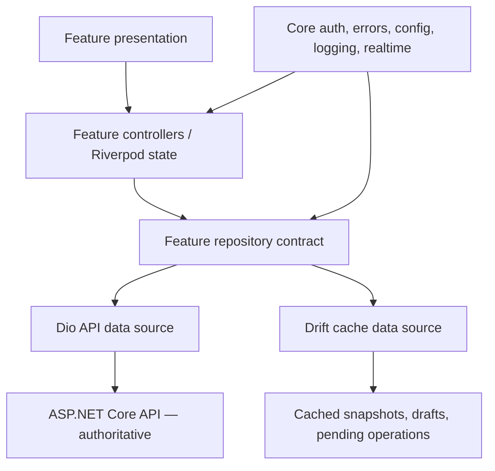
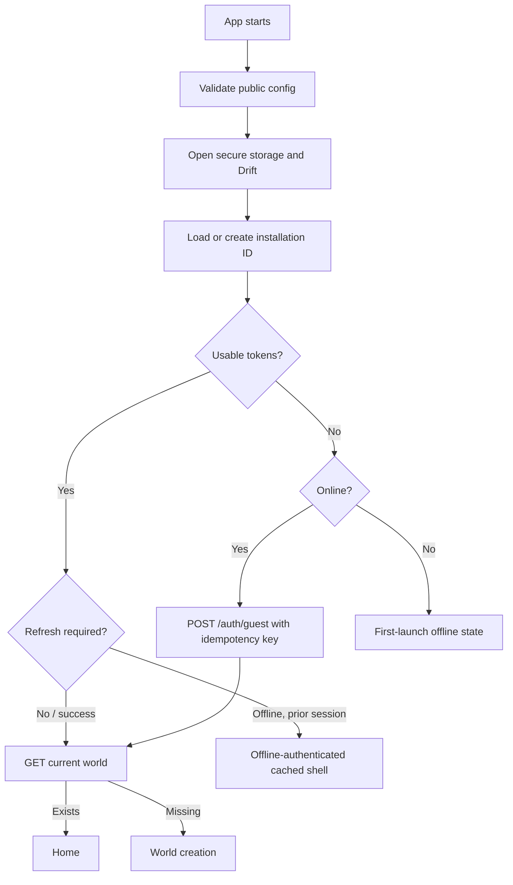
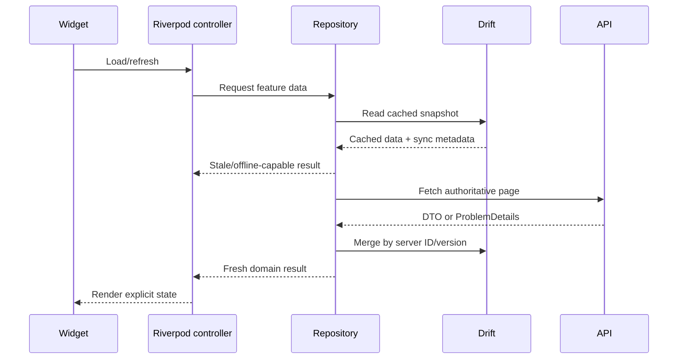
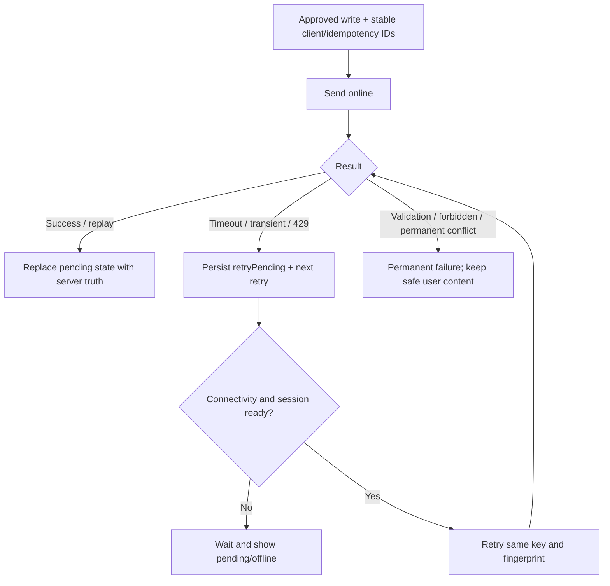
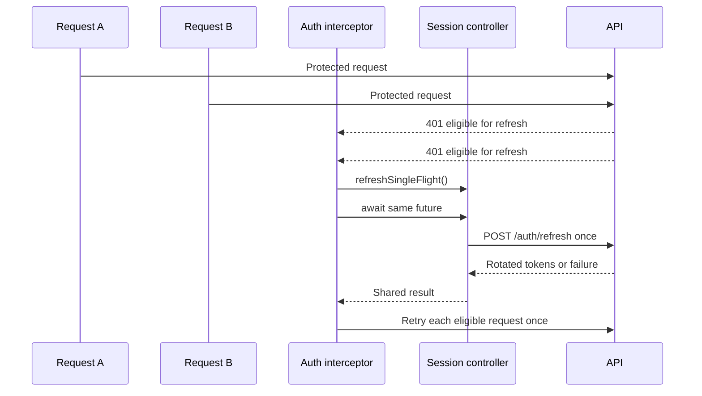
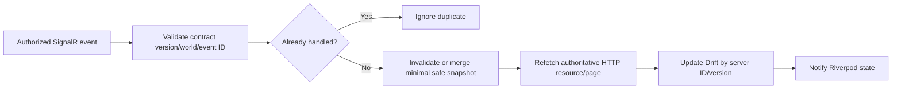
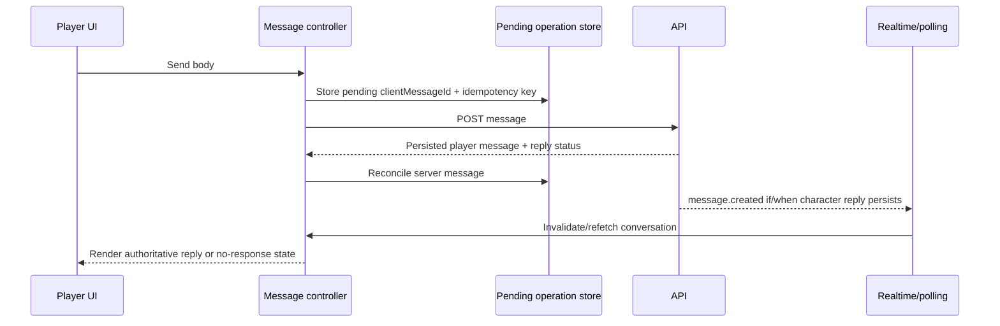

# Parallel World Flutter Development Guidelines

This document is the authoritative Flutter development guide for the Parallel World mobile application. It governs mobile structure, state, API/cache coordination, offline behavior, security, accessibility, and testing. Product scope remains in `docs/product/PRODUCT.md`; gameplay behavior in `docs/game-design/GAME_RULES.md`; system and API contracts in `docs/architecture/ARCHITECTURE.md` and `docs/architecture/API_CONVENTIONS.md`; security in `docs/architecture/SECURITY.md`; and verification in `docs/development/TEST_STRATEGY.md`.

This guide does not authorize implementation outside the current milestone. **MVP**, **Version 1**, **Future**, and **Development-only** labels must be preserved in mobile work.

## 1. Mobile architecture goals

1. Keep the application maintainable by one developer through a pragmatic feature-first structure.
2. Treat PostgreSQL/backend responses as authoritative and Drift as replaceable cache/local work storage only.
3. Keep ownership, simulation, AI decisions, relationships, dating outcomes, memories, and world time server-controlled.
4. Make loading, stale, empty, offline, retry, and terminal session states explicit.
5. Support guest-first startup, one MVP world, safe API retries, and later same-account registration upgrade.
6. Keep widgets focused on rendering and interaction; repositories/providers coordinate data and state.
7. Preserve privacy: no secrets, tokens, message bodies, prompts, or hidden game state in logs/analytics.
8. Prefer simple code and measured extraction over ceremonial layers or speculative abstractions.

## 2. Technology choices

| Concern | Choice | Boundary |
|---|---|---|
| UI | Flutter and Dart | Exact supported versions remain open |
| State/DI | Riverpod | The only primary state-management system |
| Navigation | GoRouter | One declarative route graph and guard model |
| HTTP | Dio | Access only through core API/repositories, never widgets |
| Local data | Drift | Cache, drafts, sync metadata, and approved pending work only |
| Sensitive storage | Flutter Secure Storage | Tokens and installation identity only |
| Immutable/JSON models | Freezed and `json_serializable` where justified | Not mandatory for tiny types |
| Realtime | SignalR later/when approved | HTTP remains authoritative; client package open |
| Push | Firebase Cloud Messaging in Version 1/later | Delivery of persisted notifications only |
| Tests | Flutter SDK unit/widget/integration tools | No real AI provider in mobile tests |

Do not mix Bloc or Provider with Riverpod without an accepted decision. Do not call AI providers, PostgreSQL, Supabase tables, or backend databases from Flutter.

## 3. Project structure

The intended structure is documentation until the Flutter foundation milestone creates it:

```text
mobile/
└── parallel_world_app/
    ├── lib/
    │   ├── app/
    │   │   ├── app.dart
    │   │   ├── bootstrap.dart
    │   │   ├── router.dart
    │   │   └── theme.dart
    │   ├── core/
    │   │   ├── api/
    │   │   ├── auth/
    │   │   ├── cache/
    │   │   ├── config/
    │   │   ├── errors/
    │   │   ├── logging/
    │   │   ├── realtime/
    │   │   ├── storage/
    │   │   └── widgets/
    │   ├── features/
    │   │   ├── session/
    │   │   ├── world/
    │   │   ├── feed/
    │   │   ├── posts/
    │   │   ├── characters/
    │   │   ├── messaging/
    │   │   ├── relationships/
    │   │   ├── dating/
    │   │   ├── notifications/
    │   │   ├── summaries/
    │   │   └── settings/
    │   └── main.dart
    ├── test/
    ├── integration_test/
    └── pubspec.yaml
```

`core/` holds stable cross-feature infrastructure, not miscellaneous business logic. A capability starts inside its owning feature; move it to core only after real cross-feature reuse is demonstrated.

### Diagram 1 — Flutter feature architecture



## 4. Application bootstrap

Bootstrap order:

1. Initialize Flutter bindings.
2. Load and validate non-secret environment configuration.
3. Initialize secure storage.
4. Open/migrate Drift; rebuild cache if corruption is recoverable.
5. Configure sanitized logging.
6. Build Dio and interceptors.
7. Load/create cryptographically random installation identity.
8. Restore access/refresh tokens.
9. Refresh once when required and connectivity permits.
10. Create/restore guest session when no valid session exists.
11. Load current world or route to world creation.
12. Resolve router/session state.
13. Start SignalR only when released, authenticated, and world-resolved.
14. Render the resolved application state.

Every external step has a timeout and typed failure. Startup must reach a usable splash/recovery/offline state rather than block indefinitely.

- Missing/unavailable secure storage: fail closed; never place tokens in ordinary preferences/Drift.
- Corrupt cache: preserve secure credentials, reset/rebuild only replaceable cache after reporting safely.
- Offline startup: show eligible cached data with last-sync status when a previously valid session exists; do not fabricate authentication.
- Expired/revoked refresh token: clear sensitive session state and route to session recovery.
- Backend unavailable: retain secure session and cache, expose retry/offline state.
- First launch: create installation identity and guest session online; explain connectivity if unavailable.

### Diagram 2 — startup and guest session



## 5. Environment configuration

Support local development, test, staging, and production. Public build configuration may contain API base URL, SignalR URL, environment name, safe logging level, released feature flags, timeouts, and later public FCM platform configuration.

Use a consistent build-time approach such as checked non-secret flavor configuration plus `--dart-define`; final flavor/file layout is an implementation decision. Startup validates required keys without printing values. Production URLs are never scattered through feature code.

Never embed AI/provider keys, database credentials, token signing secrets, private certificates, backend connection strings, or privileged service credentials. Feature flags cannot bypass server authorization or activate unapproved mechanics.

## 6. Dependency injection and providers

Use `ProviderScope` and Riverpod overrides for composition and tests.

- `Provider`: immutable configuration and long-lived dependencies such as API client, clock abstraction, secure store, database, repository.
- `FutureProvider`: simple idempotent reads without multi-action orchestration.
- `StreamProvider`: Drift/realtime-derived streams where streaming is the real contract.
- `Notifier`/`AsyncNotifier`: stateful flows such as session, feed paging, message send, or notification actions.
- Family providers: resource-by-ID state such as character/conversation/relationship.

Providers state dependencies explicitly and do not locate them through global mutable service locators. Providers do not mutate unrelated features or contain game rules. Side-effecting providers/controllers have names that reveal the action.

Use `autoDispose` for screen/resource state that is cheap to recreate. Keep session, current world, database, API client, and active pending-write coordinator alive at application scope. Use keep-alive only with a measured lifecycle reason.

## 7. Feature structure

A complex feature may use:

```text
feature/
├── data/
│   ├── api/
│   ├── cache/
│   ├── dto/
│   └── repositories/
├── domain/
│   ├── models/
│   └── repositories/
├── application/
│   └── providers/
└── presentation/
    ├── screens/
    ├── widgets/
    └── controllers/
```

Folders are optional. A small read-only feature may use a data source, provider, and screen. Feed, session, and messaging may justify fuller separation. Do not duplicate shared actor/world summaries; define a stable owning contract and map feature-specific projections when necessary. Cross-feature calls use narrow public providers/repository contracts, not another feature's private data source.

## 8. State-management conventions

Use `AsyncValue` for simple async reads. Complex state machines use immutable feature state with explicit fields/transitions.

Common states: initial, loading, refreshing-with-data, loaded, empty, offline-with-data, recoverable error, submitting, optimistic/pending, retry-pending, and terminal/session-expired.

Feed state includes items, next cursor, has-more, refresh/loading-next flags, stale/offline markers, page error, and pending posts. Messaging includes ordered messages, cursor, sends by client ID, failed local messages, read state, and released realtime/reply status.

Rules:

- Preserve visible data during background refresh and next-page errors.
- Do not encode “empty” as an error or “offline” as infinite loading.
- State transitions happen in controllers, not `build()` methods.
- Mechanical/server state is never recomputed locally.
- Keep one source for each screen's orchestration; avoid multiple providers racing to own the same list.

## 9. Repository conventions

Repositories hide API/cache coordination, return domain-friendly models or typed outcomes, implement stale-while-revalidate/merge behavior, and surface typed failures. They have no widget/navigation dependency and do not expose `Response`, Drift rows, or provider SDK objects.

Define a repository interface when it enables a fake, multiple implementations, or a stable cross-layer boundary. Do not add interface/implementation pairs solely for formality.

Repositories never decide relationships/dating, create simulation actions, adjust authoritative values, invoke AI providers, or assume cached `WorldId` proves ownership.

### Diagram 3 — API/cache repository flow



## 10. API client conventions

Dio is configured once with approved base URL, JSON headers, connection/receive/send timeouts, cancellation, and sanitized diagnostics.

Request path order:

1. Validate/generate `X-Correlation-ID`.
2. Attach bearer token for protected routes.
3. Attach the stable `Idempotency-Key` only for supported writes.
4. Record safe request method/route/timing metadata.

Response/error path:

1. Record safe status/duration/correlation metadata.
2. Coordinate a single token refresh for eligible `401` responses.
3. Retry the original eligible request at most once after refresh.
4. Parse ProblemDetails/stable code into a typed failure.
5. Apply safe network retry only when method/idempotency policy permits.

Dio interceptor execution order must be tested because response interceptors unwind differently from request interceptors. Never retry an unsafe POST without its original idempotency key. Respect `Retry-After`; cancel obsolete search/page/screen requests. Do not log authorization headers, tokens, post/message bodies, full request bodies containing private data, secrets, prompts, or raw provider responses.

## 11. DTO and model conventions

Separate these roles when their responsibilities differ:

```text
API request DTO -> API response DTO -> domain/UI model
                              └------> Drift cache entity
Drift cache entity ------------------> domain/UI model
```

- DTOs match API camelCase, UTC fields, nullability, string enums, and ProblemDetails.
- Drift entities match local indexing/migration needs, not public JSON.
- Domain/UI models expose only what the client uses.
- Request models never include server-controlled user/author/seed/mechanical fields.
- Use sound null safety; avoid `!` unless an invariant is locally proven.
- Decode response enums with an `unknown` fallback where API evolution allows new values; unknown request values are never invented/sent.
- Freezed/JSON generation is appropriate for nontrivial immutable DTO/state unions, not mandatory for a two-field private type.

## 12. Local-cache conventions

Drift may store feed pages, character summaries/details, conversation summaries, messages needed for user experience, released notifications, latest world summary, non-sensitive session metadata, cursors/sync timestamps, drafts, and approved pending operations.

It must not become authority for relationship values/status, dating outcome, simulation state, memories/secrets, reputation, follower counts, world clock, AI outcome, or eligibility. A cached server-calculated relationship label remains a stale display snapshot.

Use `snake_case` physical table/column names if selected by the Flutter foundation implementation, with descriptive Dart data classes. Every schema change increments Drift schema version and has migration/rebuild tests. Because cache is replaceable, unrecoverable cache corruption may reset tables after preserving safe drafts/pending actions where possible. Never silently reset secure credentials with the cache.

Suggested cache policy:

| Feature | Cached | Refresh behavior |
|---|---|---|
| Feed | Pages and pending local posts | Show stale, refresh first page, rebuild cursor chain |
| Character | Summary/detail projection | Show stale then revalidate |
| Conversations/messages | Needed history and send states | Merge by server/client IDs, reconcile read status |
| Notifications | Released safe preview/list | Refresh unread count/list; no sensitive body |
| Relationship | Visible summary only | Revalidate; never calculate values locally |
| World/catch-up summary | Latest safe snapshot | Replace from API; never simulate locally |

## 13. Offline behavior

Supported without claiming new server truth:

- Read cached feed, character profiles, conversations/messages, notifications, and latest summaries.
- Edit local drafts.
- Show last successful synchronization time and stale/offline indicators.
- Retain an already-submitted idempotent operation whose response was lost and retry it under section 14.

Not supported while offline:

- Guest creation/first authentication.
- World creation/resume or simulation.
- AI replies or new deterministic character actions.
- Relationship/dating outcomes or eligibility checks.
- Authoritative reaction/follow/repost/profile state changes unless a later product decision explicitly enables initiating that action offline.

The attached task proposes queueing new offline player actions, but `PRODUCT.md` leaves offline writes/conflict UX open and `ARCHITECTURE.md` permits only explicitly supported actions. Therefore MVP supports drafts and retry of already-submitted operations; new offline submission remains disabled behind an empty explicit allowlist until those sources and API retention/conflict rules are approved.

## 14. Pending-write and retry strategy

The durable local operation record is used for an approved action or an online submission that reached an indeterminate transient result. It contains local operation ID, action type, user/world scope, API idempotency key, safe serialized payload/reference, client entity ID, created/updated UTC, attempt count, next retry UTC, last safe error code, and state (`pending`, `sending`, `retryPending`, `succeeded`, `permanentFailure`, `cancelled`). Tokens are never stored in it.

Rules:

- Reuse one 8-100 character API idempotency key for the same logical operation.
- Retry timeouts, connection loss, `429`/`Retry-After`, and eligible `5xx` with bounded exponential backoff and jitter.
- Do not retry `400`, ownership-safe `404`, most `409`, or permanent authentication failures automatically.
- Recover the session before retrying an otherwise valid `401`; never loop refresh.
- Preserve ordering only where semantics require it, such as messages in one conversation.
- User-visible posts/messages can be retried/discarded after permanent failure.
- Reconcile success by server ID/client ID and delete or retain minimal terminal metadata according to the open retention decision.
- Do not enable a new action type until its API idempotency/concurrency behavior and product offline UX are approved.

### Diagram 4 — pending-write retry



## 15. Authentication and session handling

Session states: unknown, initializing, guestAuthenticated, registeredAuthenticated (Version 1), refreshing, offlineAuthenticated, unauthenticated, sessionExpired, and recoverable error.

The session controller is the only owner of token lifecycle. Access/refresh tokens and installation identity use secure storage; ordinary feature providers never read tokens directly. Installation identity is random, persistent, not a password, not logged/shown, and not sufficient authorization.

Guest first launch:

```text
installation ID -> POST /api/v1/auth/guest -> secure tokens
-> GET /api/v1/worlds/current -> create world or home
```

Future upgrade calls the approved `/auth/upgrade` contract, keeps the same backend `UserId`/worlds, rotates session credentials, updates local session, and does not clear same-account cache. Logout/account switch/revocation clears secure tokens, private cache, pending operations, realtime subscriptions, and navigation history.

Token refresh is single-flight: one refresh runs; concurrent failed requests await it; success retries eligible requests once; permanent refresh failure clears credentials/session; network failure does not masquerade as revocation.

### Diagram 5 — token refresh coordination



## 16. Navigation

Use one GoRouter graph. Suggested routes:

```text
/
/splash
/world/create
/home
/feed
/characters
/characters/:characterId
/conversations
/conversations/:conversationId
/relationships/:characterId
/notifications
/summaries/:summaryId
/settings
```

Guards depend on session/current-world providers and handle initialization, unauthenticated/session-expired, missing world, archived/read-only world, invalid IDs, safe deep links, and offline availability. Route builders render/navigation only; they do not refresh tokens, authorize worlds, or apply game rules.

Initial navigation should remain five or fewer primary destinations. A reasonable candidate is Feed, Characters, Messages, Notifications, and Profile; final composition remains an open UX decision. Deep links carry only safe IDs, reauthorize/refetch through API, and fall back safely when missing/forbidden/offline.

## 17. Error handling

Map API/network failures into typed application failures such as `NetworkFailure`, `OfflineFailure`, `AuthenticationFailure`, `AuthorizationFailure`, `ValidationFailure`, `ConflictFailure`, `RateLimitFailure`, `ServerFailure`, `AiUnavailableFailure`, and `UnknownFailure`.

Parse API ProblemDetails `code`, `traceId`, `errors`, `retryAfterSeconds`, and safe conflict metadata. The approved API currently returns `400` for transport/validation and `409` for state/idempotency conflicts; do not invent a `422` client branch until the API/architecture conflict is resolved.

Map safe codes to localized/user-facing language. Never display raw `detail`, SQL/provider messages, stack traces, or internal codes without translation. Use inline form errors, snackbars for reversible transient actions, full-page retry for blocking loads, persistent failed-message/post state, offline banners, session recovery navigation, and optional correlation ID in support details.

## 18. Loading and empty states

Every MVP screen defines initial loading, refresh-with-data, empty, offline/stale, recoverable error, and session/permission terminal behavior as applicable.

- Skeletons for initial feed/list/profile loads where useful.
- Pull-to-refresh without blanking existing data.
- Inline next-page indicator/error.
- Button-level submitting and duplicate-action disablement.
- Nonblocking background refresh.
- Message reply status only when supported by backend state; never fake a guaranteed typing indicator.

Empty states cover no feed posts, characters, conversations, messages, notifications, relationship history, and catch-up summary. Each explains an available next action without implying unimplemented features.

## 19. Pagination

Use API opaque cursor pagination; Flutter never decodes or constructs cursors.

| Collection | API default/max | Client order |
|---|---|---|
| Feed | 20/50 | Server order, newest first initially |
| Characters | 20/100 | Server stable catalogue order |
| Messages | 30/100 | Server newest first; reverse/group only for display |
| Notifications | 30/100 | Newest first |
| Relationship history | 25/100 | Newest first |

State includes items, `nextCursor`, `hasMore`, `isLoadingNextPage`, and page error. Prevent concurrent page requests, deduplicate by server ID, preserve stable order, and keep current items after page failure. Refresh clears/replaces the cursor chain while retaining approved pending local items. A cursor/filter mismatch or `invalid_cursor` restarts from the first page after an appropriate user-safe notice. Offset pagination is prohibited.

## 20. Optimistic updates

Optimism is a UI projection, never authority.

Allowed for released API operations: player posts/replies, likes, follows, notification read state, and player messages. Reposts/quotes are Version 1. Each pending item has a stable client operation ID and visible pending/failed state.

Do not optimistically finalize relationship/dating state, AI replies, simulation/resume results, reputation/influence/follower growth, character actions, memories, or catch-up summaries.

On success, replace temporary IDs/state with the complete server result. On validation/permanent failure, rollback an edge/read indicator or keep user-authored content as failed draft. On transient ambiguity, retain pending state and retry the same idempotency key. A later server refresh always wins for mechanical fields.

## 21. Realtime SignalR handling

SignalR remains release-gated. When introduced, connect only after authentication/current-world resolution; join only the authorized world group; reconnect with bounded backoff; disconnect on logout/account switch; and fall back to API refresh/polling.

Handle only API-defined events such as `post.created`, `reply.created`, `message.created`, `notification.created`, `relationship.updated`, `world.simulationCompleted`, and `world.summaryCreated`. Deduplicate by event/resource ID. Minimal event payloads trigger targeted invalidation/refetch or safe cache insertion; they never overwrite complex state blindly. Reconnect performs authoritative HTTP synchronization.

### Diagram 6 — realtime update flow



## 22. Push notifications

Push/FCM is Version 1/later. Future behavior: register/rotate/revoke device token through authenticated `/devices` APIs, handle taps through safe deep links, refetch from API, respect server notification/quiet-hour policy, and treat payloads as untrusted hints.

Do not include private message bodies or sensitive relationship/memory content by default. Do not accept/supply another `UserId`. Push failure cannot change gameplay or persisted notification state. Exact Flutter/FCM packages and platform setup remain open until the notification milestone.

## 23. Theme and design system

Use `ThemeData` plus a small token/component system for color roles, typography, spacing, radii, elevation, icon/avatar sizes, inputs, buttons, cards, and semantic success/warning/error/pending states. Prefer theme extensions only where ordinary ThemeData cannot express a recurring token.

Avoid per-widget hardcoded styling and do not choose final brand colors before product design approval. Support light/dark behavior only when intentionally designed and tested; do not infer status solely from color.

## 24. Accessibility

Required:

- Semantic labels/roles for controls, posts, reactions, messages, badges, and status.
- Platform-appropriate minimum touch targets.
- Screen-reader order and announcements for errors/new state.
- Text scaling without clipping fixed-height containers.
- Sufficient contrast and non-color status cues.
- Logical focus movement, keyboard support where relevant, and accessible forms.
- Reduced-motion handling for nonessential animation.
- Accessible retry/empty/offline messaging.

Critical screens are widget/manual tested at larger text scales and with screen-reader semantics. Decorative content is excluded from semantics.

## 25. Responsive layouts

Design common phone widths first. Use SafeArea, keyboard-aware/scrollable forms, adaptive padding, bounded readable widths on large phones/tablets, and layouts driven by available constraints rather than device-name checks.

Avoid fixed-height text containers and MVP desktop complexity. Tablet behavior is graceful scaling/adaptive panes only where simple; a tablet-specific information architecture remains open.

## 26. Forms and validation

Forms include world creation, profile, post/reply, message, date invitation, and Version 1 registration. Use local field state, documented length/format validation, live counts where helpful, backend field-error mapping, button submit state, and draft preservation for user-authored text.

Client validation improves UX but never duplicates domain rules or decides eligibility. Respect API limits: post/reply 500, message 2,000, display name 60, handle 30, bio 300, world name 80, and idempotency key 100 characters. Unknown server validation codes fall back safely. The client never selects an AI author or sends user/owner/mechanical fields.

## 27. Messaging UI

Conversation list: cached safe summaries, avatar, last safe preview, unread count, activity UTC converted for display, stale/offline state, cursor pagination.

Chat: paginated persistent history, player/character bubbles, pending send, permanent failure/retry, read cursor, offline state, and reply status. `clientMessageId` plus the API idempotency key reconciles sends. Character messages cannot be submitted by Flutter. Do not display typing/waiting language unless the API state indicates a planned/pending reply; MVP may resolve immediately, while delayed/character-initiated messages are Version 1.

Message editing/deletion, group chat, reply-to-message, and shared post preview remain deferred/open according to API/product scope.

### Diagram 7 — message send and reply



## 28. Feed UI

MVP feed supports cached initial content, stale marker, pull-to-refresh, cursor infinite scroll, post/reply composition, like, follow navigation/state, author profile navigation, pending/failed local posts, and loading/empty/offline/error states.

Post cards use focused reusable components for actor identity, timestamp, content, engagement counts/actions, parent preview, and pending/failed indicator. Keep API/repository/business logic outside cards.

Repost, quote preview/action, hashtags, and mentions are Version 1 and hidden behind approved release flags; they are not MVP acceptance requirements. Feed ordering is server-owned. Do not locally rank or infer AI origin/provider metadata.

## 29. Relationship and dating UI

Display only API-approved player-visible projections such as stranger, acquaintance, friend, close friend, rival, romantic interest, dating, or former partner, plus qualitative signals and safe recent history. Exact hidden values, attraction, thresholds, memories, secrets, goals, and decision weights remain unavailable unless product/API approval changes.

MVP dating UI may submit only the approved player choice such as date type and display persisted invitation pending/accepted/rejected state. Backend rules decide eligibility, acceptance, rejection, deltas, and transition. Keep the state model compatible with immediate or later outcome timing because that API/product decision is open.

Use respectful, non-coercive copy/design. Engagement, marriage, separation, divorce, and family UI are not released.

## 30. Notifications UI

MVP supports released in-app notification categories, cursor list, unread badge, mark-one/read-all actions, safe preview, empty/offline/error state, and authorized deep links. Read actions are idempotent; optimistic read state reconciles with server truth.

Do not show sensitive private-message body or hidden reasoning. Rich categories, push, quiet-hour controls, trends/world-event notifications, and other Version 1 content stay gated.

Catch-up summary UI may present “While you were away,” meaningful committed facts, new messages, relationship changes, and safe resource links. Trends/world events appear only when those Version 1 systems are released. Never show hidden simulation actions, seed, score components, or AI prompt.

## 31. Logging and analytics

Permitted sanitized mobile logs: screen/route name, safe request method and route template, response status, duration, correlation ID, cache hit/miss, retry outcome, app/build version, and realtime connection state.

Never log access/refresh tokens, authorization headers, installation ID, private message bodies, full post drafts, secrets, raw AI context, hidden relationship data, personal data, push tokens, or unredacted ProblemDetails. Disable verbose Dio logging in production.

Analytics is deferred until product/privacy approval. If added, collect feature-level events rather than private content, use privacy-safe identifiers, document disclosure/retention, honor platform requirements, and never send post/message bodies.

## 32. Security and privacy

Flutter and local storage are untrusted. Required controls:

- Store tokens/installation identity only through secure storage abstractions.
- Keep backend/provider/database secrets out of source, build config, logs, analytics, and app bundle.
- Use TLS in production; certificate pinning is not required without a risk decision.
- Treat local `WorldId`, actor IDs, deep links, cache, and push payloads only as locators; server reauthorizes.
- Clear/cryptographically separate private cache, tokens, queues, and realtime state on logout/account switch/deletion/reset.
- Minimize cached private messages and notification text.
- Validate app/deep links and never place private text/tokens in URLs.
- Never call AI or databases directly.
- Do not claim encryption guarantees not implemented; Drift encryption strategy remains open.

## 33. Performance

- Use lazy lists, stable keys, item-level provider selection, and pagination.
- Avoid rebuilding a full feed/conversation for one reaction/read-state change.
- Cancel obsolete HTTP work and dispose controllers/listeners.
- Use `const` where it improves clarity/performance; do not optimize ceremonially.
- Cache image dimensions/assets only after media is released; media/video are deferred.
- Avoid premature isolates and measure before adding complexity.

Measure representative startup, cache load, feed/chat scrolling, pagination, notification list, and realtime bursts. Performance changes must preserve state correctness, accessibility, privacy, and server authority.

## 34. Testing

Required mobile coverage, aligned with TEST_STRATEGY.md:

- Unit: DTO/enum mapping, ProblemDetails mapping, repository merge/cache policy, cursor pagination, idempotent pending retry, session refresh single-flight, cache synchronization.
- Provider/controller: initial/refresh/page/offline/error, optimistic reconciliation/rollback, failed write, session expiry, current-world transition.
- Widget: splash/bootstrap, feed all states, post composition, character profile, conversation list, pending/failed chat, relationship/dating projection, notifications, catch-up summary, accessibility/text scale.
- Navigation: auth/world guards, deep links, missing/forbidden IDs, session expiry, offline routes, notification links.
- Integration: guest session, world creation, feed/post, messaging, offline cache, resume/catch-up using fake/stub backend contracts.

Use fake repositories, in-memory Drift, fake secure storage, fake clock/connectivity/realtime service, and mock API client only where appropriate. Prefer behavior assertions over implementation-detail mocks. Never use a real AI provider in Flutter tests.

Golden tests are selective for stable design tokens/components and a few major layouts; the entire suite must not depend on fragile pixel comparisons. Report exactly which commands ran and why anything was skipped.

## 35. Code generation

Allowed where justified: Freezed, JSON serialization, Drift, and Riverpod generator if adopted consistently.

```text
dart run build_runner build --delete-conflicting-outputs
```

Generated-file commit policy and Riverpod generator usage remain open until Flutter foundation. Whichever policy is selected must be consistent in repository/CI. Do not generate every tiny class or manually edit generated files.

Formatting/static verification once a project exists:

```text
dart format --output=none --set-exit-if-changed .
flutter analyze
flutter test
```

No analyzer error is ignored without an explanation and narrowly scoped suppression.

## 36. Naming conventions

- Files/directories: `snake_case.dart`, `snake_case/`.
- Types/extensions/enums: `PascalCase`.
- Variables/functions/parameters: `camelCase`.
- Providers: `sessionProvider`, `feedControllerProvider`, `characterDetailsProvider`.
- DTOs: `CharacterSummaryDto`, `CreatePostRequest`, `FeedPageResponse`.
- Drift entities/tables: explicit feature nouns; avoid transport names when local shape differs.
- Repository actions: `loadFeed`, `refreshFeed`, `sendMessage`, `followCharacter`.
- Tests: behavior-oriented description and `_test.dart` filename.

Avoid vague `Manager`, `Helper`, `Utils`, `Common`, or `Service` unless the narrow responsibility is obvious in the complete name.

## 37. Dependency policy

Before adding a package, document the problem, alternatives, maintenance/release activity, sound-null-safety/platform support, license, bundle/build impact, transitive/native risk, testability, and removal cost. Prefer Flutter/Dart capabilities for trivial needs.

Initial dependency families are Riverpod, GoRouter, Dio, Drift, Flutter Secure Storage, and selectively Freezed/JSON generation. Exact packages/versions are chosen in the foundation milestone. SignalR client, FCM setup, analytics, image caching, encryption, and stricter lint packages are deferred/open. Do not add Bloc, Provider, GetIt/global locator, a second router, or packages for one-line helpers.

## 38. Definition of Done for Flutter tasks

A Flutter task is complete only when:

- Scope matches the active milestone and released API/product feature.
- Relevant source-of-truth documents and existing implementation were inspected.
- No business/game/ownership/AI authority moved to Flutter.
- Loading, empty, refresh, offline, error, and session states are handled as applicable.
- API, cache, retry/idempotency, privacy, accessibility, and navigation effects are addressed.
- Unit/provider/widget/integration tests are added at the appropriate boundary.
- Code generation is current when used.
- `dart format --output=none --set-exit-if-changed .`, `flutter analyze`, and relevant `flutter test` commands pass.
- Manual happy path, offline/retry, accessibility, and sensitive-log checks are reported where relevant.
- Documentation is updated for contract/behavior/setup changes.
- Failures/skips and remaining risks are reported honestly.
- No future-milestone feature or unapproved package is included.

## 39. Explicitly rejected patterns

- Raw Dio/Drift/repository calls from widgets: couples rendering to infrastructure and bypasses orchestration.
- Shared mutable globals/service locator: hides dependencies/lifecycle and harms testing.
- Flutter/Drift as source of truth: violates backend authority and synchronization safety.
- Direct AI/database/Supabase access: exposes secrets and bypasses rules/ownership.
- Business, relationship, dating, or simulation decisions in UI/providers: duplicates and contradicts authoritative rules.
- One enormous `services.dart`, provider, repository, or app state: destroys feature ownership.
- Multiple state-management/router systems: creates conflicting lifecycle/navigation authority.
- Excess clean-architecture layers: raises cost without behavior/test value.
- Offset pagination: conflicts with cursor API and growing histories.
- Full chat-history/hidden-memory upload: violates privacy/minimization and AI boundary.
- Logging private content/tokens/prompts: security/privacy failure.
- Hardcoded production URLs/secrets: unsafe and difficult to operate.
- Silent offline failure or pretending writes succeeded: misleads the player.
- Optimistic authoritative relationship/dating/simulation changes: makes client mechanics authoritative.
- Blind retry of non-idempotent writes: duplicates user actions.
- Realtime/push payload as authority: loses persisted state and ownership validation.

## 40. Open Flutter decisions

1. Exact Flutter/Dart versions and minimum Android/iOS versions.
2. Riverpod generator adoption and generated-file commit policy.
3. Freezed/JSON generation scope.
4. Drift encryption strategy and sensitive message cache minimization.
5. Final visual theme, dark-mode scope, and brand assets.
6. Bottom-navigation composition.
7. **Recorded conflict — offline writes:** this task proposes queueing new offline posts, replies, messages, reactions, reposts, follows, notification reads, and profile updates. `PRODUCT.md` section 19/open decision 11 leaves offline write/conflict UX unresolved; `ARCHITECTURE.md` section 23 permits only explicitly supported queued actions; `API_CONVENTIONS.md` leaves idempotency retention and concurrency transport open. The guide therefore enables cached reads, drafts, and safe retry of already-submitted ambiguous operations only. If new offline initiation is approved, PRODUCT.md must decide its UX/scope and ARCHITECTURE.md/API_CONVENTIONS.md must be updated before this allowlist changes.
8. Profile-update retry behavior after ETag versus version and `409` versus `412` are resolved.
9. SignalR client package and introduction milestone; polling/refresh remains valid.
10. FCM packages/platform configuration and push milestone.
11. Image caching/media package when media is approved.
12. Analytics provider, disclosure, and retention if analytics is approved.
13. Golden-test scope and screenshot platform stability.
14. Exact player-visible relationship values; default is qualitative API projection.
15. Date invitation immediate/pending UX timing.
16. Tablet-specific layout investment.
17. Cache retention/eviction and local pending-operation terminal retention.
18. Connectivity abstraction and background retry scheduling within platform constraints.

The task's references to repost UI, SignalR, push, registration upgrade, trends, and world events are not MVP authorization. They remain Version 1/open as defined by PRODUCT.md, GAME_RULES.md, ARCHITECTURE.md, and API_CONVENTIONS.md.

### Final consistency checks

Before accepting Flutter implementation, verify:

1. PostgreSQL/API remains authoritative; Flutter never decides mechanics.
2. Widgets never call Dio/Drift directly and Riverpod remains the only primary state system.
3. Drift contains cache/drafts/approved local operations only.
4. New offline writes are not enabled without the recorded product/API decisions.
5. Every retryable write reuses the correct client/idempotency identity.
6. Relationship/dating/AI/simulation outcomes remain server-controlled.
7. Tokens, messages, drafts, prompts, secrets, and hidden values are absent from logs/analytics.
8. Routes, ProblemDetails, cursors, enum handling, limits, and statuses match API_CONVENTIONS.md.
9. GoRouter guards handle session, world, invalid link, and offline state.
10. Feed/messages/notifications/history use opaque cursor pagination and deduplication.
11. Realtime/push only trigger authoritative synchronization and are release-gated.
12. MVP screens cover loading, refresh, empty, offline, error, and terminal states.
13. Tests cover session, mapping, feed, messaging, pagination, retry, cache sync, navigation, and accessibility.
14. Reposts, push, SignalR, registration, trends/events, and advanced romance are not made MVP requirements.
15. The implementation remains understandable and operable by one developer.
