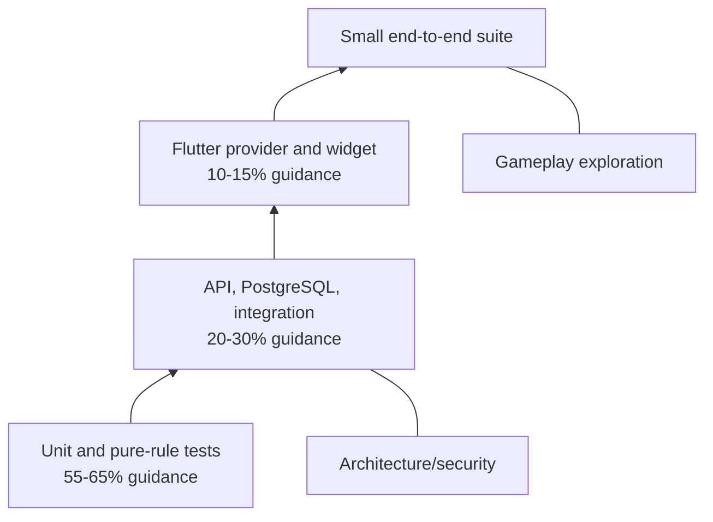
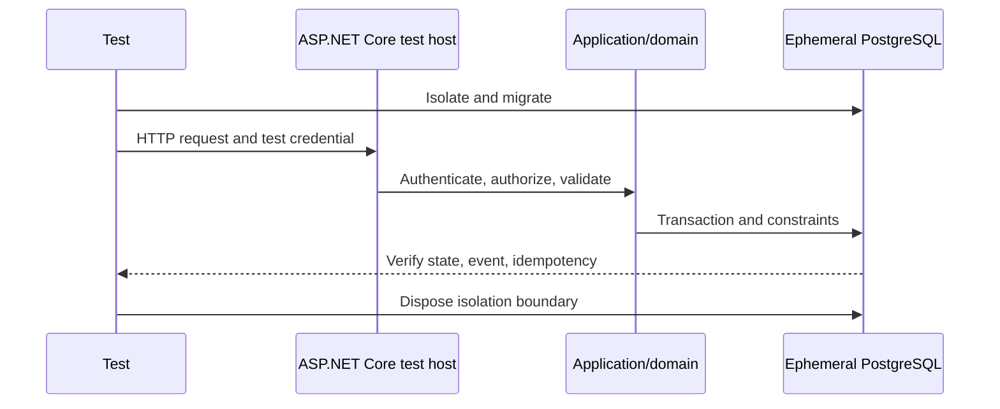
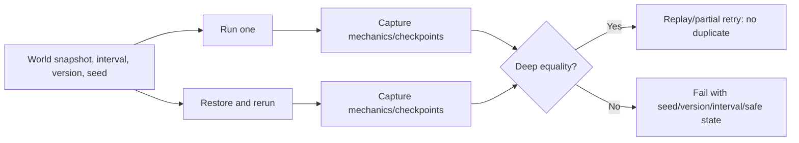
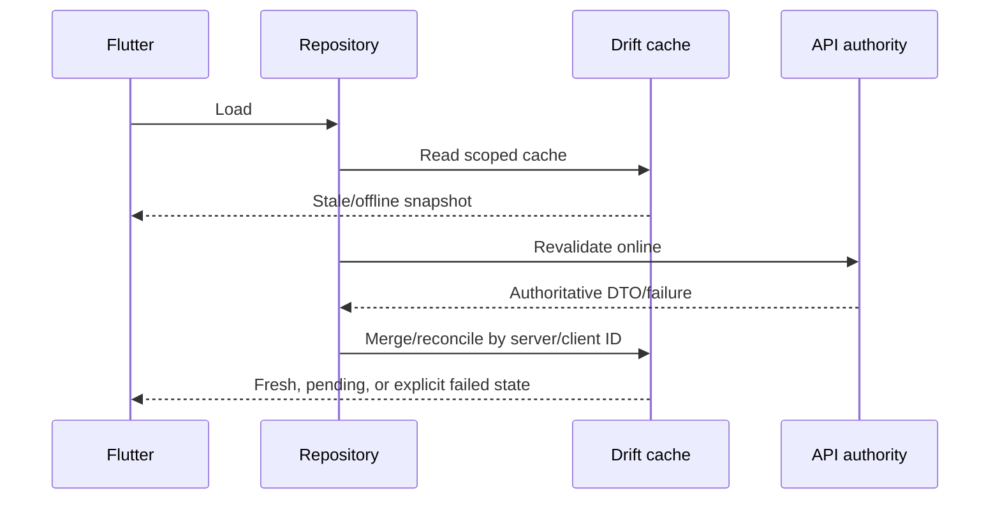
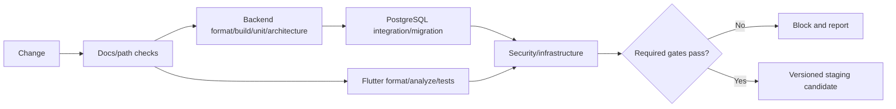
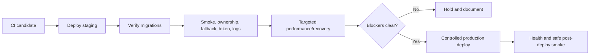

# Parallel World Test Strategy

This document is the authoritative testing, verification, quality-gate, test-data, determinism, security, performance, and release-validation specification for Parallel World. Product scope remains governed by `docs/product/PRODUCT.md`; mechanics by `docs/game-design/GAME_RULES.md`; system, database, API, and security contracts by `docs/architecture/`; mobile implementation by `docs/development/FLUTTER_GUIDELINES.md`; and accepted decisions by `docs/development/DECISIONS.md`.

Release labels are **MVP**, **Version 1**, **Future**, and **Development-only**. A test becomes a delivery gate only when its feature is released or its milestone begins. This document defines verification; it does not authorize application code, test projects, fixtures, containers, workflows, packages, or deferred features.

## 1. Quality goals

1. Prove every real user can access only their isolated private worlds.
2. Reproduce simulation decisions from authoritative state, interval, rule version, and seed.
3. Prove AI supplies wording only and cannot change mechanical state or outcomes.
4. Preserve PostgreSQL as authority and Drift as replaceable cache/offline-read storage.
5. Make retries, concurrency, background work, and catch-up idempotent and recoverable.
6. Protect guest identity, tokens, messages, memories, secrets, and credentials.
7. Verify stable pagination, mobile reconciliation, migrations, builds, and deployments.
8. Keep verification practical for one developer.

## 2. Testing principles

- Test approved behavior and public contracts, not private implementation details.
- Every released rule in `GAME_RULES.md` has automated coverage at its cheapest reliable boundary.
- Ownership requires HTTP/application tests and PostgreSQL constraint tests.
- Deterministic failures report seed, interval, rule version, and a safe world-state summary.
- Ordinary automated suites use fake/stub AI and push providers, never real providers.
- PostgreSQL behavior is tested against PostgreSQL, never primarily EF Core InMemory.
- Time and randomness are injected; tests are isolated, repeatable, order-independent, and parallel-safe where marked.
- Failures expose useful safe diagnostics without tokens, private bodies, prompts, or secrets.
- Every practical bug fix receives a regression test; Critical/High fixes require one unless explicitly justified.
- Test code contains no production credentials, accounts, or private data.
- Unrun checks are never reported as passed.

## 3. Test pyramid

The initial balance is guidance, not a quota: about 55-65% unit/pure-rule tests, 20-30% API/PostgreSQL integration tests, 10-15% Flutter provider/widget tests, focused architecture/security checks, and a small end-to-end suite. Manual exploration covers fun and believability.



End-to-end tests are slower, more fragile, and diagnose failures poorly. They cannot replace focused rule, ownership, constraint, migration, or controller tests.

## 4. Test environments

| Environment | Dependencies | Verification | Prohibited |
|---|---|---|---|
| Local | Developer machine, PostgreSQL through Docker, fake providers, deterministic seeds, debug config | Fast suites, selected integration/manual flows | Production secrets/accounts |
| CI | Ephemeral PostgreSQL, stub providers, isolated database/schema | Format, build, unit, architecture, integration, migration, Flutter, scans | Shared mutable state; real AI |
| Staging | Staging API/PostgreSQL, realistic deployment, strictly budgeted AI only for approved manual acceptance | Smoke, acceptance, migration, recovery, performance | Production data; uncontrolled destructive tests |
| Production | Real deployment/monitoring | Health, safe synthetic and post-deploy smoke checks | Destructive integration tests or fixture resets |

## 5. Test project structure

Intended structure when implementation milestones create it:

```text
backend/tests/
|-- ParallelWorld.UnitTests/
|-- ParallelWorld.IntegrationTests/
|-- ParallelWorld.ArchitectureTests/
`-- ParallelWorld.TestUtilities/

mobile/parallel_world_app/
|-- test/
|   |-- unit/
|   |-- providers/
|   |-- widgets/
|   `-- navigation/
`-- integration_test/
```

`TestUtilities` may hold narrow builders, fake clocks/random/providers, PostgreSQL lifecycle helpers, and ownership fixtures. It is not a second application framework. These folders are not created by this documentation task.

## 6. Unit testing

Fast network-free/database-free tests cover value objects, clamping, UTC/time calculations, scores, cursor helpers, idempotency fingerprints, retry decisions, prompt-context selection, output validation, and pure transitions. Use fake clocks and seeded randomness. Each test owns its state.

## 7. Domain-rule testing

### Matrix 1 - source-of-truth requirement to test type

| Rule family | Unit/pure rule | Integration | Scenario | Release |
|---|---|---|---|---|
| World time/simulation interval | Formula, UTC, state table | Cursor/lock/run persistence | Quiet world/resume | MVP |
| Activity, schedule, mood, goals | Scores, caps, cooldowns | Planned action/reason | Active/sleeping actor | Released portions MVP |
| Posts/replies | POST-01/REPLY-01 | World scope, event/text work, cursor | Mention/active feed | MVP |
| Reactions/follows | REACT-01/FOLLOW-01 | Unique edges/count rebuild | Repetition/cooldown | Like/follow MVP |
| Messaging | MSG-02 eligibility/no-response | Conversation/send/page | Player message/fallback | MVP; initiation/delay deferred |
| Relationships | REL-01 deltas/caps/labels | Transaction/history/ledger | Friends/rivals/defence | MVP |
| Dating | ROM-01/02/state table | Pair/history/idempotency | Eligible/rejected/accepted | MVP through Dating only |
| Memories/secrets/promises | MEM-01/02, access/ranking | Provenance/selection constraints | Promise/secret/conflict | MVP |
| Reputation/followers | Caps/follow derivation | Count rebuild | Released public event | Broader system deferred |
| Trends/world/life events | Formula/template eligibility | Same-world status | Seeded catalogue | Deferred except MVP topics |
| Catch-up | Buckets/caps/priorities | Checkpoints/partial retry | Long offline | MVP |
| Notifications | Category/priority/dedupe | Recipient/unread cursor | Reply/message/summary | Basic MVP; rich/push deferred |
| AI wording | Context/output validation | Stub transport/work/fallback | Unavailable/hostile input | MVP |

Released formulas receive boundary, below/exact/above threshold, cap, and replay cases. Tests obtain tunable constants through the rule-version fixture rather than copying values inconsistently.

## 8. Simulation testing

```text
same authoritative world state
+ same half-open simulation interval
+ same rule version
+ same seed
= same decisions and mechanical outcomes
```

Compare actor/action ordering, target/topic selection, score changes, relationship transitions, events, summary selection, and template fallback. Deliberately vary physical candidate order to prove stable sorting and order-independent substreams. Different seeds may yield different valid outcomes.

Prove an interval cannot apply twice, provider failure does not reroll mechanics, partial work resumes after the last committed boundary, and simulation-version change is explicit.

### Matrix 2 - simulation scenario catalogue

| Seed | Scenario | Primary assertions |
|---:|---|---|
| 1001 | Quiet world | No fabricated action/summary |
| 1002 | Highly active feed | Caps, fairness, stable order |
| 1003 | Rivalry escalation | Cooldown, daily deltas, history |
| 1004 | Public defence between friends | Directional deltas, label, memory |
| 1005 | Eligible invitation | Candidate/reason/pending history |
| 1006 | Rejected invitation | Reason/cooldown/no Dating |
| 1007 | Dating acceptance | Outcome/history/Dating |
| 1008 | Long catch-up | Buckets/caps/partial cursor/summary |
| 1009 | AI unavailable | Same mechanics, fallback, safe logs |
| 1010 | Duplicate resume | One interval/effect set |
| 1011 | Failure after checkpoint | Resume without reroll/duplicate |
| 1012 | Sleeping message recipient | MVP eligibility/reason only; delay deferred |

## 9. Application testing

With fake infrastructure test create guest/world, current world, player post, reaction/follow, message send, resume, relationship summary, date invitation, and notification read. Verify validation, ownership orchestration, domain invocation, transaction/idempotency boundaries, result mapping, and failure mapping. Avoid duplicating the same assertions in handlers and thin endpoints.

## 10. Integration testing

Use the real ASP.NET Core test host and PostgreSQL. Each isolated test database/schema applies migrations, then exercises authentication, authorization, validation, application/domain behavior, EF mapping, constraints, transactions, ProblemDetails, and persistence.



## 11. API contract testing

For every released endpoint verify route, method, authentication, JSON shape, unknown-field rejection, lower-camel enums, UTC timestamps, status, ProblemDetails, opaque cursors, the endpoint's approved idempotency or non-idempotency semantics, concurrency, and rate-limit response. Prove ownership-safe `404 resource_not_available`, approved `400` validation, `409` conflict, and `429` with `Retry-After`. OpenAPI compatibility checks may be added after tooling is selected; tests must match `API_CONVENTIONS.md` examples/inventory.

## 12. Database testing

Run EF migrations against PostgreSQL from empty and previous-release schemas. Verify bounded checks; every composite `(WorldId, Id)` FK; unique/idempotency constraints; explicit delete behavior; transaction sets; cursor indexes; canonical romantic pair; direct-conversation uniqueness; simulation cursor/interval claim; token/proof-hash uniqueness and rotation/consumption; and later guest-upgrade ownership preservation.

Initial migrations are forward-only. Rollback uses verified backup/restore or reviewed compensating migration. Destructive changes require explicit review and expand/migrate/contract planning. Representative query plans are inspected after realistic data exists.

## 13. Architecture testing

Automate that Domain has no infrastructure/framework/provider/system-time dependencies; Application has no API, `DbContext`, or provider SDK dependency; Simulation has no provider SDK, endpoint, uncontrolled randomness, or direct feature-table access; AI has no mechanical mutation; API has no gameplay calculations/direct EF writes; Infrastructure owns no rules; Flutter presentation imports no raw Dio/Drift client; and module references follow `ARCHITECTURE.md`.

The additional .NET architecture-test library is open; xUnit is already approved.

## 14. Security testing

Cover auth bypass, token expiry/modification/claims, refresh reuse, guest-bootstrap proof reuse/expiry/scope, revoked session/device, rate/size limits, malformed input, error/log redaction, production dev-route absence, AI-context minimization, and nonsensitive push previews when push ships. Captured responses/logs must contain no authorization headers, tokens, raw guest-bootstrap proofs, installation/push IDs, credentials, message/post bodies, prompts/responses, secret memories, or hidden values.

## 15. Authentication testing

### Matrix 3 - authentication state test matrix

| State/flow | Required behavior | Negative/concurrency case | Release |
|---|---|---|---|
| First online installation | Client supplies an independent 256-bit-or-greater proof; one transaction creates guest/session/world/player and stores proof/token hashes only | Same-proof races create one identity/world/family; installation ID alone fails | MVP/M03 |
| Bootstrap response recovery | One valid proof retry within 10 minutes returns the same User/world with newly rotated credentials, then the client discards the proof | Expired/consumed proof fails; at most one concurrent recovery succeeds; proof cannot authenticate or call unrelated endpoints | MVP/M03 |
| Access token | Valid RS256 JWT; exact issuer/audience; 15-minute expiry; `sub`, `jti`, `kid`; 30-second skew | Expired, invalid signature, wrong issuer/audience/algorithm, and outside-skew token denied | MVP/M03 |
| Refresh | Opaque hash-only 30-day token; atomic one-use, non-idempotent rotation in one device/session family | Concurrent second use fails; consumed replay, including after a lost response, revokes that family and never returns prior/new credentials; unrelated family remains valid | MVP/M03 |
| Session-family limit | At most five active families per user | Sixth creation revokes oldest active family; revoked/expired family cannot refresh | MVP/M03 |
| Logout/device revoke | Current-family and all-family backend revocation block refresh; short-lived access limitation tested | Repetition safe; unrelated family survives current-family logout | MVP/M03; public all-device management M17 |
| Auth rate limit | M03 guest/refresh/invalid-refresh/logout windows return standard `429` when exceeded | Limits cannot authenticate an installation ID or disclose/log tokens | MVP/M03 |
| Registration/login | Generic safe credential flow | Duplicate email/invalid password/enumeration | Version 1 |
| Guest upgrade | Same user and all data | M03 proves identity/world continuity; M17 proves parallel/partial/duplicate-identity rollback end to end | M03 invariant; Version 1 endpoint |
| Recovery/providers/devices | Approved proof/session policy | Replay, bad claims, silent merge denied | Later |

### M03 authentication and session gate

M03 automated coverage explicitly includes:

1. First guest bootstrap with an independent CSPRNG proof of at least 256 bits transactionally creates exactly one User, installation/session lineage, initial refresh family, GameWorld, player Actor/Profile, WorldSettings, and WorldSimulationState.
2. Exact proof retry within 10 minutes resolves the same User/world, invalidates the prior active initial-family credential as needed, issues new access/refresh credentials in the same lineage, and consumes the sole recovery. It does not replay token bytes.
3. Expired/consumed proof fails; the proof cannot authenticate normal requests, rotate a refresh token, call unrelated endpoints, derive from/substitute for installation ID, or appear raw in PostgreSQL, logs, errors, URLs, or responses.
4. Synchronized first-bootstrap requests using the same proof create no duplicate User, world, player, or family; synchronized recovery requests produce at most one success.
5. A valid access token authenticates the stable `sub` user.
6. Wrong issuer, wrong audience, expired token, invalid signature, and timestamps immediately inside/outside the 30-second clock-skew boundary are accepted or rejected as specified.
7. Refresh succeeds once, rotates to a new hash-only 30-day token in the same family, and an expired token fails. It does not accept or use a generic idempotency key.
8. Two synchronized requests using the same refresh token produce exactly one successful rotation.
9. Replaying the consumed/replaced token, including after a simulated lost success response, transactionally revokes its family and returns neither the prior response nor a new token, while another device/session family remains valid.
10. Current-device logout revokes only the current family; the all-family backend operation revokes every active family. The public all-device/session-management API remains M17.
11. Creating a sixth active family revokes the oldest active family and no newer unrelated family.
12. PostgreSQL never contains raw refresh/proof values, and captured application/request logs contain no raw access token, refresh token, bootstrap proof, authorization header, or cookie value.
13. Session and world operations preserve the guest `UserId` and owned world identity needed for later same-user upgrade. M03 does not implement the M17 upgrade endpoint; M17 adds the full transactional upgrade test.
14. Each M03 auth limit returns standard `429` ProblemDetails at the accepted boundary: guest creation 10/IP/10 minutes, refresh 30/family/10 minutes, invalid refresh/replay 10/IP/10 minutes, and logout 30/authenticated user/10 minutes.
15. Installation-ID-only, client-supplied `UserId`, cross-user refresh/logout, and other cross-user/session ownership attacks fail without disclosure.

## 16. Authorization and ownership testing

Every module uses a two-user/two-world fixture and attempts cross-user, cross-world, and wrong-actor access. Assert application rejection and PostgreSQL protection where a relation exists.

### Matrix 4 - resource ownership test matrix

| Resource | Valid owner action | Wrong scope attempt | API result | Database protection/test |
|---|---|---|---|---|
| World | Read/update/resume owned | Foreign world | Safe 404 | Owner/world key; User B cannot address World A |
| Profile/character | Read; edit allowed player fields | Foreign actor/AI edit | 404/safe validation | Composite FKs, player uniqueness/discriminator |
| Post/reply | Create/read same world | Foreign parent/quote/author | 404 | Composite actor/post/event FKs |
| Reaction/follow | Player to same-world target | Foreign/self/wrong actor | 404/safe validation | Composite FKs and edge uniqueness |
| Conversation/message | Participant sends/reads | Foreign conversation/sender/cursor | 404 | Conversation/actor/message composite FKs |
| Relationship/date | Read/submit permitted choice | Foreign actor/client mechanics | 404/400/409 | Actor FKs, canonical pair/history |
| Memory/secret/promise | Internal authorized use | Foreign subject/knower/broad read | No exposure/404 | Provenance/knower composite FKs |
| Event/trend | Read released owned projection | Foreign event | 404 | World constraints when released |
| Notification/summary | Read/mark owned | Foreign recipient/summary | 404 | Recipient-owner/world constraints |
| Simulation | Resume owned world | Foreign target/seed/action | 404/400 | Cursor lock, interval/action FKs |

Cross-world negative coverage is module-by-module; one global ownership test is insufficient.

## 17. Idempotency and concurrency testing

Repeat and race world creation, post/reply/message creation, reaction, follow, date invitation, world resume, notification creation/read, simulation action, AI work, and later push delivery. For ordinary idempotent endpoints, the same key and fingerprint returns the recorded result and the same key with another fingerprint returns `409 idempotency_key_reused`. Guest bootstrap is the explicit credential exception: its proof provides identity idempotency and one newly rotated credential recovery, not byte-for-byte response replay. Refresh is explicitly non-idempotent and never uses a generic idempotency key. Natural PUT/DELETE operations return current/no-op success.

Bounded concurrent tests cover profile update, resume, relationship events, reaction/follow, message send, date invitation, notification read, refresh rotation, work leases, and interval claims. Assert one effect, no lost update, correct conflict/reuse response, rollback on failure, and stable final state. Use synchronization barriers, not sleeps.

## 18. AI integration testing

Use a deterministic fake generator for most tests and a local HTTP stub for transport cases: success, timeout, rate limit, malformed/empty/excessive/duplicate output, provider error, retry, fallback, cost/token metadata, and sanitized diagnostics. Always assert action type, actor, target, visibility, score delta, relationship/dating result, timing, and mechanical event IDs are unchanged.

Hostile text such as “ignore previous instructions,” fake system messages, SQL-like strings, HTML/script, oversized input, secret-extraction requests, score-alteration instructions, and requests for another character's memory is treated only as data. No command runs, unauthorized context is sent, or private content is logged.

## 19. Messaging testing

Test direct-conversation uniqueness, player membership, message send and `clientMessageId` replay, newest-first cursor order and ID tie-break, eligible immediate MVP reply/no-response, reply-plan persistence, provider fallback, realtime/poll refetch, reconnect, pending local send, indeterminate retry, read cursor, wrong ownership, and redaction.

Character-initiated and simulated delayed replies are deferred. MVP may test that sleep/schedule affects approved eligibility/reason behavior; it must not require unreleased delayed delivery.

## 20. Relationship and dating testing

For every relationship dimension verify initial value, 0-100 clamp, impact-matrix delta, multiplier range, ordinary/severe event cap, daily ledger, sign preservation, asymmetry, source idempotency, friendship priority, severe bypass, repetition, no passive MVP decay, and recovery.

MVP dating covers ROM-01 thresholds/compatibility/cooldown/candidate ordering, invitation uniqueness, ROM-02 acceptance/rejection/reason, Dating transition, canonical pair, required invitation/outcome history, and forbidden transitions. Breakup lifecycle, FormerPartner re-entry, reconciliation, engagement, marriage, separation, and divorce become test gates only when explicitly approved after MVP.

## 21. Memory testing

Cover meaningful-event threshold; mandatory Promise, Secret, and released RomanticEvent creation; trivial rejection; bounds; expiry/permanence; source uniqueness; relevance/ranking/ID tie-break; recall cap/penalty/reinforcement; contested contradictions; provenance; promise terminal states; secret knower/disclosure access; and no full-history retrieval. Breakup memory tests activate only with the deferred breakup feature. AI text alone cannot create, resolve, reinforce, or alter memory.

## 22. Feed and pagination testing

Test empty/first/next/refresh feed, stable ordering, equal-time ID tie-break, no duplicates, deleted posts, reply rendering/depth, player optimistic reconciliation, likes/follows, isolation, limits, invalid/mismatched/tampered cursor, and high-volume boundaries. Quotes, reposts, hashtags, mentions, rich reactions, and ranked-feed specifics remain deferred.

## 23. Catch-up simulation testing

Cover no elapsed time; short/long intervals; paused/archived exclusion; per-run cap; newest detailed and older daily buckets; CatchUp SimulationRun identification; requested, processed, and remaining intervals; relational checkpoint ownership/uniqueness; Pending/Running/Partial/Completed/FailedRetryable transitions; action/summary caps; meaningful priority; committed relationship/memory effects; duplicate/concurrent resume; failure midway; checkpoint retry/resume without reroll; summary/item fact provenance and idempotency; latest-summary route semantics; fallback independence; retention safety; and cursor/`LastSimulatedAt` advancement only to committed state.



## 24. Notification and realtime testing

MVP notification tests cover Reply, PrivateMessage, CatchUpSummary, deduplication, read one/all, unread count, bounded minimal-list cursor behavior, expiry visibility, safe preview/deep link, ownership, and retry. Follow, DatingInvitation, relationship/world-event/trend/mention notifications, rich history/filtering/search, and push are deferred.

When SignalR is introduced, test authorized connection/group, unauthorized and wrong-world subscription, minimal payload, duplicate event, reconnect, missed-event HTTP refetch, logout disconnect, message/simulation events, and no hidden data. Realtime remains a hint to PostgreSQL-backed HTTP truth.

## 25. Flutter unit testing

Test DTO/JSON parsing, unknown response enums, request/model/cache mapping, ProblemDetails, cursor state, cache merge/tombstones, pending-write/retry classification, single-flight refresh, session transitions, deep-link parsing, UTC display, and sanitized diagnostics.

## 26. Flutter provider/controller testing

Test initial load, cached-first/stale data, background refresh, pull-to-refresh, paging/failure, offline state, optimistic update/rollback, pending/failed post or message, original-key retry, session expiry, missing world, realtime invalidation/refetch, and logout/account-switch clearing. Override repositories, clock, secure storage, connectivity, and realtime.

## 27. Flutter widget testing

### Matrix 5 - Flutter screen-state matrix

| Screen | Required states/behavior |
|---|---|
| Splash | Initializing, first-launch offline, cached recovery, error, guest success |
| Feed | Loading, refresh-with-data, empty, populated, offline, error, pending/failed, paging |
| Character | Loading, follow, message, safe relationship summary, hidden data absent |
| Messaging | Empty/history, sending, failed/retry, reported pending reply, offline |
| Relationship/dating | Friendship/rival/dating/former partner, history, ineligible, persisted outcome |
| Notifications | Empty, unread/read, pagination, safe preview, deep link |
| Catch-up | No changes, meaningful/partial summary, related navigation |

Also verify semantics, text scaling, non-color status, touch targets where practical, and safe errors. Goldens remain selective.

## 28. Flutter navigation testing

Test splash to guest, missing world to creation, authenticated world to home, expired/revoked session to recovery, character/conversation/notification links, invalid/forbidden resource, offline cached route, archived/read-only world, logout, and account switch. Guards never authorize locally.

## 29. Flutter integration testing

Keep focused flows: online first launch, world creation, characters, feed/post, like/follow, message with fake reply, relationship/date projection, resume/summary, cached offline read and retry of an already-submitted ambiguous operation, and logout. Upgrade/account switch is Version 1. Do not make every UI test device-level.

## 30. Offline and cache testing

Test cached startup with a previously valid session, first-launch offline without fabricated authentication, stale feed, drafts, already-submitted pending post/message, same-key reconnect retry, duplicate prevention, cache-corruption reset preserving secure credentials, account-switch/logout clearing, Drift migration, server conflict reconciliation, and no local simulation.



New offline initiation remains disabled until the approved product/API decisions change.

## 31. Performance testing

Measure backend feed, message, pending-action, relationship, memory, notification, catch-up, and AI-work queries; and Flutter startup, feed/chat scrolling, large cache, notification list, and realtime bursts. Record environment, data size, and warm/cold state.

Targets remain provisional until measured: reasonable common-API p95, bounded first-page latency, catch-up bounded by action limits, and smooth scrolling on a representative mid-range Android device. Large load tests are deferred until usage justifies them; initial staging scenarios are concurrent launches/resumes, feed reads, message bursts, AI slowdown, and later push backlog.

## 32. Reliability and recovery testing

Inject API restart, PostgreSQL transient failure, AI/push unavailability, worker restart, duplicate pickup, stale lease/lock, partial transaction, cache failure, secure-storage failure, and network loss during send. Verify rollback or committed-boundary recovery, durable resumption, no duplicate mechanics, safe fallback, preserved user content, and honest terminal state.

## 33. Test data and fixtures

Use small builders and immutable scenario snapshots. Required fixtures include a deterministic world/cast, fictional named characters, two users/two worlds, relationship states, eligible/rejected dating, long offline interval, AI responses/failures, equal-time cursors, token family, and pending writes. Avoid one enormous shared fixture or production-derived data.

Each fixture declares release, rule version, UTC clock, world seed, safe aliases, starting state, and cleanup boundary. Behavior-critical values are explicit.

## 34. Deterministic seeds

The stable catalogue begins with seeds 1001-1012 in section 8. Random/property-style tests report and replay their seed. Canonical snapshots compare mechanics independent of row enumeration, worker count, or provider result.

All time tests use a fake clock and cover UTC/day rollover, cooldowns, token expiry, message delay when released, offline intervals, event/notification expiry, daylight-saving projection, and half-open boundaries. Rule code must not hide direct system-time calls.

## 35. Mocking and test doubles

Prefer a fake clock, seeded random source, fake AI generator, stub AI HTTP server, fake push, fake secure storage, in-memory Drift, fake connectivity/realtime, and PostgreSQL container. Mock only necessary behavior; prefer result/state assertions to call-order verification. Never mock PostgreSQL when verifying PostgreSQL semantics.

## 36. CI quality gates

### Matrix 6 - CI job and quality-gate matrix

| Job | Required checks | Required from |
|---|---|---|
| Documentation | Links, authoritative paths, optional lint | Tooling availability |
| Backend fast | Restore, format, build, unit, architecture | Backend foundation |
| Backend integration | Ephemeral PostgreSQL, API/integration, migration | Relevant backend milestone |
| Flutter | Pub get, format, analyze, unit/provider/widget, later build smoke | Flutter foundation |
| Security | Secret/dependency scan; selected static analysis | As tools arrive; mandatory by production |
| Infrastructure | Docker and workflow validation | Files exist |
| Release | Artifact, migration, staging smoke/acceptance | Production milestone |

A required failed check blocks merge. A check whose project/tool does not exist is reported Not applicable or Unavailable, not silently skipped.



## 37. Local verification

From the repository root, once projects exist:

```powershell
dotnet restore backend/ParallelWorld.sln
dotnet build backend/ParallelWorld.sln --no-restore
dotnet test backend/ParallelWorld.sln --no-build

Set-Location mobile/parallel_world_app
flutter pub get
dart format --output=none --set-exit-if-changed .
flutter analyze
flutter test
```

Once infrastructure exists:

```powershell
docker compose config
docker compose up --build
```

Report every command as **Passed**, **Failed**, **Unavailable**, or **Not applicable**, with the exact command and reason for non-pass results.

## 38. Manual testing

Each milestone checklist covers its new happy path, principal negative path, ownership, retry/recovery, privacy/logging, and accessibility where applicable. Manual testing supplements but does not replace automation.

Exploratory sessions assess character distinctiveness, dialogue repetition, relationship/dating pacing, world activity, notification frequency, catch-up usefulness, memory believability, AI tone, and confusion. Record fixture/seed and observations; do not silently change rules.

## 39. Staging validation

Before production: apply migrations; check liveness/readiness; create guest/world; load feed; post; message; force AI fallback; resume/read summary; read/mark notification; rotate token; perform ownership-negative and log-redaction checks; verify backup/restore access; and confirm Development-only routes are absent from production routing/OpenAPI. Any approved real-AI manual wording check uses fictional data and strict budget.

## 40. Release acceptance

Block release for any Critical security issue, cross-user/world access, data loss, non-idempotent/non-deterministic mechanics, broken guest auth/refresh, failed migration, AI cost runaway, sensitive logs, unusable core flow, or failed required CI. A known High requires documented acceptance, owner, mitigation, and target date.



## 41. Regression strategy

Maintain focused suites for authentication, ownership, simulation, relationships/dating, messaging/privacy, memory/secret access, pagination, offline retry/cache clearing, and migrations. Tag by capability/release. Critical/High fixes add the lowest-boundary test that catches the defect plus integration coverage when it crossed a boundary.

## 42. Flaky-test policy

- Do not use silent retry as the primary fix.
- Reproduce with seed, fake clock, isolated database, and barriers.
- Investigate wall time, randomness, shared state, ports, ordering, and races.
- Quarantine only with issue, owner, impact, and removal target.
- Quarantined release-critical security/ownership tests still block unless explicitly accepted.
- Track recurrence and remove quarantine quickly.

## 43. Coverage policy

Coverage is a signal, not a substitute for assertions. Require strong behavioral coverage for rules, ownership, security-sensitive sessions, simulation, relationship transitions, memory ranking/access, and idempotency. Do not require 100% repository-wide coverage. Exact backend, Domain/Simulation, and Flutter percentages remain open until meaningful baselines exist.

## 44. Test naming and organization

Use behavior names such as `DatingInvitation_WhenTrustBelowThreshold_IsRejected` and `showsCachedFeedWhileRefreshingFromApi`. Use Arrange-Act-Assert or Given-When-Then consistently. Organize by capability; parameterized cases expose threshold/seed/outcome. Helpers must not hide critical arrangement/assertions.

## 45. MVP versus deferred test requirements

### Matrix 7 - MVP versus deferred test matrix

| Capability | MVP gate | Deferred gate |
|---|---|---|
| Guest/session/world | ADR-014 proof-bound guest bootstrap and one lost-response recovery, ADR-013 access/non-idempotent refresh/family limits and backend revocation, current logout, one exposed world, isolation, upgrade identity invariant | Registered-account recovery, public device/session management, full same-user upgrade endpoint |
| Feed/social | Profiles, posts, replies, likes, follows, cursor | Reposts, quotes, rich reactions, hashtags, mentions, ranking |
| Simulation/AI | Determinism, persisted actions, wording-only AI, fallback | Provider/tuning expansion |
| Relationships/dating | Basic directional state, invitation/outcome, Dating, necessary romantic history | Breakup, FormerPartner/reconciliation, commitment, engagement, marriage, separation, divorce |
| Messaging/memory | Player-character history, immediate eligibility/no-response, structured memory | Initiation, delay, group chat |
| Events/careers | Seeded MVP topics and basic display | Trends, full world/life events, careers |
| Catch-up/notifications | Bounded summary and released indicators | Rich categories/history and push |
| Offline | Cached reads, drafts, retry of indeterminate submitted writes | New offline writes/conflict UX |
| Operations | Build, migration, health, security/privacy gates | Scale tests triggered by need |

## 46. Definition of Done

A feature is complete only when acceptance criteria are met; sources/existing code were inspected; appropriate tests were added; ownership-negative and idempotency/concurrency paths were covered; applicable format/build/test gates passed; PostgreSQL migrations/constraints were verified when changed; manual happy/negative/offline/accessibility/privacy checks were reported; docs were updated; no sensitive logging or future work was added; and unavailable checks/remaining risks were reported honestly.

### Matrix 8 - milestone to minimum-test matrix

| Milestone | Minimum automated verification |
|---|---|
| M01 Repository/tooling | Structure, paths/links, baseline command validation |
| M02 Backend foundation | Startup/config, health, ProblemDetails, production dev-route gate |
| M03 Guest session/world | ADR-014 proof bootstrap/recovery/expiry/scope/concurrency/hash-only/redaction; ADR-013 JWT validation matrix; non-idempotent hash-only refresh rotation/concurrency/lost-response replay/family isolation/expiry; current/all-family revocation; five-family cap; auth `429`; upgrade identity invariant; atomic world/player creation and ownership denial |
| M04 Flutter foundation | Bootstrap/session, secure storage abstraction, routing, error mapping |
| M05 Characters | Seed/profile/traits, cursor, cross-world denial, screen states |
| M06 Feed | Create, order/cursor/tie, pending reconciliation, isolation |
| M07 Social actions | Replies/likes/follows, uniqueness, counts, nested ownership |
| M08 Simulation | Seed reproducibility, ordering/reasons, interval idempotency/checkpoint |
| M09 AI | Success/failure/fallback, minimized context, no mechanics, safe diagnostics |
| M10 Relationships | Dimensions/caps/asymmetry/history/labels |
| M11 Messages | Conversation uniqueness, send/idempotency/cursor, eligibility/privacy |
| M12 Memory | Creation/ranking/provenance/secrets/promises/no full history |
| M13 Dating | Eligibility/outcome/cooldown/required history/invalid transitions through Dating |
| M14 Events/trends | Deferred-feature tests only when intentionally activated |
| M15 Catch-up | Compression/caps/summary/partial retry/concurrent resume |
| M16 Notifications | Released category/dedupe/read/cursor/ownership; realtime if introduced |
| M17 Auth | Registration/login/recovery, guest-upgrade preservation/rollback |
| M18 Production | CI, migration, security scans, performance/recovery, staging smoke |

## 47. Explicitly rejected testing patterns

- Only manual or only end-to-end testing.
- EF Core InMemory as a PostgreSQL substitute.
- Real AI provider calls in normal automated suites.
- Shared mutable test databases or order-dependent tests.
- Sleep-based timing and unreported random seeds.
- Mocking everything or testing private call sequences.
- Ignoring failures, silently retrying them, or claiming unrun checks passed.
- 100% coverage as the sole quality measure.
- Golden/snapshot testing every screen.
- Production secrets/accounts/data in tests.
- One global cross-world test instead of per-module coverage.
- AI fixtures deciding mechanics or Drift fixtures acting authoritative.

## 48. Open testing decisions

1. Assertion/mocking libraries beyond approved xUnit.
2. PostgreSQL container library and database-versus-schema isolation.
3. Architecture-test library and enforceable namespace rules.
4. OpenAPI compatibility tooling.
5. Coverage tooling/thresholds after a baseline.
6. Golden scope and rendering platform.
7. Flutter device/OS matrix and CI operating systems.
8. Measured performance targets and representative profiles.
9. Load tooling and activation threshold.
10. Secret/dependency/SAST/DAST/SBOM scanning tools.
11. Previous-version migration fixture and rollback approach.
12. Staging reset/retention and real-AI manual policy.
13. Flaky tracking/quarantine ownership.
14. Release checklist owner and High-risk acceptance authority.
15. Feed-order oracle after its product decision.
16. Concurrency tests after ETag/version and `409`/`412` decisions.
17. SignalR/push test environments when released.
18. New-offline-write tests after product/API decisions.

### Recorded conflicts and phase mismatches

1. **Offline writes:** the requested tests include new offline pending posts/messages, but `PRODUCT.md` leaves offline write/conflict UX open and `ARCHITECTURE.md`, `API_CONVENTIONS.md`, and `FLUTTER_GUIDELINES.md` allow only explicitly approved actions. MVP therefore tests drafts and retry of already-submitted indeterminate operations. Those four documents require later correction before new offline initiation becomes a gate.
2. **Deferred features:** requested catalogues include push, rich notifications, reposts/quotes, trends/world/life events, and registered auth. Approved documents mark them Version 1/deferred. They remain catalogued but are not MVP requirements; their owning source documents must change release placement first.
3. **Message timing:** requested scenarios include delayed replies and sleeping-at-receipt timing, while `PRODUCT.md` and `GAME_RULES.md` defer simulated delay/character initiation. MVP covers immediate eligibility/no-response and schedule inputs. Those documents require correction before delay becomes an MVP gate.
4. **AI context:** `SECURITY.md` records a conflict between broader recent-message context and the persisted decision contract in `GAME_RULES.md`. Tests preserve the approved contract and bounded authorized memories. `GAME_RULES.md` and `ARCHITECTURE.md` require correction before broader context is tested.
5. **Validation status:** `API_CONVENTIONS.md` records an earlier `422` proposal conflicting with approved `400` validation. Tests require `400` until `ARCHITECTURE.md` and `API_CONVENTIONS.md` change together.

### Final consistency checklist

- Every MVP capability and important game-rule family maps to coverage.
- Every module has two-user/two-world negative tests.
- PostgreSQL constraints, migrations, indexes, locks, and transactions use PostgreSQL.
- Simulation determinism, checkpoint retry, fallback independence, and idempotency are explicit.
- External providers are fake/stubbed and AI cannot mutate mechanics.
- Flutter cache, retry, navigation, screen states, privacy, and accessibility are covered.
- Authentication, rotation/reuse, logout, and later same-user upgrade are phase-correct.
- Private messages, memories, prompts, tokens, and logs receive privacy tests.
- CI gates match the modular monolith and appear only when artifacts exist.
- Milestone minimums remain manageable for one developer.
- Deferred features do not become MVP acceptance requirements.
